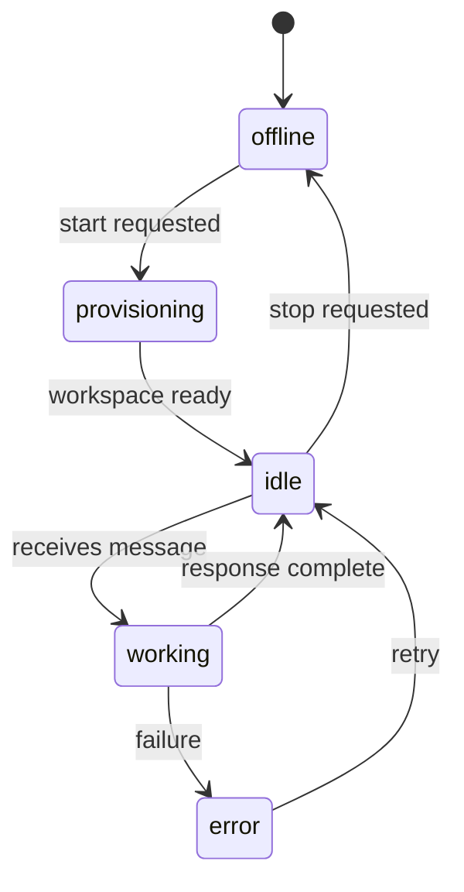
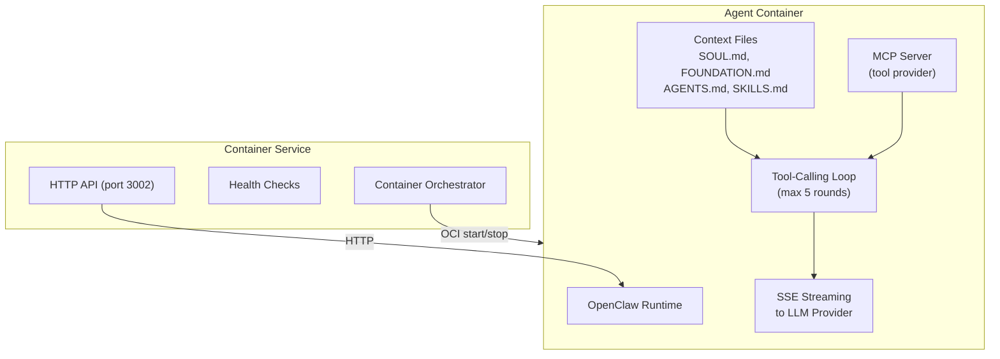
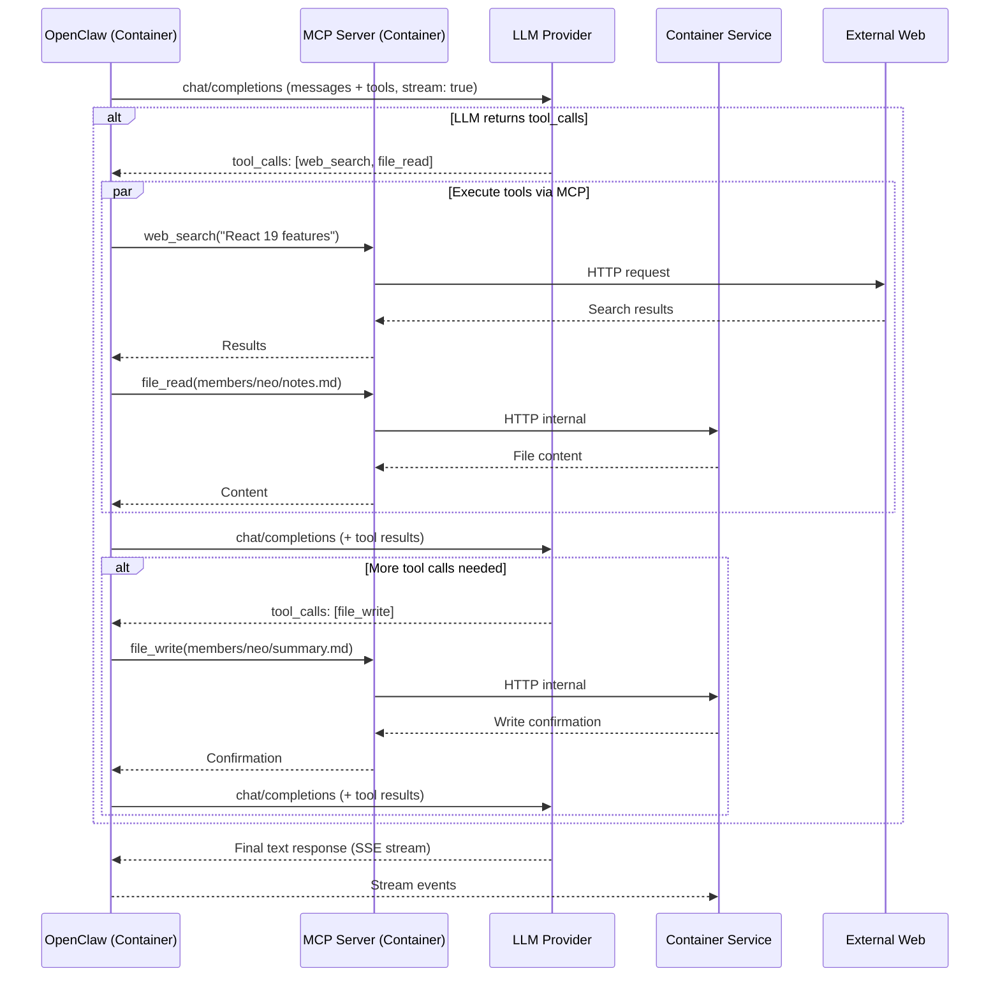
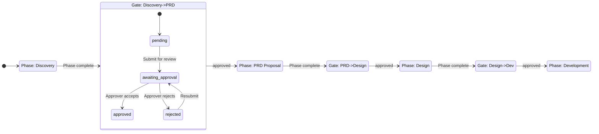
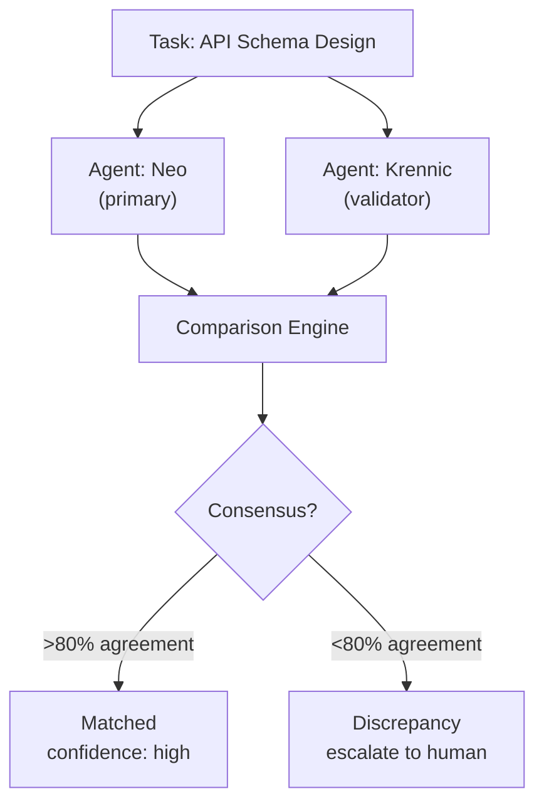
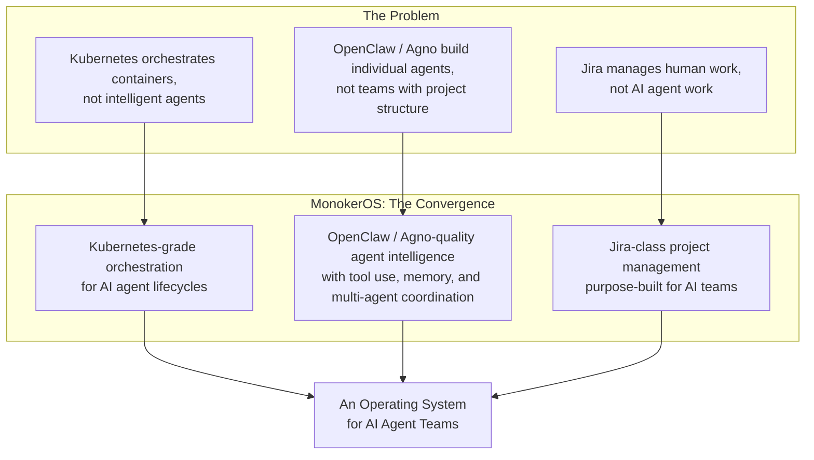

# Design Inspirations

MonokerOS draws from three distinct domains -- container orchestration, agentic AI, and project management -- and fuses them into a single platform. Understanding these inspirations clarifies why the platform is structured the way it is and where its terminology comes from.

```mermaid
graph TB
    subgraph K8S["Kubernetes<br/>Infrastructure & Orchestration"]
        K1["Namespaces"]
        K2["Pods & Services"]
        K3["Deployments"]
        K4["PersistentVolumes"]
        K5["Ingress / Traefik"]
        K6["Readiness / Liveness Probes"]
        K7["Declarative YAML Manifests"]
    end

    subgraph OC["OpenClaw / Agno<br/>Agentic AI"]
        O1["Autonomous Agents"]
        O2["Tool Use"]
        O3["Long-Term Memory"]
        O4["System Prompts as Personality"]
        O5["Constrained Autonomy"]
        O6["Lightweight Runtime"]
        O7["Multi-Agent Orchestration"]
    end

    subgraph PM["Jira / Linear<br/>Project Management"]
        P1["Kanban Boards"]
        P2["Sprint Planning"]
        P3["Status Workflows"]
        P4["Priority Tiers"]
        P5["Assignment & Teams"]
        P6["SDLC Methodology"]
    end

    subgraph MK["MonokerOS<br/>Operating System for AI Agent Teams"]
        M1["Workspaces"]
        M2["AI Agents"]
        M3["Teams & Org Chart"]
        M4["Drives & File System"]
        M5["Mono Dispatcher"]
        M6["SDLC Gates"]
        M7["YAML Manifests"]
        M8["Projects & Tasks"]
        M9["Chat with Tool Calling"]
    end

    K1 & K7 -->|inform| M1 & M7
    K2 -->|inform| M2
    K3 -->|inform| M3
    K4 -->|inform| M4
    K5 -->|inform| M5
    K6 -->|inform| M6

    O1 & O5 -->|inform| M2
    O2 -->|inform| M9
    O3 -->|inform| M2
    O4 -->|inform| M2
    O6 -->|inform| M2
    O7 -->|inform| M3

    P1 & P3 -->|inform| M8
    P2 & P6 -->|inform| M6
    P4 & P5 -->|inform| M8
    P5 -->|inform| M3

```



---

## Kubernetes Parallels

MonokerOS borrows heavily from Kubernetes in its resource model, declarative configuration, lifecycle management, and separation of desired state from runtime state. The analogy runs deep -- MonokerOS is effectively "Kubernetes for AI agents" rather than containers.

### Resource Mapping

| Kubernetes | MonokerOS | Parallel |
|---|---|---|
| **Namespace** | **Workspace** | Isolated environment with its own set of resources. All resources are scoped within a workspace, just as Kubernetes resources are scoped within a namespace. Multi-tenancy boundary. |
| **Pod / Service** | **Agent (+ Container)** | The fundamental unit of execution. Each agent runs inside its own Docker container managed by the Container Service, analogous to how each Pod runs its own container(s). Has lifecycle states and status tracking. |
| **Deployment / ReplicaSet** | **Team** | A logical grouping of Pods (agents) with a defined purpose. Teams organize agents by function (engineering, design, QA) just as Deployments organize replicas of a service. |
| **PersistentVolume / PVC** | **Drive** | Shared storage that persists independently of agents. Drives can be mounted by multiple agents with configurable access (read-only, read-write), scoped by category (personal, team, project, workspace). |
| **Ingress Controller / Traefik** | **Mono (Dispatcher Agent)** | The entry point for user requests. Mono receives all incoming messages and routes them to the appropriate agent, or delegates project management work to Keros -- analogous to how Traefik routes HTTP traffic to backend services. |
| **Job / CronJob** | **Project** | A defined unit of work with completion criteria. Projects have phases (analogous to Job steps), defined teams and members, and drive allocations. |
| **ReadinessProbe / LivenessProbe** | **SDLC Gates** | Quality checkpoints. SDLC gates require approval before a project can advance to the next phase, just as Kubernetes probes verify a Pod is ready to receive traffic. Gates support `pending`, `awaiting_approval`, `approved`, `rejected`, and `bypassed` states. |
| **ConfigMap / Secret** | **Agent Config (SOUL.md, config.toml)** | Declarative configuration injected into the agent at runtime. The OpenClaw runtime reads `config.toml`, `SOUL.md`, `FOUNDATION.md`, `AGENTS.md`, and `SKILLS.md` from the agent's workspace directory inside the container, similar to how a Pod reads ConfigMaps and Secrets. |
| **etcd (source of truth)** | **Convex Database** | The authoritative data store. Kubernetes uses etcd; MonokerOS uses Convex as its persistent, real-time database. YAML manifests are the import/export format, not the source of truth -- exactly mirroring `kubectl apply`. |
| **Controller / Reconciler** | **Reconciler Service** | Watches desired state in the database and reconciles it with actual state by provisioning agent workspace directories and updating agent status. |

### Manifest Format

MonokerOS uses Kubernetes-style YAML manifests for declarative resource definition:

```yaml
apiVersion: monokeros/v1
kind: Agent
metadata:
  name: neo
  namespace: acme-corp
  labels:
    team: development
spec:
  displayName: "Neo"
  title: "Dev Lead"
  specialization: "Architecture"
  identity:
    soulRef: ./souls/neo.md
    skills:
      - system-architecture
      - code-review
  drives:
    - name: personal
      source: members/neo
      readOnly: false
    - name: team
      source: teams/development
      readOnly: false
```

The manifest convention matches Kubernetes exactly: `apiVersion`, `kind`, `metadata` (with `name`, `namespace`, `labels`, `annotations`), and `spec`. Status is never stored in manifests -- it is runtime-only, managed by the reconciler.

Multi-document YAML is supported (separated by `---`), with apply ordering by kind priority:
```
Workspace > Agent > Team > Project > Drive > TaskTemplate > Org
```

### Agent Lifecycle State Machine



This mirrors Kubernetes Pod lifecycle management -- the separation between desired state (`active`, `standby`, `dormant`) and observed state (`idle`, `working`, `error`, `offline`).

---

## Agentic AI Parallels

MonokerOS agents run as containerized [OpenClaw](https://openclaw.ai)-style agents. OpenClaw defines a framework for building autonomous AI agents with tool use, memory, and constrained autonomy. [Agno](https://github.com/agno-agi/agno) contributes the multi-agent orchestration model -- a programming language for building, running, and managing multi-agent systems at scale. MonokerOS adapts concepts from both into a managed platform where each agent runs inside its own OCI container.

### What MonokerOS Draws from OpenClaw and Agno

| Concept | Source | MonokerOS Implementation |
|---------|--------|--------------------------|
| **Autonomous agent** | OpenClaw | Each agent has its own conversation state, tools, and LLM access, running inside a dedicated container |
| **System prompt as personality** | OpenClaw | The agent's "soul" -- a markdown file (`SOUL.md`) that defines personality, values, communication style, and expertise |
| **Tool use** | OpenClaw | Agents can call `web_search`, `web_read`, `file_read`, `file_write`, `list_drives`, `knowledge_search`, plus role-specific tools |
| **Constrained autonomy** | OpenClaw | Configurable `autonomy` level (`supervised` or `autonomous`) and `maxToolRounds` limit (1-20) per agent |
| **Long-term memory** | OpenClaw | Agent identity includes a `memory` array, plus persistent file drives for accumulated knowledge |
| **Context injection** | OpenClaw | Multiple context files per agent: `SOUL.md`, `FOUNDATION.md`, `AGENTS.md`, `SKILLS.md` |
| **Multi-agent orchestration** | Agno | Teams of agents with leads, routing, delegation, and structured collaboration across roles |
| **Pluggable runtimes** | Agno | Runtime-agnostic architecture -- swap agent backends without changing application code |

### The Container Service

The Container Service is MonokerOS's agent runtime orchestrator. Each agent runs inside its own OCI container with a pluggable agentic runtime (OpenClaw by default). The Container Service manages container lifecycle (start, stop, health checks) and provides an HTTP API for the Convex backend to interact with agents.



**Why OCI containers?**

MonokerOS uses OCI containers (Podman or Docker, Kubernetes planned) for agent execution for three reasons:

1. **Isolation** -- Each agent runs in its own sandboxed environment with its own filesystem, preventing cross-agent interference.

2. **Scalability** -- Containers can be distributed across hosts (and across Kubernetes clusters), enabling horizontal scaling of the agent workforce.

3. **Security** -- Agent code execution is sandboxed. Podman's rootless mode adds an extra layer of host isolation. The MCP server inside each container provides controlled access to workspace resources via the Container Service API.

### Tool Calling Architecture



The loop runs for a maximum of `maxToolRounds` iterations (default 5, configurable per agent up to 20). If the limit is reached, the service returns the last assistant response or a fallback message.

---

## Jira / Linear Parallels

MonokerOS includes a full project management layer inspired by modern PM tools like Jira and Linear. This is not an afterthought -- it is central to the platform's thesis that AI agents need structured work tracking to be productive.

### Project Management Features

| Jira / Linear | MonokerOS | Notes |
|---|---|---|
| **Projects** | **Projects** | Named containers for related work, with assigned teams and members |
| **Kanban board** | **Kanban view** | Drag-and-drop task board with status columns |
| **Gantt chart** | **Gantt view** | Timeline visualization of tasks and phases |
| **List view** | **List view** | Tabular task listing with sorting and filtering |
| **Backlog** | **Queue view** | Prioritized backlog with triage workflow |
| **Sprints** | **SDLC Phases** | Configurable phases per project (not fixed sprints) -- e.g., intake, discovery, PRD, kickoff, design, development, testing, deployment, handoff |
| **Status workflow** | **TaskStatus enum** | `backlog` -> `todo` -> `in_progress` -> `in_review` -> `awaiting_acceptance` -> `done` |
| **Priority levels** | **TaskPriority enum** | `critical`, `high`, `medium`, `low`, `none` |
| **Assignees** | **assigneeIds** | Tasks assigned to specific agents (multiple assignees supported) |
| **Labels / Components** | **Task types** | Configurable task categorization |
| **Dependencies** | **Task dependencies** | Tasks can declare dependencies on other tasks |
| **Acceptance criteria** | **Human acceptance** | `HumanAcceptanceStatus`: `pending` -> `accepted` / `rejected` |

### SDLC Gate Workflow

MonokerOS extends the Jira/Linear model with SDLC gates -- approval checkpoints between project phases that ensure quality and human oversight:



Each gate has a designated approver (configurable per phase, with a default approver as fallback). Gate statuses are:
- `pending` -- Phase work not yet submitted
- `awaiting_approval` -- Submitted for review
- `approved` -- Gate passed, next phase unlocked
- `rejected` -- Sent back for rework
- `bypassed` -- Skipped (admin override)

### Cross-Validation

A feature unique to MonokerOS: multiple agents can independently work on the same task, and their outputs are compared for consensus. This borrows from the software engineering concept of code review but applies it to AI-generated work:



The `ConsensusState` enum tracks the cross-validation lifecycle: `executing` -> `comparing` -> `matched` / `discrepancy` -> `retrying` / `escalated` -> `resolved`.

---

## Where the Inspirations Converge

The power of MonokerOS comes from combining these three domains into something none of them offers alone:



### The "OS" Vision

MonokerOS positions itself as an operating system -- not a heavyweight framework, but a **lean, minimal, yet featureful** platform that provides the core primitives for running AI agent organizations:

| OS Primitive | MonokerOS Implementation | Inspiration Source |
|---|---|---|
| Process management | Agent lifecycle (provision, start, stop) via Container Service | Kubernetes + OpenClaw |
| Filesystem | Hierarchical drives with ACLs and category scoping (Convex file storage) | Kubernetes PVs + traditional OS |
| IPC | Convex real-time subscriptions with SSE-based streaming | OpenClaw + traditional OS |
| Scheduler | Mono dispatcher routes requests; reconciler manages desired state | Kubernetes scheduler |
| User management | Workspace-scoped RBAC with Convex Auth | Kubernetes RBAC |
| Package management | YAML manifests with `apply` / `export` | Kubernetes + Helm |
| Init system | Reconciler watches database, provisions agent workspaces | Kubernetes controller manager |
| Logging | Per-agent activity tracking | Kubernetes container logging |
| Audit trail | Audit log for all mutations (who, what, when) | Enterprise compliance |

### Compatibility and Extensibility

MonokerOS is designed to integrate with existing stacks rather than replace them. Every major subsystem is backed by an abstraction layer:

| Category | Supported | Planned |
|----------|-----------|---------|
| **Container Runtimes** | Podman, Docker | Kubernetes |
| **Agentic Runtimes** | OpenClaw | nanobot, ZeroClaw, NanoClaw, PicoClaw, MimiClaw |
| **LLM Providers** | 33+ via OpenAI-compatible API | -- |
| **Project Management** | Built-in (Kanban, Gantt, List, Queue) | Jira, Linear, Asana, Trello, GitHub Issues |
| **Chat / Messaging** | Built-in real-time chat | Slack, Discord, Microsoft Teams |
| **File Storage** | Built-in scoped drives | Google Drive, OneDrive, Dropbox |
| **MCP Clients** | 9 tool categories | Claude, Cursor, Windsurf, any MCP-compatible client |
| **Configuration** | YAML manifests (Kubernetes-style) | -- |
| **Industry Presets** | 15 verticals (5 at launch) | -- |

The platform supports the full spectrum from fully supervised (human approves every action) to fully autonomous (agents operate independently within configured boundaries), with SDLC gates providing structured checkpoints regardless of autonomy level.

---

## Related Pages

- [System Architecture](overview.md) -- Technical architecture details
- [Monorepo Structure](monorepo.md) -- Package organization and tooling
- [Workspaces](../core-concepts/workspaces.md) -- The Kubernetes namespace equivalent
- [Agents](../core-concepts/agents.md) -- The Kubernetes pod equivalent
- [Teams](../core-concepts/teams.md) -- The Kubernetes deployment equivalent
- [Drives](../core-concepts/drives.md) -- The Kubernetes PersistentVolume equivalent
- [Projects & Tasks](../core-concepts/projects.md) -- Project management layer
