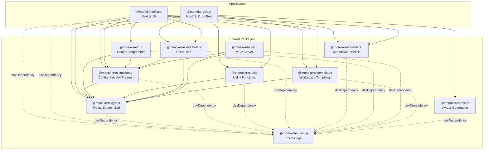
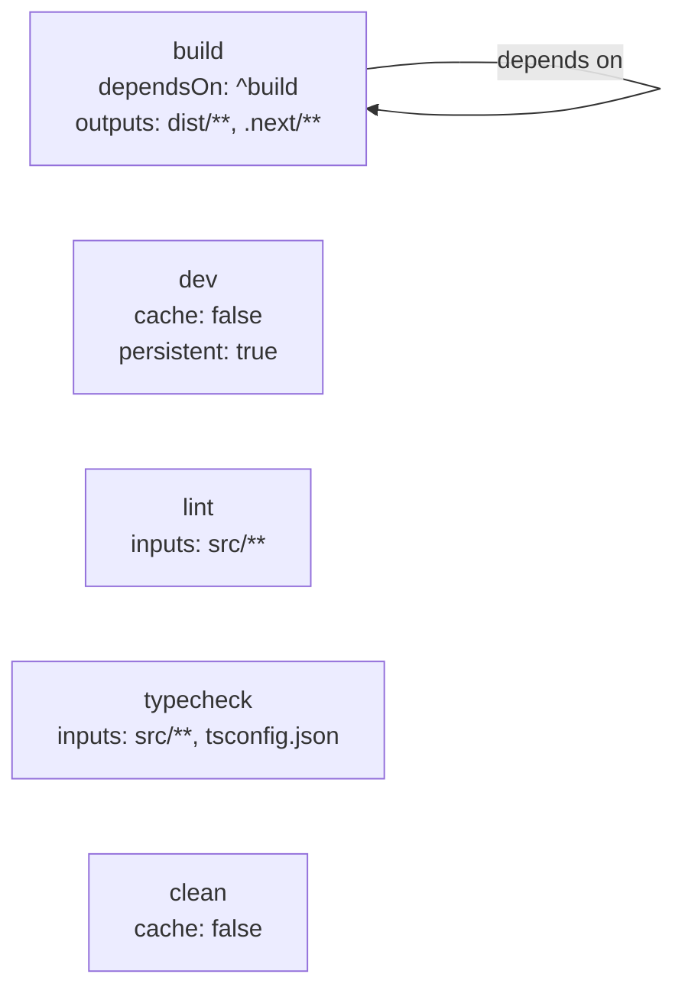

# Monorepo Structure

MonokerOS is a TurboRepo monorepo using Bun workspaces. It contains 2 applications and 10 shared packages. All packages use source-level imports -- there is no pre-build step for shared code. Package entry points are `main: "./src/index.ts"` (or `.tsx` for UI), and consumers import directly from TypeScript source.

---

## Repository Layout

```
monokeros/
  apps/
    api/              @monokeros/api       NestJS 11 on Bun (port 3001)
    web/              @monokeros/web       Next.js 15 + TurboPack (port 3000)
  packages/
    avatar/           @monokeros/avatar    Agent avatar generation (sharp)
    config/           @monokeros/config    Shared TypeScript configs
    constants/        @monokeros/constants Configuration values, industry presets
    mcp/              @monokeros/mcp       Model Context Protocol server
    mock-data/        @monokeros/mock-data Seed data for development
    renderer/         @monokeros/renderer  Markdown rendering pipeline
    templates/        @monokeros/templates Workspace template definitions
    types/            @monokeros/types     Shared TypeScript types, enums, Zod schemas
    ui/               @monokeros/ui        React component library (ShadCN-style)
    utils/            @monokeros/utils     Shared utility functions
  docs/                                    Documentation (this site)
  turbo.json                               TurboRepo pipeline configuration
  package.json                             Root workspace config
  tsconfig.json                            Root TypeScript config
```

---

## Package Dependency Graph



Every package (except `@monokeros/config`) has a `devDependency` on `@monokeros/config` for shared TypeScript configuration. The `config` package contains no runtime code -- only `tsconfig.*.json` files.

---

## Package Details

### @monokeros/types

**Role:** Single source of truth for all shared TypeScript types, enums, Zod validation schemas, and manifest definitions.

**Key exports:**
- `enums.ts` -- All platform enums: `MemberStatus`, `TaskStatus`, `WorkspaceIndustry`, `AiProvider` (31 providers), `WorkspaceRole`, `ConversationType`, `DriveType`, `AgentLifecycle`, and more
- `models.ts` -- Runtime model interfaces: `Member`, `Team`, `Project`, `Task`, `ChatMessage`, `Workspace`, `Permission`, `AcceptanceCriterion`, `TaskArtifact`, `GitRepoBinding`, `DoDCriterion`
- `validation.ts` -- Zod schemas for API request/response DTOs
- `ws.ts` -- WebSocket event name constants (`WS_EVENTS`)
- `zeroclaw.ts` -- Agent runtime types: `ZeroClawStatus`, `AgentRuntime`
- `manifests/` -- Kubernetes-style manifest schemas for declarative configuration

**Dependencies:** `zod`

```typescript
// Example: WS_EVENTS from ws.ts
export const WS_EVENTS = {
  chat: {
    message: 'chat:message',
    streamStart: 'chat:stream-start',
    streamChunk: 'chat:stream-chunk',
    streamEnd: 'chat:stream-end',
    typing: 'chat:typing',
    thinkingStatus: 'chat:thinking-status',
    toolStart: 'chat:tool-start',
    toolEnd: 'chat:tool-end',
  },
  member: { statusChanged: 'member:status-changed', ... },
  task: { created: 'task:created', updated: 'task:updated', moved: 'task:moved' },
  project: { gateUpdated: 'project:gate-updated' },
  notification: { created: 'notification:created', ... },
};
```

### @monokeros/constants

**Role:** Platform-wide configuration values, limits, timeouts, and industry preset definitions. These are product-defined business data and should not be modified without explicit instruction.

**Key exports:**
- `WORKSPACE_INDUSTRIES` -- Industry configurations with default teams, phases, labels, and icons
- `INDUSTRY_SUBTYPES` -- Valid subtypes per industry (e.g., Software Development: web, mobile, web3, ai_ml, gaming, embedded, desktop)
- `LAUNCH_INDUSTRIES` -- Subset of industries available at launch (5 of 15)
- Agent runtime constants: `DAEMON_MAX_HISTORY`, `LLM_TIMEOUT_MS`, `TOOL_REQUEST_TIMEOUT_MS`, `FILE_FETCH_TIMEOUT_MS`, `DEFAULT_ZAI_BASE_URL`, `DEFAULT_ZAI_MODEL`, `API_PORT`
- WebSocket constants: `WS_OPEN`

**Dependencies:** `@monokeros/types` (devDependency only)

### @monokeros/ui

**Role:** Shared React component library following ShadCN-style patterns. Provides foundational UI primitives used by the `apps/web` frontend.

**Dependencies:** `react`, `@monokeros/types`, `@monokeros/constants`

### @monokeros/utils

**Role:** Pure utility functions shared across apps and packages.

**Key exports:**
- `buildSearchKey()` -- Generates search-friendly normalized strings for filtering
- Formatting helpers for dates, names, file sizes, and display values

**Dependencies:** `@monokeros/types` (devDependency only)

### @monokeros/renderer

**Role:** Server-side markdown rendering pipeline. Converts agent response markdown into sanitized HTML with rich content support.

**Pipeline stages:**
1. **markdown-it** -- Core markdown parser (HTML disabled, linkify and typographer enabled)
2. **markdown-it-texmath** + **temml** -- LaTeX math (`$...$`, `$$...$$`) to MathML (zero client-side JavaScript)
3. **Mermaid plugin** -- Transforms `` ```mermaid `` code blocks into `<div class="mermaid-diagram">` placeholders
4. **Mention links plugin** -- Converts `@agent`, `#project`, `~task`, `:file` into styled `<span>` elements
5. **Heading IDs plugin** -- Adds `id` attributes for anchor navigation
6. **Prism.js** -- Syntax highlighting for 16+ languages
7. **sanitize-html** -- XSS prevention on the final output

**Dependencies:** `markdown-it`, `markdown-it-texmath`, `temml`, `prismjs`, `sanitize-html`

```typescript
// Usage
import { renderMarkdown } from '@monokeros/renderer';

const result = renderMarkdown(agentResponse);
// result.html      -> sanitized HTML string
// result.hasMermaid -> boolean (client should initialize Mermaid)
// result.hasMath    -> boolean (client should load math styles)
```

### @monokeros/mock-data

**Role:** Seed data for the development mock store. Provides a complete workspace with teams, agents, projects, tasks, conversations, and files for the "DU v2" demo workspace.

**Dependencies:** `@monokeros/types`, `@monokeros/constants` (devDependencies only)

### @monokeros/templates

**Role:** Workspace template definitions. Provides pre-configured workspace setups with teams, agents, and default configurations for each industry.

**Dependencies:** `@monokeros/types`

### @monokeros/mcp

**Role:** Model Context Protocol (MCP) server that exposes MonokerOS workspace data and operations to external AI tools (e.g., Claude, Cursor, Windsurf). Uses stdio transport for local integration.

**9 Tool Categories:**

| Category | Tools |
|---|---|
| **Members** | List members, get member details, update member |
| **Teams** | List teams, get team details |
| **Projects** | List projects, get project details |
| **Tasks** | List/create/update/move/assign tasks |
| **Conversations** | List conversations, send messages |
| **Files** | List drives, read/write files |
| **Agents** | List agents, start/stop agents |
| **Workspace** | Get workspace info, update settings |
| **Knowledge** | Search across knowledge directories |

**4 Resource Types:**
- Member resources, Team resources, Project resources, Workspace resources

**Configuration via environment:**
- `MONOKEROS_API_KEY` / `MK_API_KEY` -- API key for authentication
- `MONOKEROS_WORKSPACE` / `MK_WORKSPACE` -- Target workspace slug

**Dependencies:** `@modelcontextprotocol/sdk`, `@monokeros/types`, `@monokeros/constants`, `zod`

### @monokeros/avatar

**Role:** Programmatic avatar image generation for agents using `sharp`. Creates consistent, visually distinct avatars for each agent in the workspace.

**Dependencies:** `sharp`

### @monokeros/config

**Role:** Shared TypeScript configuration files. This is not a runtime package -- it exports no JavaScript. It provides:

- `tsconfig.base.json` -- Base config for all packages
- `tsconfig.nextjs.json` -- Config for `apps/web`
- `tsconfig.nestjs.json` -- Config for `apps/api`
- `tsconfig.library.json` -- Config for shared packages

---

## Tooling

### Runtime: Bun

Bun is the sole runtime for the entire monorepo. Node.js, npm, npx, and yarn are never used.

| Command | Purpose |
|---|---|
| `bun install` | Install all workspace dependencies |
| `bun run dev` | Start both apps via TurboRepo |
| `bun run typecheck` | Typecheck all packages (via turbo) |
| `bun run lint` | Lint all packages |
| `bun --watch src/main.ts` | Run API server with hot reload (in `apps/api/`) |
| `bunx next dev --port 3000 --turbopack` | Run web dev server (in `apps/web/`) |

### Typechecking: tsgo

MonokerOS uses `tsgo` (`@typescript/native-preview`) instead of the standard `tsc` compiler. This is the native (Go-based) TypeScript type checker, providing significantly faster type-checking performance.

```bash
# Per-package typecheck script
bunx @typescript/native-preview --noEmit
```

### Build System: TurboRepo

TurboRepo manages the build pipeline, task ordering, and caching. The `turbo.json` defines five tasks:



### Source-Level Imports

All shared packages use `main: "./src/index.ts"` in their `package.json`. This means:

1. No `build` step is required before running the apps in development.
2. Changes to shared packages are immediately reflected without rebuilding.
3. TurboPack (Next.js) and Bun (API) both resolve imports directly to TypeScript source.
4. Type checking covers the full dependency chain in a single pass.

```json
// Example: packages/types/package.json
{
  "name": "@monokeros/types",
  "main": "./src/index.ts",
  "types": "./src/index.ts"
}
```

This is possible because both Bun and TurboPack natively understand TypeScript imports without requiring transpilation.

---

## Application Details

### @monokeros/api (NestJS 11 on Bun)

The API server runs directly on Bun (not Node.js). NestJS 11 is used for its decorator-based routing, dependency injection, and gateway (WebSocket) support.

**Key dependencies beyond shared packages:**
- `@nestjs/common`, `@nestjs/core`, `@nestjs/websockets` -- NestJS framework
- `grammy` -- Telegram bot integration
- `reflect-metadata` -- Required by NestJS decorators
- `rxjs` -- Required by NestJS internals
- `zod` -- Request validation

**Module structure:**
```
apps/api/src/
  auth/           Authentication (JWT, API keys, guards)
  chat/           Chat messaging and agent interaction
  common/         Shared base classes (BaseGateway)
  docs/           Documentation serving endpoints
  files/          Drive file management
  identity/       Agent identity generation (randomuser.me)
  knowledge/      Knowledge base search
  members/        Agent/member CRUD and lifecycle
  models/         AI model catalog and listing
  notifications/  Real-time notification system
  platform/       BunWsAdapter, platform utilities
  projects/       Project and gate management
  render/         Server-side markdown/CSV rendering
  store/          MockStore (in-memory data layer)
  tasks/          Task CRUD and workflow
  teams/          Team management
  telegram/       Telegram bot integration (Grammy)
  templates/      Workspace template marketplace
  workspace/      Workspace CRUD and configuration
  openclaw/       OpenClaw agent runtime service
  main.ts         Application bootstrap
```

### @monokeros/web (Next.js 15)

The frontend is a Next.js 15 application using the App Router, React 19, TurboPack for development, and Tailwind CSS v4.

**Key dependencies beyond shared packages:**
- `@xyflow/react` -- Interactive org chart (React Flow)
- `@dnd-kit/*` -- Drag-and-drop for kanban boards
- `mermaid` -- Client-side Mermaid diagram rendering
- `@phosphor-icons/react` -- Icon library
- `codeflask` -- Code editor widget
- `next` v15 -- Framework with App Router
- `react` + `react-dom` v19

**Route structure:**
```
app/
  login/                    Login page
  workspaces/               Workspace launchpad
  [workspace]/              Dynamic workspace routes
    projects/[project]/     Project views (kanban, gantt, list, queue)
    chat/[conversation]/    Chat interface
    files/                  Drive explorer
    roles/                  RBAC management
    settings/               Workspace settings
    org/                    Org chart visualization
```

---

## Related Pages

- [System Architecture](overview.md) -- How the layers fit together
- [Design Inspirations](inspirations.md) -- Where the architecture came from
- [MCP Server](../technical/mcp.md) -- Deep dive into the Model Context Protocol integration
- [Rendering Pipeline](../technical/rendering.md) -- Markdown processing details
