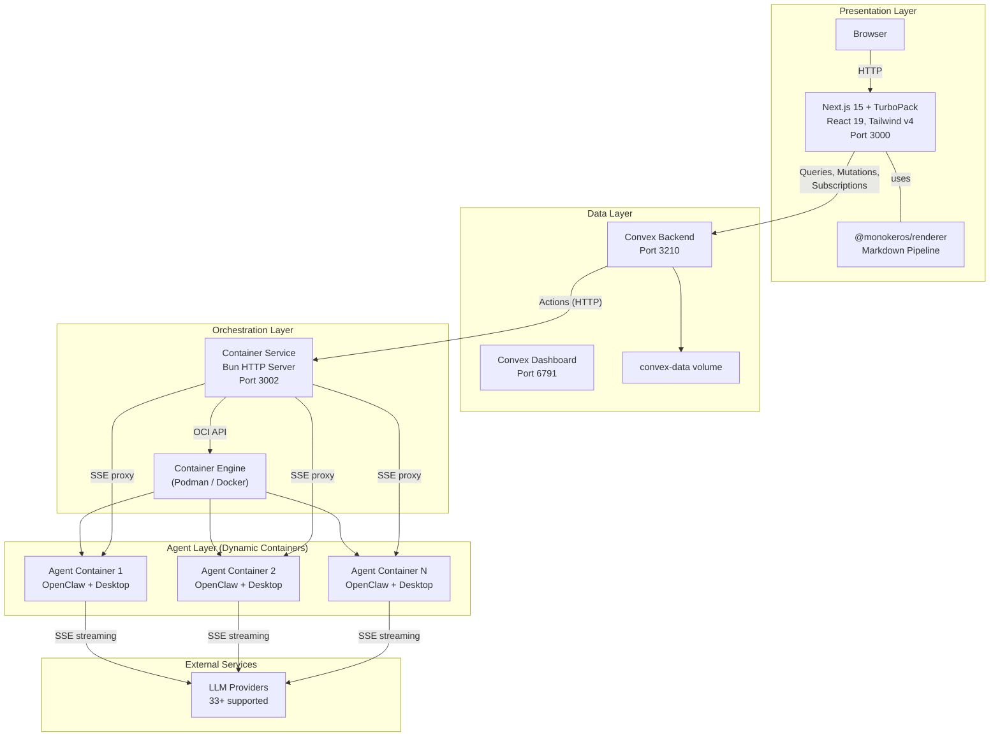
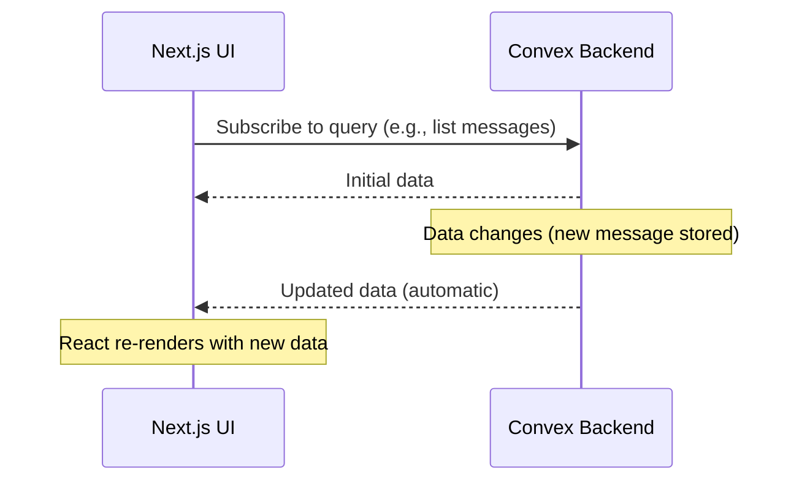
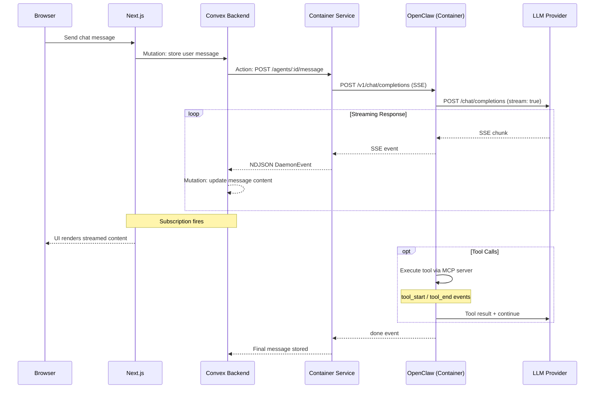
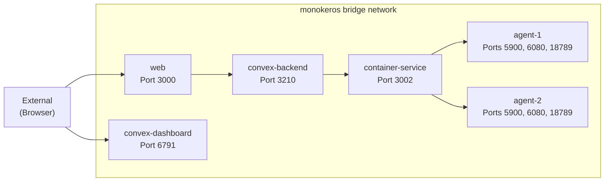

# System Architecture

MonokerOS follows a four-layer architecture: a React presentation tier, a Convex real-time data layer, a Container Service for OCI container orchestration, and individual containers running agent runtimes. Each layer has a distinct responsibility and communicates with adjacent layers through well-defined interfaces.

MonokerOS is designed around **pluggable backends** at every layer -- OCI-compatible container runtimes (Podman, Docker, Kubernetes planned), swappable agentic runtimes (OpenClaw default; nanobot, ZeroClaw, NanoClaw, PicoClaw, MimiClaw planned), and integration bridges for existing productivity tools (Jira, Slack, Google Drive, and more). This makes it a drop-in solution or integration point for organizations of any size.

---

## High-Level System Diagram



---

## The Four Layers

### 1. Presentation Layer (Next.js 15)

The frontend is a Next.js 15 application running with TurboPack on port 3000. It uses React 19, Tailwind CSS v4, and imports shared packages directly at the source level (no build step required for packages).

Key responsibilities:

- Rendering the workspace UI (org chart, kanban boards, file browser, chat)
- Subscribing to Convex queries for real-time data updates
- Calling Convex mutations for user actions (create task, send message, etc.)
- Rich content rendering via `@monokeros/renderer` (markdown, LaTeX, Mermaid, code highlighting)

Key UI dependencies:

| Library | Purpose |
|---------|---------|
| `@xyflow/react` | Interactive org chart visualization (React Flow) |
| `@dnd-kit` | Drag-and-drop for kanban boards and sortable lists |
| `mermaid` | Client-side Mermaid diagram rendering |
| `@phosphor-icons/react` | Icon system |
| `codeflask` | Inline code editor component |

### 2. Data Layer (Convex)

Convex is a self-hosted real-time backend running on port 3210. It replaces the traditional REST API + database combination with a single system that provides:

- **Schema-enforced tables** -- All data is stored in typed Convex tables with validation
- **Real-time subscriptions** -- The UI subscribes to queries that automatically re-run when underlying data changes
- **Mutations** -- Transactional writes that trigger subscription updates
- **Actions** -- Server-side functions that can call external services (like the Container Service)
- **Auth** -- Built-in authentication with password-based login and session management
- **File storage** -- Native file storage for attachments and uploads

Convex tables:

| Table | Description |
|-------|-------------|
| `workspaces` | Workspace configuration and metadata |
| `workspaceMembers` | Human user memberships and roles |
| `members` | Agent and human member records |
| `teams` | Team definitions |
| `projects` | Project definitions, phases, gates |
| `tasks` | Individual work items |
| `conversations` | Chat conversations |
| `messages` | Chat messages |
| `files` | File metadata |
| `notifications` | User notifications |
| `apiKeys` | Programmatic access keys (mk_ prefix) |
| `agentRuntimes` | Agent container state |
| `activities` | Activity log / audit trail |

The Convex Dashboard (port 6791) provides a web UI for inspecting tables, running queries, and monitoring the backend.

### 3. Orchestration Layer (Container Service)

The Container Service is a lightweight Bun HTTP server running on port 3002. It manages the lifecycle of agent containers and acts as an SSE proxy between Convex and the agentic runtime instances running inside agent containers.

The Container Service is **OCI-compatible** -- it communicates with any container engine that exposes the Docker-compatible REST API over a Unix socket. At startup, the runtime detection module (`runtime.ts`) auto-detects the available engine, preferring Podman (daemonless, rootless) and falling back to Docker. Kubernetes support for distributing agents across a cluster is planned.

Key responsibilities:

- **Container lifecycle** -- Start, stop, and restart agent containers via the Podman/Docker Engine API
- **SSE proxy** -- Forward messages from Convex actions to the agentic runtime endpoint inside agent containers, and stream SSE responses back as NDJSON
- **Health monitoring** -- Track container health and report status back to Convex
- **File provisioning** -- Write agent identity files (SOUL.md, AGENTS.md, TOOLS.md, USER.md, openclaw.json) into agent data volumes before container start
- **Runtime detection** -- Auto-detect Podman or Docker at startup; configurable via `CONTAINER_RUNTIME` or `CONTAINER_SOCKET` env vars

### 4. Agent Layer (OCI Containers)

Each running agent is an isolated OCI container with a full Linux desktop environment. The default agentic runtime is **OpenClaw**, but the architecture is runtime-agnostic -- planned backends include nanobot, ZeroClaw, NanoClaw, PicoClaw, and MimiClaw. Any runtime that exposes an OpenAI-compatible `/v1/chat/completions` streaming endpoint can be used. See [Agents](../core-concepts/agents.md) for detailed container architecture.

Container specifications:

| Property | Value |
|----------|-------|
| Base image | Ubuntu 24.04 |
| Desktop | OpenBox + Xvnc + noVNC |
| Browser | Google Chrome |
| Runtime | Bun + OpenClaw |
| Ports | 5900 (VNC), 6080 (noVNC), 18789 (OpenClaw) |
| RAM limit | 512 MB |
| CPU limit | 1 core |
| SHM | 256 MB |
| User | Non-root `agent` user |

Agent containers are spawned dynamically by the Container Service via the OCI-compatible engine API. They are not defined in `docker-compose.yml` -- only the infrastructure services (Convex, Container Service, Web) are statically defined.

---

## Data Flow

### Real-Time UI Updates

All real-time data flows through Convex subscriptions:



There are no WebSocket connections between the browser and the API. Convex handles all real-time synchronization natively.

### Agent Communication Flow

When a user sends a message to an agent:



---

## Security Model

### Authentication

MonokerOS uses two authentication mechanisms:

| Method | Format | Use Case |
|--------|--------|----------|
| **Convex Auth** | Password-based sessions | Human users logging in through the web UI |
| **API Keys** | `mk_` prefixed tokens | Programmatic access from external tools and MCP clients |

API keys are stored in the `apiKeys` Convex table, scoped to a workspace and member, and carry the member's role.

### Authorization

Role-based access control is enforced at the Convex layer:

| Role | Permissions |
|------|-------------|
| **Admin** | Full control including workspace configuration, member management, and provider setup |
| **Validator** | Read/write on most resources, gate approvals, but no workspace-level admin |
| **Viewer** | Read-only access to all resources |

Every Convex table has a `workspaceId` field. All queries and mutations verify that the authenticated user has access to the workspace and sufficient role permissions.

### Container Service Security

The Container Service uses Bearer token authentication. Convex actions include a shared secret when calling the Container Service API. Unauthorized requests are rejected.

### Agent Container Security

Agent containers run with restricted privileges:

- Non-root `agent` user
- `no-new-privileges` security option
- Read-only VNC by default (humans can observe but not interact with the desktop)
- Resource limits (512MB RAM, 1 CPU) prevent runaway consumption
- Containers are isolated on the bridge network (Podman rootless adds an extra layer of host isolation)

---

## Network Architecture

All services communicate over a bridge network (`monokeros`):



Internal DNS allows services to reference each other by container name (e.g., `convex-backend:3210`, `container-service:3002`). Both Podman and Docker support this via the bridge network driver.

### Volumes

| Volume | Purpose |
|--------|---------|
| `convex-data` | Persistent Convex database storage |
| `agent-data` | Shared volume for agent identity files and workspace data |
| `chromium-cache` | Shared Chromium cache (~250MB) to avoid per-container download |

---

## Docker Compose Services

The `docker-compose.yml` defines the infrastructure services:

| Service | Image | Port | Description |
|---------|-------|------|-------------|
| `convex-backend` | `ghcr.io/get-convex/convex-backend` | 3210 | Self-hosted Convex backend |
| `convex-dashboard` | Convex dashboard image | 6791 | Convex data inspection UI |
| `container-service` | Custom (Bun) | 3002 | OCI container orchestration and SSE proxy |
| `web` | Custom (Next.js) | 3000 | Presentation layer |

Agent containers are not listed in `docker-compose.yml`. They are created dynamically by the Container Service via the OCI-compatible engine API (Podman or Docker).

---

## Technology Stack

| Layer | Technology | Purpose |
|-------|-----------|---------|
| Frontend | Next.js 15 + TurboPack | Server-rendered React application |
| UI Framework | React 19 + Tailwind CSS v4 | Component rendering and styling |
| Data Backend | Convex (self-hosted) | Real-time database, auth, file storage |
| Orchestration | Bun HTTP server | Container lifecycle management |
| Containerization | Podman / Docker (OCI-compatible) | Agent isolation and resource management. Kubernetes planned. |
| Agent Runtime | OpenClaw (default, pluggable) | LLM orchestration, tool calling, conversation management. nanobot, ZeroClaw, NanoClaw, PicoClaw, MimiClaw planned. |
| Desktop | Xvnc + noVNC + OpenBox | Virtual desktop environment for agents |
| Rendering | markdown-it + Prism.js + temml | Markdown, code, math, and diagram rendering |
| Package Manager | Bun | Monorepo workspace management and script execution |
| Build System | TurboRepo | Monorepo task orchestration |
| Type Checking | tsgo (@typescript/native-preview) | Fast native TypeScript type checking |
| Linting | oxlint | Fast Rust-based linter |

---

## Monorepo Structure

```
monokeros/
  apps/
    web/                  -- Next.js 15 + TurboPack (port 3000)
    api/                  -- NestJS 11 (LEGACY, being replaced by Convex)
  convex/                 -- Convex backend (schema, functions, auth, seed)
  services/
    container-service/    -- Bun HTTP server for Docker management (port 3002)
  docker/
    openclaw-desktop/        -- Agent container Dockerfile + entrypoint
    container-service/    -- Container Service Dockerfile
    web/                  -- Web app Dockerfile
  packages/
    types/                -- TypeScript types, manifests, Zod validation
    constants/            -- Industry presets, status colors, provider catalog
    ui/                   -- 30+ headless React components
    utils/                -- Helpers (generateId, formatTimestamp, slugify, cn)
    mcp/                  -- Model Context Protocol server
    renderer/             -- Markdown pipeline (Prism, LaTeX, Mermaid, mentions)
    templates/            -- Workspace templates (law-firm, web-dev-agency, etc.)
    avatar/               -- SVG avatar generator
```

All packages use `main: "./src/index.ts"` for source-level imports with no pre-build step required.

---

## Related Pages

- [Agents](../core-concepts/agents.md) -- Agent container architecture and lifecycle
- [Workspaces](../core-concepts/workspaces.md) -- Workspace configuration and multi-tenancy
- [Chat](../features/chat.md) -- Real-time messaging and streaming
- [Monorepo Structure](monorepo.md) -- Package dependency graph and tooling
