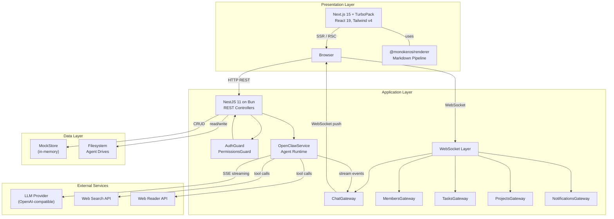
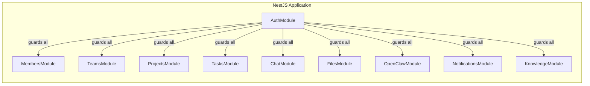
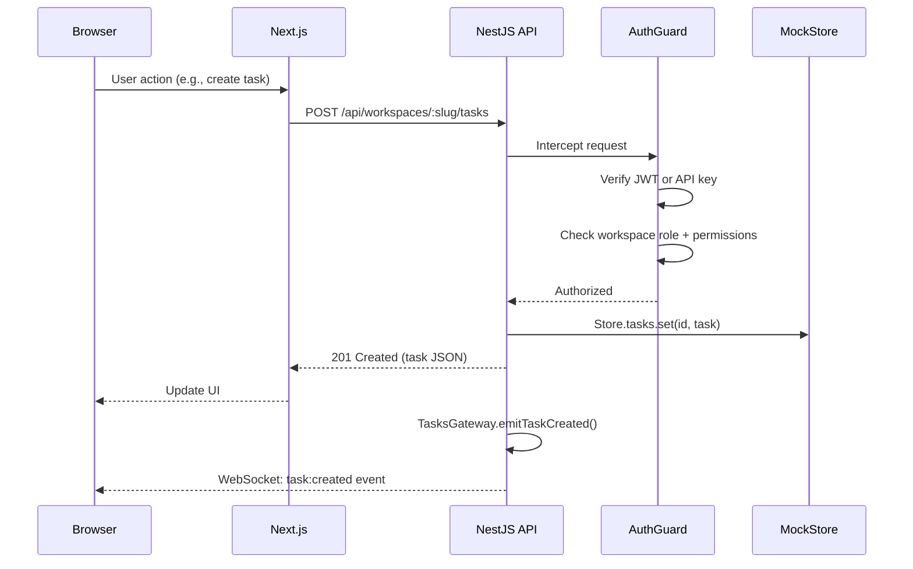
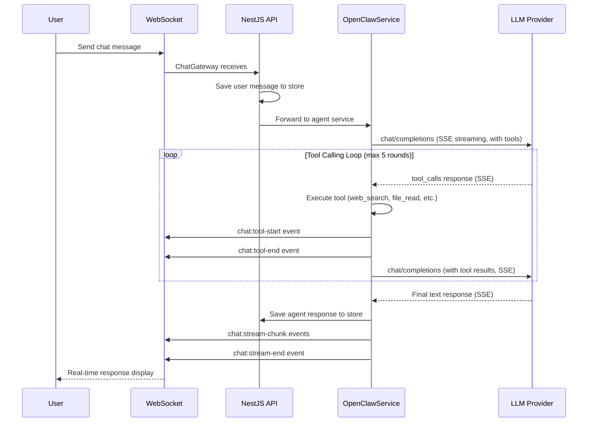
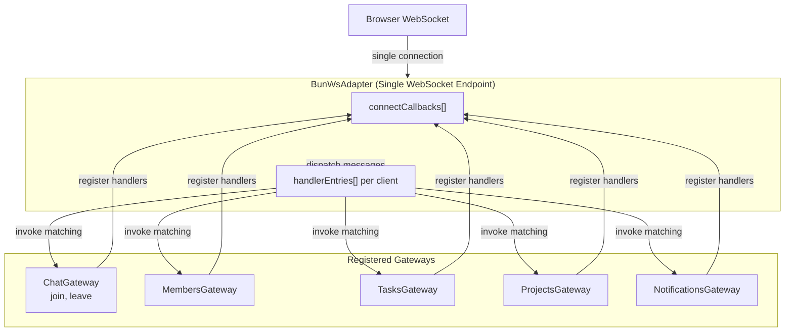
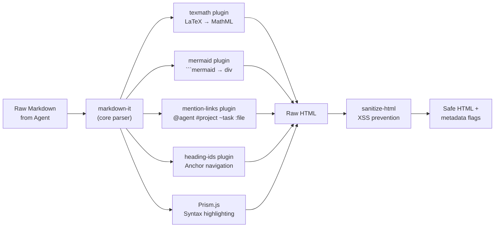
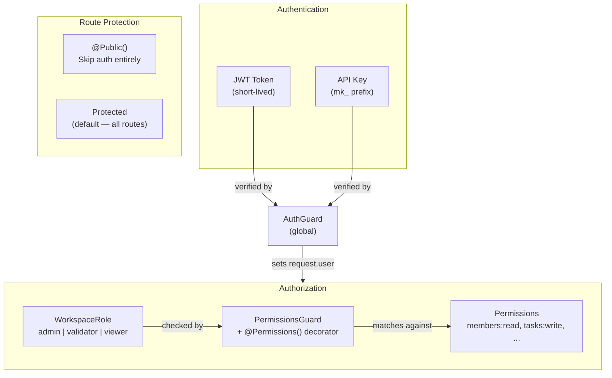

# System Architecture

MonokerOS follows a three-layer architecture: a React-based presentation tier, a NestJS application tier running on Bun, and a data tier that currently uses an in-memory mock store (with SQLite planned). Agent intelligence is provided by the OpenClaw service -- an in-process NestJS service that calls LLM providers directly via SSE streaming using the OpenAI-compatible API pattern.

---

## High-Level System Diagram



---

## The Three Layers

### 1. Presentation Layer (Next.js 15)

The frontend is a Next.js 15 application running with TurboPack on port 3000. It uses React 19, Tailwind CSS v4, and imports shared packages directly at the source level (no build step required for packages).

Key UI dependencies:
- **@xyflow/react** -- Interactive org chart visualization (React Flow)
- **@dnd-kit** -- Drag-and-drop for kanban boards and sortable lists
- **mermaid** -- Client-side Mermaid diagram rendering
- **@phosphor-icons/react** -- Icon system
- **codeflask** -- Inline code editor component

The rendering pipeline (`@monokeros/renderer`) processes agent responses on the server side, converting markdown to sanitized HTML with support for LaTeX math, syntax highlighting, Mermaid diagram placeholders, and entity mention links.

### 2. Application Layer (NestJS 11 on Bun)

The API runs on port 3001 using NestJS 11 with Bun as the runtime (not Node.js). It exposes both REST endpoints for CRUD operations and WebSocket connections for real-time events.



**Authentication** is handled by a global `AuthGuard` that intercepts every request:
1. Routes decorated with `@Public()` bypass authentication entirely.
2. Tokens starting with `mk_` are validated as API keys against the `ApiKeyService`.
3. All other Bearer tokens are verified as JWTs via the `AuthService`.

**RBAC** uses workspace-scoped roles (`admin`, `validator`, `viewer`) checked via a `PermissionsGuard` with granular permission strings like `members:read`, `tasks:write`, and `files:admin`.

### 3. Data Layer (Mock Store / Future SQLite)

The current data tier is an in-memory `MockStore` -- a singleton service that holds all workspace state in TypeScript Maps. This is seeded on startup with demo data and is wiped on server restart.

The planned migration path replaces `MockStore` with SQLite via `bun:sqlite`:
- A global `registry.db` for workspace list and user memberships
- Per-workspace `workspace.db` files for all runtime state
- WAL mode with 30-second busy timeout for concurrent access

File storage uses the physical filesystem, organized by drive category:
```
drives/
  members/{agent-name}/
  teams/{team-name}/
  projects/{project-name}/
  workspace/shared/
```

---

## Request Flow

### HTTP REST (CRUD Operations)



### WebSocket (Real-Time Events)

The WebSocket layer uses a custom `BunWsAdapter` that bridges NestJS gateway decorators with Bun's native WebSocket server. Multiple gateways share a single WebSocket endpoint:

| Gateway | Events | Scope |
|---|---|---|
| `ChatGateway` | `chat:message`, `chat:stream-start`, `chat:stream-chunk`, `chat:stream-end`, `chat:typing`, `chat:thinking-status`, `chat:tool-start`, `chat:tool-end` | Room-scoped (per conversation) |
| `MembersGateway` | `member:status-changed`, `member:created`, `member:updated` | Global broadcast |
| `TasksGateway` | `task:created`, `task:updated`, `task:moved` | Global broadcast |
| `ProjectsGateway` | `project:gate-updated` | Global broadcast |
| `NotificationsGateway` | `notification:created`, `notification:read`, `notification:read-all` | Per-client |

The `BunWsAdapter` maintains an array of connect callbacks -- one per registered gateway -- so that all gateways' `@SubscribeMessage` handlers are invoked on incoming messages. This resolved a critical bug where only the last registered gateway's handlers were functional.

---

## Agent Runtime Architecture

Agent intelligence is provided by **OpenClawService** -- an in-process NestJS service that calls LLM providers directly. There are no child processes, no webhooks, and no NDJSON. The service runs within the NestJS API process and streams LLM responses via SSE (Server-Sent Events).

Key characteristics:

- **In-process execution** -- no separate daemon processes to manage or monitor
- **Per-agent conversation state** -- each agent maintains its own bounded message history
- **Independent LLM configuration** -- agents can use different models and providers
- **SSE streaming** -- responses are streamed directly from the LLM provider to the client via WebSocket



### Agent Provisioning

When an agent is started, `OpenClawService`:
1. Loads the agent's configuration including model settings and provider credentials
2. Builds the system prompt from `SOUL.md`, `FOUNDATION.md`, `AGENTS.md`, and `SKILLS.md` in the agent's runtime directory
3. Registers the agent as active and ready to receive messages
4. Resolves the LLM provider chain (agent override, workspace provider, environment default)

### SSE Streaming

OpenClawService sends requests to the LLM provider with `stream: true` and parses the SSE response in real time. Each SSE event contains a delta with either content tokens or tool call fragments. The service assembles these deltas into complete tool calls or content blocks and emits corresponding WebSocket events to the client as they arrive.

### Available Tools

Each agent has access to tools based on its role:

| Tool Category | Tools | Available To |
|---|---|---|
| **Standard** | `web_search`, `web_read`, `file_read`, `file_write`, `list_drives`, `knowledge_search` | All agents |
| **Admin** | `create_team`, `create_member`, `update_team`, `create_project`, `update_workspace` | Agents with admin context |
| **PM** | `create_task`, `assign_task`, `move_task`, `update_task`, `list_tasks`, `list_members`, `list_teams`, `list_projects`, `update_project`, `update_gate` | Keros (project manager) |
| **Delegation** | `delegate_to_keros` | Mono (dispatcher) |

---

## Multi-Gateway WebSocket Architecture



The `BunWsAdapter` is a custom WebSocket adapter that maps NestJS's gateway pattern onto Bun's native WebSocket API. It maintains:

- **`connectCallbacks[]`** -- An array of callbacks, one registered per gateway. On each new WebSocket connection, every callback fires to initialize that gateway's state for the client.
- **Handler entries per client** -- Each client accumulates handler entries from all gateways. When a message arrives (e.g., `{ event: "join", data: "conv-123" }`), the adapter invokes the matching `@SubscribeMessage('join')` handler from whichever gateway registered it.

This design ensures that ChatGateway's room-scoped `join`/`leave` handlers coexist with MembersGateway's global broadcast, TasksGateway's task events, and NotificationsGateway's per-client notifications -- all on a single WebSocket connection.

---

## Rendering Pipeline

Agent responses are markdown that may contain LaTeX math, Mermaid diagrams, code blocks, and entity mentions. The rendering pipeline (`@monokeros/renderer`) processes this server-side:



| Stage | Library | Purpose |
|---|---|---|
| Core parser | `markdown-it` | Parse markdown to HTML with linkify and typographer |
| LaTeX math | `markdown-it-texmath` + `temml` | Convert `$...$` and `$$...$$` to MathML (zero client JS) |
| Mermaid | Custom plugin | Replace `` ```mermaid `` blocks with `<div class="mermaid-diagram">` placeholders |
| Mentions | Custom plugin | Transform `@agent`, `#project`, `~task`, `:file` into styled `<span>` elements |
| Heading IDs | Custom plugin | Add `id` attributes to headings for anchor navigation |
| Syntax highlighting | Prism.js | Highlight code blocks in 16+ languages (TypeScript, Python, Rust, Go, SQL, etc.) |
| Sanitization | `sanitize-html` | Strip dangerous HTML while preserving safe rendering output |

The `renderMarkdown()` function returns a `RenderResult` with the sanitized HTML plus boolean flags (`hasMermaid`, `hasMath`) so the client knows whether to initialize Mermaid rendering or load math styles.

---

## Security Model



- **JWT tokens** authenticate human users. The payload contains `sub` (user ID), `email`, and `name`. Workspace role is resolved server-side per request.
- **API keys** (prefixed `mk_`) authenticate programmatic access. Each key is scoped to a workspace and member, carrying the member's role.
- The global `AuthGuard` is applied to every route by default. Only routes explicitly decorated with `@Public()` bypass authentication.

---

## Related Pages

- [Monorepo Structure](monorepo.md) -- Package dependency graph and tooling
- [Design Inspirations](inspirations.md) -- Kubernetes, OpenClaw, and Jira/Linear parallels
- [OpenClaw Service](../technical/daemon.md) -- Agent runtime architecture
- [WebSocket Protocol](../technical/websocket.md) -- Event format and gateway details
- [Authentication](../technical/auth.md) -- JWT, API keys, and RBAC details
