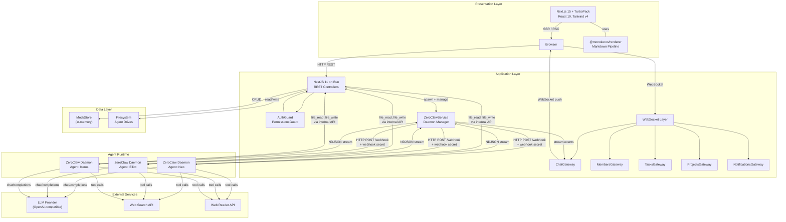
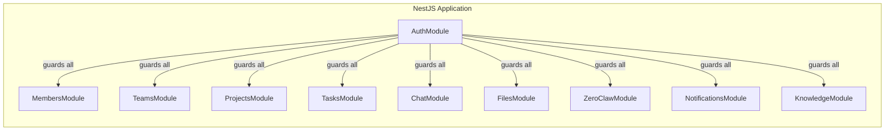
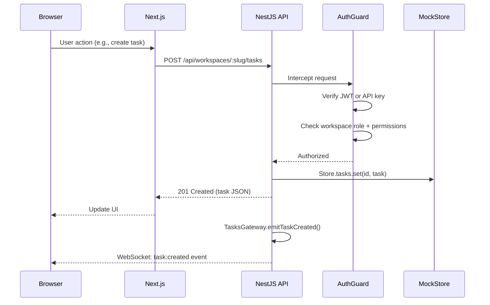
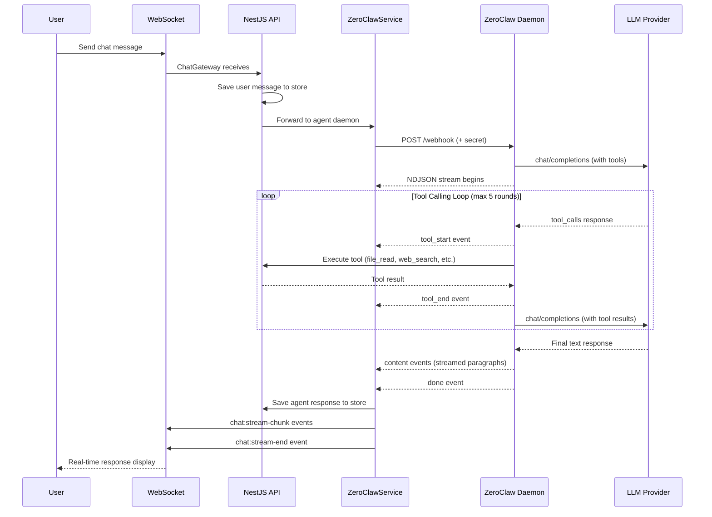
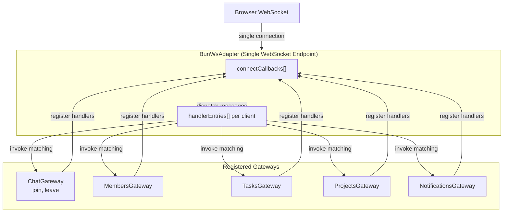
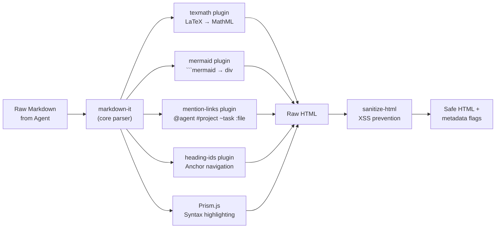
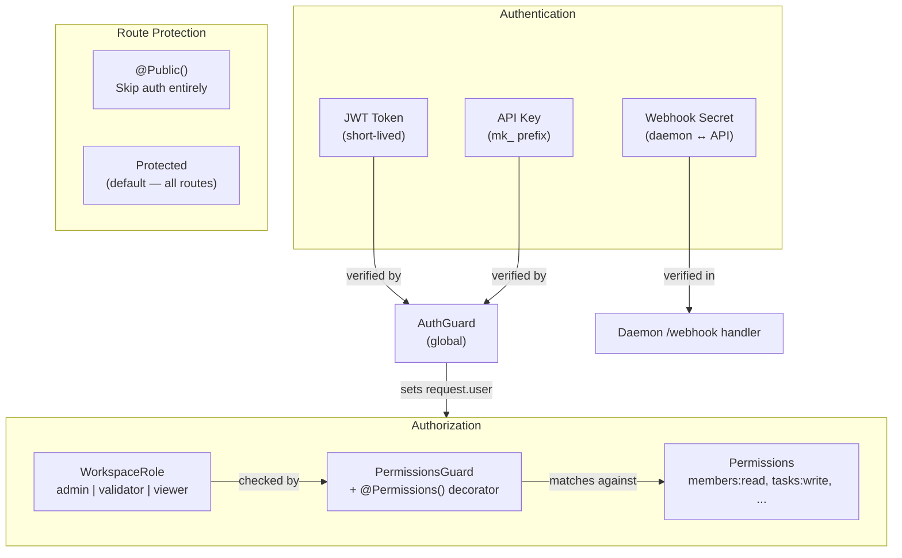

# System Architecture

MonokerOS follows a three-layer architecture: a React-based presentation tier, a NestJS application tier running on Bun, and a data tier that currently uses an in-memory mock store (with SQLite planned). Agent intelligence is provided by ZeroClaw daemon processes -- one per agent -- that communicate with LLM providers via the OpenAI-compatible API pattern.

---

## High-Level System Diagram



---

## The Three Layers

### 1. Presentation Layer (Next.js 15)

The frontend is a Next.js 15 application running with TurboPack on port 3000. It uses React 19, Tailwind CSS v4, and imports shared packages directly at the source level (no build step required for packages).

Key UI dependencies:
- **@xyflow/react** -- Interactive org chart visualization (React Flow)
- **@dnd-kit** -- Drag-and-drop for kanban boards and sortable lists
- **mermaid** -- Client-side Mermaid diagram rendering
- **@phosphor-icons/react** -- Icon system
- **codeflask** -- Inline code editor component

The rendering pipeline (`@monokeros/renderer`) processes agent responses on the server side, converting markdown to sanitized HTML with support for LaTeX math, syntax highlighting, Mermaid diagram placeholders, and entity mention links.

### 2. Application Layer (NestJS 11 on Bun)

The API runs on port 3001 using NestJS 11 with Bun as the runtime (not Node.js). It exposes both REST endpoints for CRUD operations and WebSocket connections for real-time events.



**Authentication** is handled by a global `AuthGuard` that intercepts every request:
1. Routes decorated with `@Public()` bypass authentication entirely.
2. Tokens starting with `mk_` are validated as API keys against the `ApiKeyService`.
3. All other Bearer tokens are verified as JWTs via the `AuthService`.

**RBAC** uses workspace-scoped roles (`admin`, `validator`, `viewer`) checked via a `PermissionsGuard` with granular permission strings like `members:read`, `tasks:write`, and `files:admin`.

### 3. Data Layer (Mock Store / Future SQLite)

The current data tier is an in-memory `MockStore` -- a singleton service that holds all workspace state in TypeScript Maps. This is seeded on startup with demo data and is wiped on server restart.

The planned migration path replaces `MockStore` with SQLite via `bun:sqlite`:
- A global `registry.db` for workspace list and user memberships
- Per-workspace `workspace.db` files for all runtime state
- WAL mode with 30-second busy timeout for concurrent access

File storage uses the physical filesystem, organized by drive category:
```
drives/
  members/{agent-name}/
  teams/{team-name}/
  projects/{project-name}/
  workspace/shared/
```

---

## Request Flow

### HTTP REST (CRUD Operations)



### WebSocket (Real-Time Events)

The WebSocket layer uses a custom `BunWsAdapter` that bridges NestJS gateway decorators with Bun's native WebSocket server. Multiple gateways share a single WebSocket endpoint:

| Gateway | Events | Scope |
|---|---|---|
| `ChatGateway` | `chat:message`, `chat:stream-start`, `chat:stream-chunk`, `chat:stream-end`, `chat:typing`, `chat:thinking-status`, `chat:tool-start`, `chat:tool-end` | Room-scoped (per conversation) |
| `MembersGateway` | `member:status-changed`, `member:created`, `member:updated` | Global broadcast |
| `TasksGateway` | `task:created`, `task:updated`, `task:moved` | Global broadcast |
| `ProjectsGateway` | `project:gate-updated` | Global broadcast |
| `NotificationsGateway` | `notification:created`, `notification:read`, `notification:read-all` | Per-client |

The `BunWsAdapter` maintains an array of connect callbacks -- one per registered gateway -- so that all gateways' `@SubscribeMessage` handlers are invoked on incoming messages. This resolved a critical bug where only the last registered gateway's handlers were functional.

---

## Daemon Architecture

Each AI agent runs as its own **ZeroClaw daemon** -- a standalone Bun HTTP server spawned as a child process via `Bun.spawn`. This isolation provides:

- **Independent failure domains** -- one agent crashing does not affect others
- **Per-agent conversation state** -- each daemon maintains its own bounded message history
- **Independent LLM configuration** -- agents can use different models and providers
- **Security isolation** -- each daemon gets a unique `ZEROCLAW_WEBHOOK_SECRET`



### Daemon Startup

When an agent is started, `ZeroClawService`:
1. Generates a unique `ZEROCLAW_WEBHOOK_SECRET` via `crypto.randomUUID()`
2. Writes `config.toml`, `SOUL.md`, `FOUNDATION.md`, `AGENTS.md`, and `SKILLS.md` to the agent's runtime directory
3. Spawns the daemon with `Bun.spawn(['bun', 'run', 'daemon.ts'], { cwd, env })`
4. Waits for the `/health` endpoint to respond before marking the agent as running

### NDJSON Streaming Protocol

The daemon responds to `/webhook` with a chunked NDJSON stream. Each line is a JSON object with a `type` field:

```
{"type":"status","data":{"phase":"thinking"}}
{"type":"tool_start","data":{"id":"call_1","name":"web_search","args":{"query":"React 19"}}}
{"type":"tool_end","data":{"id":"call_1","name":"web_search","durationMs":1523}}
{"type":"status","data":{"phase":"reflecting"}}
{"type":"content","data":{"text":"Based on my research..."}}
{"type":"content","data":{"text":"Based on my research...\n\nReact 19 introduces..."}}
{"type":"done","data":{"response":"Based on my research...\n\nReact 19 introduces..."}}
```

Content events are **accumulated** -- each `content` event contains all text up to that point, not just the new chunk. This simplifies client-side rendering.

### Available Tools

Each daemon has access to tools based on its role:

| Tool Category | Tools | Available To |
|---|---|---|
| **Standard** | `web_search`, `web_read`, `file_read`, `file_write`, `list_drives`, `knowledge_search` | All agents |
| **Admin** | `create_team`, `create_member`, `update_team`, `create_project`, `update_workspace` | Agents with admin context |
| **PM** | `create_task`, `assign_task`, `move_task`, `update_task`, `list_tasks`, `list_members`, `list_teams`, `list_projects`, `update_project`, `update_gate` | Keros (project manager) |
| **Delegation** | `delegate_to_keros` | Mono (dispatcher) |

### Critical Configuration: `idleTimeout`

`Bun.serve()` defaults to a 10-second `idleTimeout`. Since LLM API calls routinely exceed this, the daemon sets `idleTimeout: 255` (the maximum value in seconds). Without this, Bun silently kills the connection mid-flight, causing the "Thinking..." indicator to persist forever in the UI.

---

## Multi-Gateway WebSocket Architecture



The `BunWsAdapter` is a custom WebSocket adapter that maps NestJS's gateway pattern onto Bun's native WebSocket API. It maintains:

- **`connectCallbacks[]`** -- An array of callbacks, one registered per gateway. On each new WebSocket connection, every callback fires to initialize that gateway's state for the client.
- **Handler entries per client** -- Each client accumulates handler entries from all gateways. When a message arrives (e.g., `{ event: "join", data: "conv-123" }`), the adapter invokes the matching `@SubscribeMessage('join')` handler from whichever gateway registered it.

This design ensures that ChatGateway's room-scoped `join`/`leave` handlers coexist with MembersGateway's global broadcast, TasksGateway's task events, and NotificationsGateway's per-client notifications -- all on a single WebSocket connection.

---

## Rendering Pipeline

Agent responses are markdown that may contain LaTeX math, Mermaid diagrams, code blocks, and entity mentions. The rendering pipeline (`@monokeros/renderer`) processes this server-side:



| Stage | Library | Purpose |
|---|---|---|
| Core parser | `markdown-it` | Parse markdown to HTML with linkify and typographer |
| LaTeX math | `markdown-it-texmath` + `temml` | Convert `$...$` and `$$...$$` to MathML (zero client JS) |
| Mermaid | Custom plugin | Replace `` ```mermaid `` blocks with `<div class="mermaid-diagram">` placeholders |
| Mentions | Custom plugin | Transform `@agent`, `#project`, `~task`, `:file` into styled `<span>` elements |
| Heading IDs | Custom plugin | Add `id` attributes to headings for anchor navigation |
| Syntax highlighting | Prism.js | Highlight code blocks in 16+ languages (TypeScript, Python, Rust, Go, SQL, etc.) |
| Sanitization | `sanitize-html` | Strip dangerous HTML while preserving safe rendering output |

The `renderMarkdown()` function returns a `RenderResult` with the sanitized HTML plus boolean flags (`hasMermaid`, `hasMath`) so the client knows whether to initialize Mermaid rendering or load math styles.

---

## Security Model



- **JWT tokens** authenticate human users. The payload contains `sub` (user ID), `email`, and `name`. Workspace role is resolved server-side per request.
- **API keys** (prefixed `mk_`) authenticate programmatic access. Each key is scoped to a workspace and member, carrying the member's role.
- **Webhook secrets** secure daemon-to-API communication. Each daemon receives a unique `crypto.randomUUID()` secret at spawn time, validated on every `/webhook` request. After an API server restart, old daemons have stale secrets and return 401 -- all daemons must be killed before restarting the API.
- The global `AuthGuard` is applied to every route by default. Only routes explicitly decorated with `@Public()` bypass authentication.

---

## Related Pages

- [Monorepo Structure](monorepo.md) -- Package dependency graph and tooling
- [Design Inspirations](inspirations.md) -- Kubernetes, OpenClaw, and Jira/Linear parallels
- [Daemon System](../technical/daemon.md) -- Deep dive into ZeroClaw internals
- [WebSocket Protocol](../technical/websocket.md) -- Event format and gateway details
- [Authentication](../technical/auth.md) -- JWT, API keys, and RBAC details
