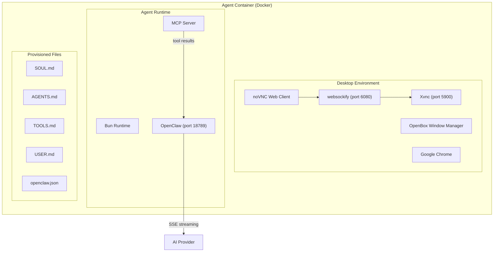
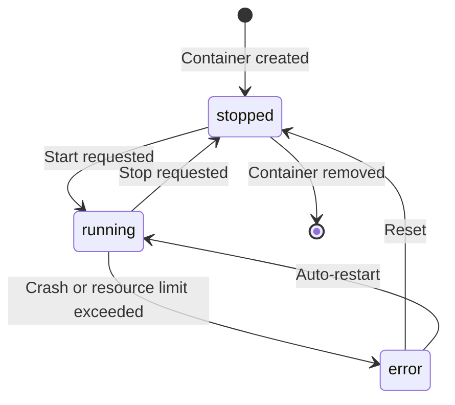
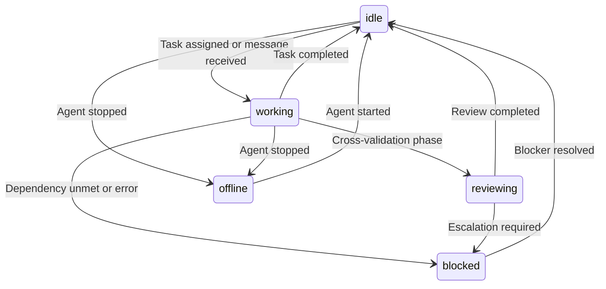
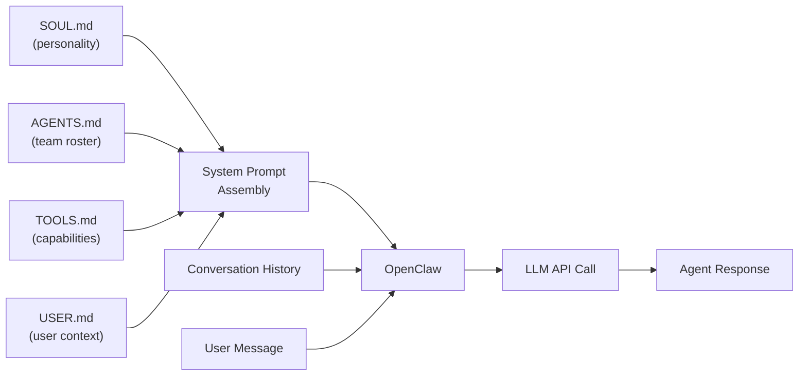
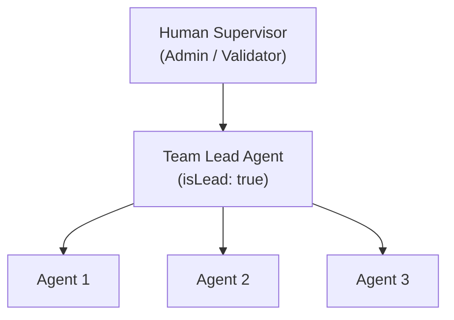

# Agents

An **agent** in MonokerOS is a containerized AI worker running inside its own Docker container. Each agent gets a full Linux desktop environment with a browser, a Bun runtime, and an OpenClaw instance that connects to an LLM provider. Agents are the fundamental unit of work -- they receive tasks, produce deliverables, participate in conversations, and collaborate with other agents through the team hierarchy.

---

## Container Architecture

Every running agent is an isolated Docker container built on a purpose-built stack:

| Component | Purpose |
|-----------|---------|
| **Ubuntu 24.04** | Base OS image |
| **OpenBox** | Lightweight window manager for the virtual desktop |
| **Xvnc** | Virtual framebuffer + VNC server on port 5900 |
| **websockify + noVNC** | WebSocket proxy on port 6080 for browser-based VNC access |
| **Google Chrome** | Full browser available to the agent for web research |
| **Bun** | JavaScript/TypeScript runtime |
| **OpenClaw** | Agent orchestration framework on port 18789 |
| **MCP Server** | Model Context Protocol server running inside the container |

### Resource Limits

Each agent container is constrained to prevent runaway resource consumption:

| Resource | Limit |
|----------|-------|
| RAM | 512 MB |
| CPU | 1 core |
| Shared memory (`/dev/shm`) | 256 MB |
| tmpfs | 100 MB |

The container runs as a non-root `agent` user with `no-new-privileges` enabled.

---

## Agent Lifecycle

Agents have three levels of state: a high-level lifecycle classification, a container state, and a runtime status.

### Lifecycle Levels

| Lifecycle | Description |
|-----------|-------------|
| `active` | Fully operational. Container is running or can be started on demand. |
| `standby` | Registered but not currently needed. Can be activated quickly. |
| `dormant` | Long-term inactive. Configuration preserved but not scheduled for use. |

### Container States

The Docker container itself transitions through these states:

| State | Description |
|-------|-------------|
| `stopped` | Container exists but is not running. No resource consumption. |
| `running` | Container is up and OpenClaw is accepting requests. |
| `error` | Container crashed or failed a health check. May auto-restart. |

### Runtime Statuses (UI-Level)

Once a container is running, the agent cycles through operational statuses visible in the UI:

| Status | Description |
|--------|-------------|
| `idle` | Running and ready. Available for task assignment or conversation. |
| `working` | Actively processing a task or responding to a message. |
| `reviewing` | Reviewing another agent's output during cross-validation. |
| `blocked` | Cannot proceed due to an unmet dependency, error, or escalation. |
| `offline` | Agent container is not running. Not accepting messages. |

---

## Provisioned Files

When a container starts, the Container Service writes identity files into the agent's working directory. These files define who the agent is, what it knows, and how it behaves.

| File | Purpose |
|------|---------|
| `SOUL.md` | The agent's core identity and personality. Becomes the system prompt sent to the LLM. Defines tone, expertise, and behavioral constraints. |
| `AGENTS.md` | Team roster listing all agents in the workspace, their roles, teams, and specializations. Provides inter-agent awareness. |
| `TOOLS.md` | Enumerated list of tools and capabilities available to the agent via the MCP server. |
| `USER.md` | Context about the human user interacting with the workspace -- preferences, role, and communication style. |
| `openclaw.json` | Machine-readable configuration for the OpenClaw runtime: model settings, provider credentials, MCP server endpoint, and channel configuration. |

### How Provisioned Files Shape Behavior

OpenClaw assembles a complete prompt by combining all provisioned files with conversation history and the user's message. This composite context shapes the agent's personality, knowledge, and behavioral boundaries for every interaction.

---

## Agent Identity

Each agent has a structured identity that defines who they are within the organization:

| Property | Type | Description |
|----------|------|-------------|
| `name` | `string` | Display name (e.g., "Sarah Chen") |
| `title` | `string` | Role title (e.g., "Senior UX Designer") |
| `specialization` | `string` | Area of expertise |
| `identity.soul` | `string` | Personality and behavioral instructions (system prompt text) |
| `identity.skills` | `string[]` | List of capabilities and competencies |
| `identity.memory` | `string[]` | Persistent memory entries across conversations |
| `teamId` | `string` | Team assignment |
| `isLead` | `boolean` | Whether this agent is a team lead |
| `system` | `boolean` | Whether this is a system agent |
| `gender` | `MemberGender` | Used for avatar generation |

---

## Model Configuration

Each agent can specify its own model configuration or inherit from the workspace default.

### Per-Agent Model Override

| Field | Type | Description |
|-------|------|-------------|
| `providerId` | `AiProvider` | Override the workspace default provider |
| `model` | `string` | Specific model name (e.g., `claude-sonnet-4-5-20250929`) |
| `apiKeyOverride` | `string` | Agent-specific API key (highest priority) |
| `temperature` | `number` | Sampling temperature (0.0 - 2.0, default: 0.7) |
| `maxTokens` | `number` | Maximum response tokens (default: 4096) |

### Provider Resolution Chain

When OpenClaw needs to call an LLM, credentials are resolved through a cascading chain:

```mermaid
flowchart TB
    subgraph APIKey["API Key Resolution"]
        AK1["agent.modelConfig.apiKeyOverride"] --> AK2["workspace provider.apiKey"]
        AK2 --> AK3["env: LLM_API_KEY"]
        AK3 --> AK4["empty string (fail)"]
    end

    subgraph BaseURL["Base URL Resolution"]
        BU1["workspace provider.baseUrl"] --> BU2["env: LLM_BASE_URL"]
        BU2 --> BU3["DEFAULT_LLM_BASE_URL"]
    end

    subgraph Model["Model Resolution"]
        M1["agent.modelConfig.model"] --> M2["workspace provider.defaultModel"]
        M2 --> M3["env: LLM_MODEL"]
    end
```

This means you can run a workspace where most agents use a cost-effective model (e.g., `gpt-4o-mini`) while lead agents or specialized reviewers use a more capable model (e.g., `claude-sonnet-4-5`). MonokerOS supports 33+ AI providers out of the box, including OpenAI, Anthropic, Google, DeepSeek, xAI, Mistral, OpenRouter, Ollama, Groq, and many more.

---

## Desktop Environment

Each agent has a virtual Linux desktop accessible through the browser via noVNC. The desktop provides:

- A full **Xvnc** virtual framebuffer on port 5900
- **websockify** on port 6080 bridging WebSocket to VNC
- **noVNC** web client for browser-based desktop viewing
- **OpenBox** as a lightweight window manager
- **Google Chrome** for web browsing and research

By default, the VNC connection is **read-only** -- humans can observe what the agent is doing on its desktop but cannot interact with it. This provides transparency into agent activities without risking interference.

---

## System Agents

MonokerOS includes two built-in system agents that are present in every workspace:

- **Mono** -- The platform dispatcher. Routes incoming messages to the appropriate agents, manages workspace operations, and handles agent provisioning.
- **Keros** -- The project manager. Manages projects, tasks, and team coordination. Has access to PM-specific tools (create/assign/move tasks, update projects).

System agents have the `system: true` flag and cannot be deleted or reassigned to teams.

---

## Agent Hierarchy

Agents are organized into a clear hierarchy within teams:

- **Humans** interact with **Team Leads** -- not directly with every individual agent
- **Team Leads** coordinate work within their team, conduct cross-validation, and communicate with other leads for cross-team collaboration
- **Agents** work on tasks assigned by their lead, produce deliverables, and participate in cross-validation reviews

---

## Observability

### Agent Runtime Info

The `agentRuntimes` table in Convex provides real-time observability into each agent:

| Field | Description |
|-------|-------------|
| `memberId` | Which agent this runtime belongs to |
| `status` | Container state (stopped, running, error) |
| `error` | Error message if in error state |
| `retryCount` | Number of restart attempts |
| `nextRetryAt` | When the next auto-retry is scheduled |
| `lifecycle` | High-level lifecycle: active, standby, or dormant |

### Performance Stats

Each agent tracks performance metrics:

- **Tasks completed** -- Total tasks marked done
- **Average agreement score** -- Mean cross-validation score across all reviewed tasks
- **Active projects** -- Number of projects currently assigned to

---

## Related Pages

- [Workspaces](./workspaces.md) -- The organizational boundary in which agents operate
- [Teams](./teams.md) -- How agents are organized into functional groups
- [Projects & Tasks](./projects.md) -- The work agents perform
- [Drives](./drives.md) -- Agent file systems and knowledge storage
