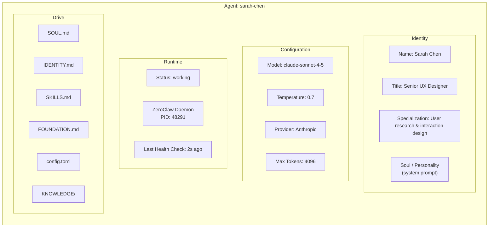
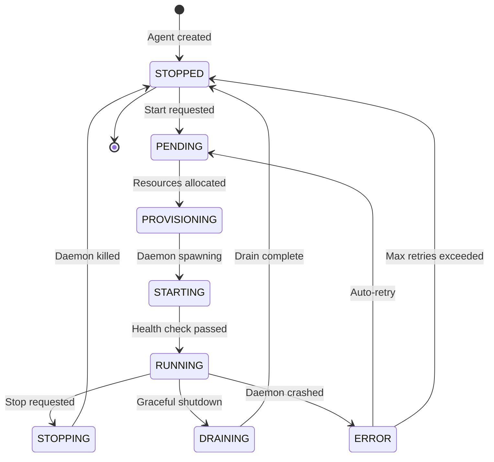
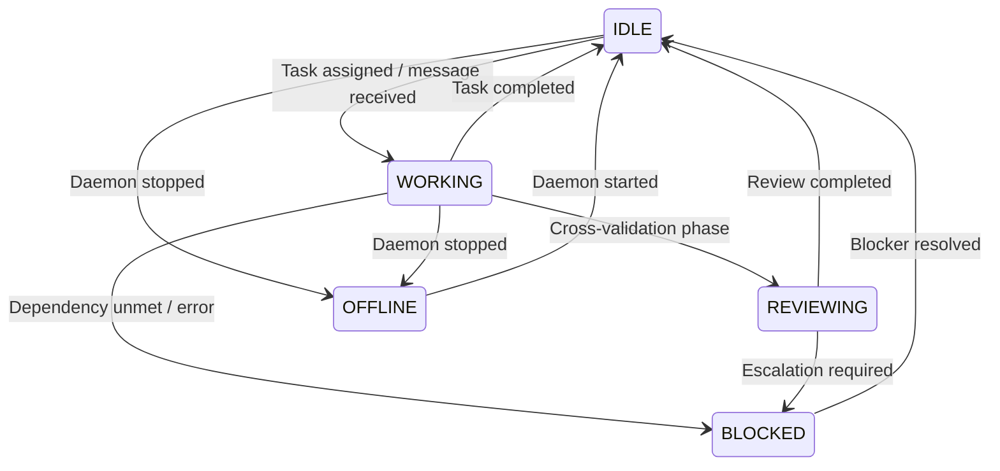
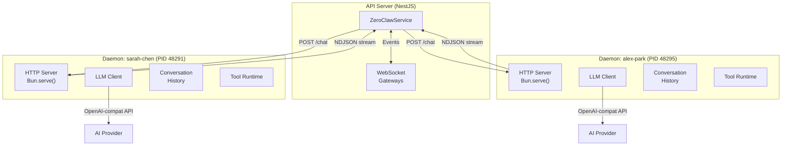
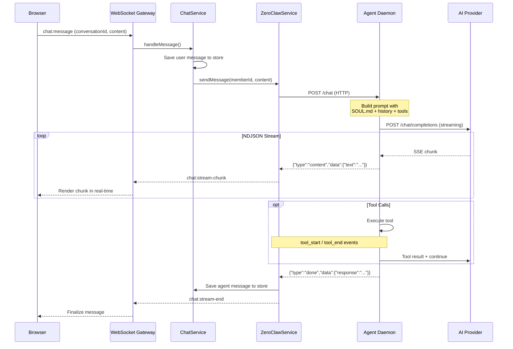
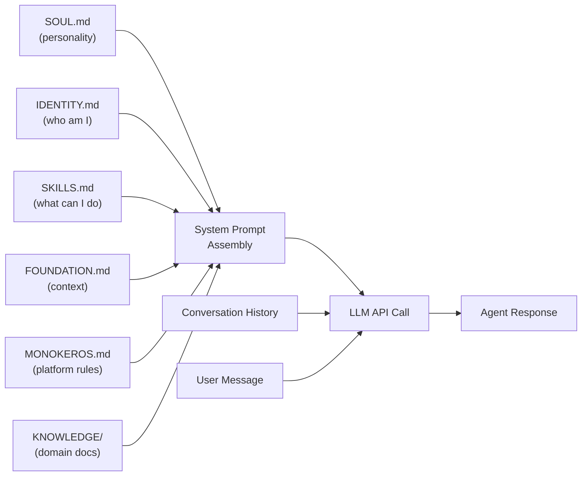
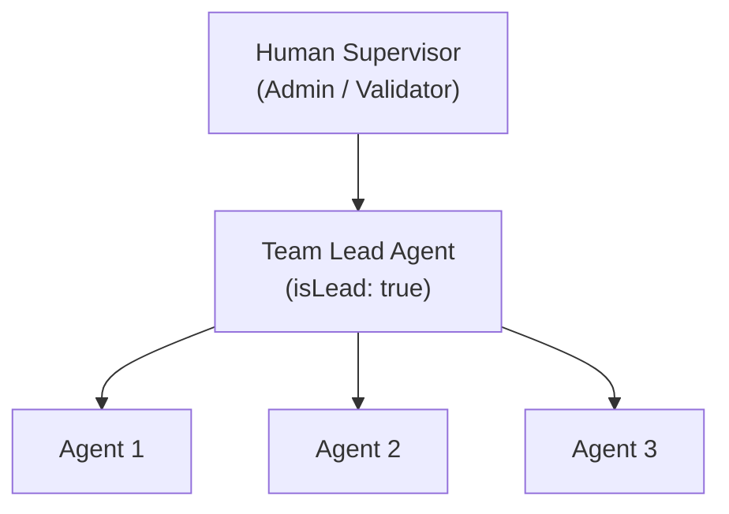

# Agents

Agents are the core primitive of MonokerOS. An agent is an autonomous AI worker that occupies a role within your organization -- the equivalent of a Kubernetes pod, an employee in your org chart, or an AI-powered team member. Each agent has a name, a role, a personality, a set of capabilities, and a model configuration that determines how it thinks.

MonokerOS treats agents as first-class citizens with their own identity, file system, memory, and communication channels.

---

## What Makes an Agent



---

## Agent Properties

| Property | Type | Description |
|----------|------|-------------|
| `id` | `string` | Unique identifier (UUID) |
| `name` | `string` | Display name (e.g., "Sarah Chen") |
| `type` | `MemberType` | `agent` (AI) or `human` |
| `title` | `string` | Role title (e.g., "Senior UX Designer") |
| `specialization` | `string` | Area of expertise (e.g., "User research & interaction design") |
| `teamId` | `string \| null` | Team assignment |
| `isLead` | `boolean` | Whether this agent is a team lead |
| `system` | `boolean` | Whether this is a system agent (Mono, Keros) |
| `status` | `MemberStatus` | Current operational status |
| `gender` | `MemberGender` | `1` (male) or `2` (female) -- used for avatar generation |
| `currentTaskId` | `string \| null` | Task currently being worked on |
| `currentProjectId` | `string \| null` | Active project assignment |
| `avatarUrl` | `string \| null` | Avatar image URL |
| `identity` | `MemberIdentity` | Soul (system prompt), skills list, and memory entries |
| `stats` | `MemberStats` | Performance metrics: tasks completed, avg agreement score, active projects |
| `modelConfig` | `AgentModelConfig` | Per-agent model overrides |
| `supervisedTeamIds` | `string[]` | Teams supervised by this agent (if lead/human) |
| `permissions` | `string[]` | Granular permission set |

---

## Agent Lifecycle

Agents go through a well-defined lifecycle from creation to active operation. The lifecycle is managed by the ZeroClaw daemon system.

### ZeroClaw Runtime States



| Status | Description |
|--------|-------------|
| `STOPPED` | No daemon process. Agent exists in configuration only. |
| `PENDING` | Start has been requested. Queued for provisioning. |
| `PROVISIONING` | Allocating resources, resolving provider credentials. |
| `STARTING` | `Bun.spawn` has been called. Waiting for health check. |
| `RUNNING` | Daemon is alive and accepting requests. |
| `STOPPING` | Graceful shutdown initiated. Completing in-flight requests. |
| `DRAINING` | Finishing active work before stopping. |
| `ERROR` | Daemon has crashed or health check failed. May auto-retry. |

### Operational Status (Member Status)

Once running, an agent cycles through operational statuses:



| Status | Description |
|--------|-------------|
| `idle` | Running but not actively processing work. Available for task assignment. |
| `working` | Actively processing a task or responding to a message. |
| `reviewing` | Participating in cross-validation -- reviewing another agent's output. |
| `blocked` | Cannot proceed due to an unmet dependency, error, or escalation. |
| `offline` | Daemon is not running. Agent is configured but inactive. |

### Agent Lifecycle Levels

Agents also have a higher-level lifecycle classification:

| Lifecycle | Description |
|-----------|-------------|
| `active` | Fully operational. Daemon runs or can be started on demand. |
| `standby` | Registered but not currently needed. Can be activated quickly. |
| `dormant` | Long-term inactive. Configuration preserved but not scheduled. |

---

## The Daemon System (ZeroClaw)

Each running agent is backed by a **ZeroClaw daemon** -- a standalone Bun process spawned via `Bun.spawn`. The daemon is the agent's "brain": it holds the conversation history, manages the LLM API connection, and executes tool calls.



Key daemon characteristics:

- **Isolation** -- Each agent has its own process. A crash in one daemon does not affect others.
- **Persistence** -- Daemons outlive server restarts. They run as independent child processes.
- **Webhook security** -- Each daemon receives a `ZEROCLAW_WEBHOOK_SECRET` environment variable. All HTTP calls from the API server must include this secret. If the API server restarts, old daemons have stale secrets and return `401`.
- **Health checks** -- The API server periodically pings each daemon's health endpoint.
- **Idle timeout** -- Daemons set `idleTimeout: 255` (maximum) on `Bun.serve()` to prevent premature connection termination during long LLM calls.
- **History management** -- Each daemon maintains up to `DAEMON_MAX_HISTORY` (50) messages of conversation context.

---

## Message Processing Flow

When a user sends a chat message to an agent, the following sequence occurs:



### Streaming Events

The daemon communicates via **NDJSON** (newline-delimited JSON) streaming. Each line is a `DaemonEvent`:

| Event Type | Description |
|------------|-------------|
| `status` | Phase indicator (e.g., "thinking", "researching") |
| `tool_start` | Agent is invoking a tool (name, args) |
| `tool_end` | Tool execution completed (name, duration) |
| `content` | Text chunk from the LLM response |
| `done` | Final complete response |
| `error` | Error occurred during processing |

These events are relayed through WebSocket events to the client in real time:

| WebSocket Event | Direction | Purpose |
|----------------|-----------|---------|
| `chat:stream-start` | Server to Client | Agent begins responding |
| `chat:stream-chunk` | Server to Client | Incremental text content |
| `chat:thinking-status` | Server to Client | Agent's current thinking phase |
| `chat:tool-start` | Server to Client | Tool invocation started |
| `chat:tool-end` | Server to Client | Tool invocation completed |
| `chat:stream-end` | Server to Client | Agent finished responding |

---

## System Files

Each agent has a personal [drive](./drives.md) containing system files that define its identity and behavior. These files are protected -- they cannot be renamed or deleted.

| File | Purpose |
|------|---------|
| `SOUL.md` | The agent's core identity and personality. This becomes the system prompt sent to the LLM. Defines tone, expertise boundaries, behavioral constraints. |
| `IDENTITY.md` | Structured identity document: name, title, specialization, team affiliation, background narrative. |
| `SKILLS.md` | Enumerated list of capabilities and tools the agent can use. Defines what the agent is allowed to do. |
| `FOUNDATION.md` | Foundational knowledge and context about the workspace, projects, and organizational norms. |
| `AGENTS.md` | Team roster listing all agents in the workspace, their roles, teams, and specializations. Read by the daemon for inter-agent awareness. |
| `config.toml` | Machine-readable configuration: model settings, daemon parameters, drive access flags. |
| `MONOKEROS.md` | Platform-level instructions injected by MonokerOS into the agent context. |
| `avatar.svg` / `avatar.png` | The agent's visual avatar. |
| `KNOWLEDGE/` | A protected directory containing domain knowledge documents the agent can reference. |

### How System Files Shape Agent Behavior



The daemon assembles a complete prompt by combining all system files with conversation history and the user's message. This composite context shapes the agent's personality, knowledge, and behavioral boundaries for every interaction.

---

## Model Configuration

Each agent can specify its own model configuration, or inherit from the workspace default. The resolution follows a cascading chain:

### Provider Resolution Chain

```mermaid
flowchart TB
    subgraph APIKey["API Key Resolution"]
        AK1["agent.modelConfig.apiKeyOverride"] --> AK2["workspace provider.apiKey"]
        AK2 --> AK3["env: ZAI_API_KEY"]
        AK3 --> AK4["empty string (fail)"]
    end

    subgraph BaseURL["Base URL Resolution"]
        BU1["workspace provider.baseUrl"] --> BU2["env: ZAI_BASE_URL"]
        BU2 --> BU3["DEFAULT_ZAI_BASE_URL"]
    end

    subgraph Model["Model Resolution"]
        M1["agent.modelConfig.model"] --> M2["workspace provider.defaultModel"]
        M2 --> M3["env: ZAI_MODEL"]
        M3 --> M4["glm-5 (default)"]
    end

```



### Per-Agent Model Override

| Field | Type | Description |
|-------|------|-------------|
| `providerId` | `AiProvider` | Override the workspace default provider |
| `model` | `string` | Specific model name (e.g., `claude-sonnet-4-5-20250929`) |
| `apiKeyOverride` | `string` | Agent-specific API key (highest priority) |
| `temperature` | `number` | Sampling temperature (0.0 - 2.0, default: 0.7) |
| `maxTokens` | `number` | Maximum response tokens (default: 4096) |

This means you can run a workspace where most agents use a cost-effective model (e.g., `gpt-4o-mini`) while lead agents or specialized reviewers use a more capable model (e.g., `claude-sonnet-4-5`).

---

## Agent Roles and Hierarchy

Agents are organized into a clear hierarchy within [teams](./teams.md):



- **Humans** interact with **Team Leads** -- never directly with individual agents
- **Team Leads** coordinate work within their team, conduct cross-validation, and communicate with other leads for cross-team collaboration
- **Agents** work on tasks assigned by their lead, produce deliverables, and participate in cross-validation reviews

### System Agents

MonokerOS includes two built-in system agents:

- **Mono** (`system_mono`) -- The platform orchestrator. Manages workspace operations, agent provisioning, and system health.
- **Keros** (`system_keros`) -- The project manager. Manages projects, tasks, gates, and team coordination. Has access to PM tools (create/assign/move tasks, update projects, manage gates).

System agents have the `system: true` flag and cannot be deleted or reassigned.

---

## Agent Autonomy and Constraints

Agent autonomy in MonokerOS is not unlimited. It is shaped and bounded by several layers:

1. **Soul (Personality)** -- The `SOUL.md` file defines the agent's persona, tone, expertise boundaries, and behavioral rules. An agent with a "Senior QA Engineer" soul will approach problems differently than one with a "Creative Director" soul.

2. **Skills** -- The `SKILLS.md` file enumerates what tools and capabilities the agent can use. An agent without a code execution skill cannot run code.

3. **Permissions** -- The granular permission system (`members:read`, `tasks:write`, `files:write`, etc.) controls what resources the agent can access. Default agent permissions include read/write on tasks, conversations, and files but not workspace administration.

4. **Communication hierarchy** -- Agents can only communicate within their team (with lead permission) and never across teams directly. All cross-team communication flows through leads.

5. **Cross-validation** -- Critical deliverables are cross-validated by multiple agents through the sink-fan pattern, preventing any single agent from unilaterally committing work.

6. **Human gates** -- SDLC gates require human approval before projects advance, providing a human-in-the-loop checkpoint.

---

## Kubernetes Manifest

Agents can be defined declaratively:

```yaml
apiVersion: v1
kind: Agent
metadata:
  name: sarah-chen
  labels:
    team: ui-ux-design
    seniority: senior
spec:
  displayName: "Sarah Chen"
  title: "Senior UX Designer"
  specialization: "User research, interaction design, and accessibility"
  identity:
    soulRef: "souls/ux-designer.md"
  model:
    provider: anthropic
    name: claude-sonnet-4-5-20250929
    temperature: 0.7
    maxTokens: 4096
  daemon:
    maxHistory: 50
    maxToolRounds: 5
  drives:
    personal: true
    team: true
```

The `identity` field supports either inline `soul` text or a `soulRef` pointing to an external file.

---

## Observability

### Agent Runtime Info

The `AgentRuntime` structure provides real-time observability into each agent's daemon:

| Field | Description |
|-------|-------------|
| `memberId` | Which agent this runtime belongs to |
| `pid` | OS process ID of the daemon |
| `status` | ZeroClaw status (stopped, running, error, etc.) |
| `lastHealthCheck` | Timestamp of the last successful health ping |
| `error` | Error message if in error state |
| `retryCount` | Number of restart attempts |
| `nextRetryAt` | When the next auto-retry is scheduled |
| `lifecycle` | High-level lifecycle: active, standby, or dormant |

### Performance Stats

Each agent tracks performance metrics:

- **Tasks completed** -- Total tasks marked done
- **Average agreement score** -- Mean cross-validation score across all reviewed tasks
- **Active projects** -- Number of projects currently assigned to

---

## Related Pages

- [Workspaces](./workspaces.md) -- The container in which agents operate
- [Teams](./teams.md) -- How agents are organized into functional groups
- [Projects & Tasks](./projects.md) -- The work agents perform
- [Drives](./drives.md) -- Agent file systems and knowledge storage
