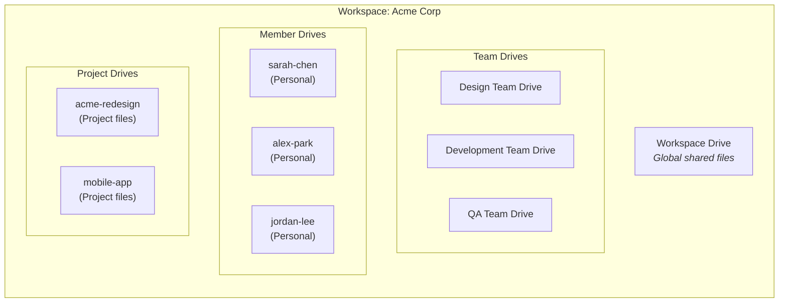
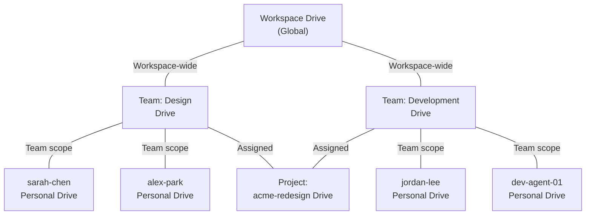
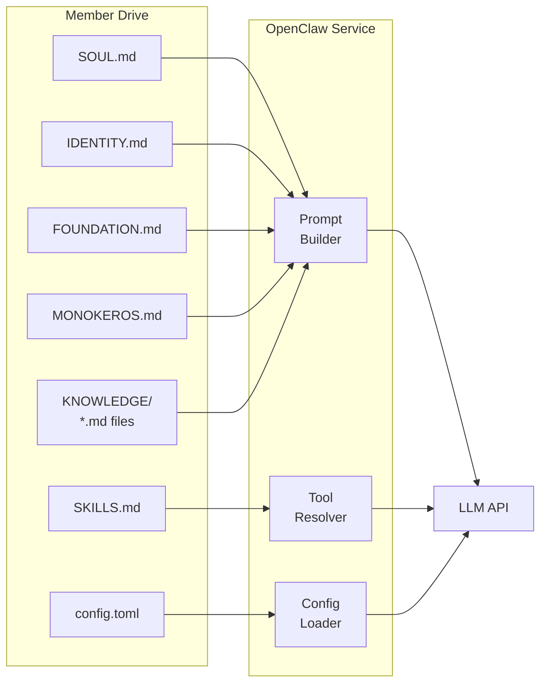
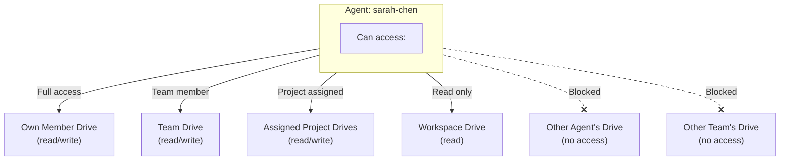

# Drives

**Drives** are the file storage system in MonokerOS -- the equivalent of Kubernetes PersistentVolumes, shared network drives, or cloud storage. Every entity in MonokerOS (agents, teams, projects, and the workspace itself) can have its own drive, creating a hierarchical file system where knowledge, deliverables, and configuration files live.

---

## What Is a Drive

A drive is a scoped file storage area attached to an entity. Drives contain files and directories that agents can read from and write to. They serve as the persistent memory layer for the AI workforce.



---

## Drive Types

MonokerOS defines four drive types, each scoped to a different entity:

| Type | Enum | Owner | Purpose |
|------|------|-------|---------|
| **Member Drive** | `member` | Individual [agent](./agents.md) | Personal workspace. System files, working documents, private notes. |
| **Team Drive** | `team` | [Team](./teams.md) | Shared team files. Style guides, templates, collaborative docs. |
| **Project Drive** | `project` | [Project](./projects.md) | Project deliverables, specs, assets, and documentation. |
| **Workspace Drive** | `workspace` | [Workspace](./workspaces.md) | Global shared resources. Company-wide policies, knowledge base. |

### Drive Hierarchy



---

## Drive Data Structures

### FileEntry

Every file and directory in a drive is represented as a `FileEntry`:

| Field | Type | Description |
|-------|------|-------------|
| `id` | `string` | Unique file identifier |
| `name` | `string` | File or directory name |
| `path` | `string` | Full path from the drive root |
| `type` | `FileEntryType` | `file` or `directory` |
| `size` | `number` | File size in bytes |
| `mimeType` | `string` | MIME type (e.g., `text/markdown`, `application/json`) |
| `modifiedAt` | `string` | ISO 8601 last modification timestamp |
| `children` | `FileEntry[]` | Nested files (directories only) |

### Drive Structures

Each drive type has a corresponding data structure:

```typescript
// Member Drive
interface MemberDrive {
  memberId: string;
  memberName: string;
  rootPath: string;
  files: FileEntry[];
}

// Team Drive
interface TeamDrive {
  id: string;
  name: string;
  teamId: string;
  rootPath: string;
  files: FileEntry[];
}

// Project Drive
interface ProjectDrive {
  id: string;
  name: string;
  projectId: string;
  rootPath: string;
  files: FileEntry[];
}

// Workspace Drive
interface WorkspaceDrive {
  id: string;
  name: string;
  rootPath: string;
  files: FileEntry[];
}
```

### DriveListing

The `DriveListing` response aggregates all drives in a workspace:

```typescript
interface DriveListing {
  teamDrives: TeamDrive[];
  memberDrives: MemberDrive[];
  projectDrives: ProjectDrive[];
  workspaceDrive: WorkspaceDrive | null;
}
```

---

## System Files

System files are special files within member drives that define an [agent's](./agents.md) identity and behavior. They are **protected** -- they cannot be renamed or deleted through the file API.

| File | Purpose | Used By |
|------|---------|---------|
| `SOUL.md` | Core personality and system prompt. Defines the agent's persona, tone, expertise boundaries, and behavioral rules. | OpenClaw (system prompt assembly) |
| `IDENTITY.md` | Structured identity document: name, role, specialization, background narrative. | OpenClaw, UI (agent profile) |
| `SKILLS.md` | Enumerated capabilities and tools the agent can use. | OpenClaw (tool permissions) |
| `FOUNDATION.md` | Foundational knowledge about the workspace, projects, and norms. | OpenClaw (context) |
| `AGENTS.md` | Team roster with all agents, roles, and specializations. | OpenClaw (inter-agent awareness) |
| `MONOKEROS.md` | Platform-level instructions injected by MonokerOS. | OpenClaw (platform context) |
| `config.toml` | Machine-readable configuration: model settings, runtime parameters. | OpenClaw (configuration) |
| `avatar.svg` | Agent's visual avatar (SVG format). | UI (agent display) |
| `avatar.png` | Agent's visual avatar (PNG format). | UI (agent display) |

### Protected Directories

| Directory | Purpose |
|-----------|---------|
| `KNOWLEDGE/` | Contains domain knowledge documents that the agent can reference during conversations. Cannot be renamed or deleted. |
| `WIKI/` | Wiki pages stored as markdown files. Pages under this prefix are served by the wiki system (`wiki.nav`, `wiki.page`, `wiki.save`). |

### How System Files Flow into Agent Behavior



---

## File Operations

Drives support standard CRUD operations through Convex queries and mutations:

### Create

| Operation | Convex Function | Parameters |
|-----------|----------------|------------|
| Create file | `files.createFile` | `driveType`, `ownerId`, `dir` (parent path), `name`, `extension?`, `content?` |
| Create folder | `files.createFolder` | `driveType`, `ownerId`, `dir` (parent path), `name` |

### Read

| Operation | Convex Function | Parameters |
|-----------|----------------|------------|
| List all drives | `files.drives` | -- |
| Get member file tree | `files.memberDrive` | `memberId` |
| Get team file tree | `files.teamDrive` | `teamId` |
| Get project file tree | `files.projectDrive` | `projectId` |
| Get workspace file tree | `files.workspaceDrive` | -- |
| Read file content | `files.getContent` | `fileId` |

### Update

| Operation | Convex Function | Parameters |
|-----------|----------------|------------|
| Update content | `files.updateContent` | `fileId`, `content` |
| Rename | `files.renameItem` | `fileId`, `newName` |

### Delete

Files can be deleted via `files.deleteItem` unless they are system files or protected directories.

---

## File Access Patterns

Different entities have different access scopes:



### Access Control List (ACL)

Drive manifests support fine-grained access control through ACL entries:

| Field | Type | Description |
|-------|------|-------------|
| `principal` | `string` | Agent name, team name, or role identifier |
| `access` | `DriveAccessLevel` | `read`, `write`, or `admin` |

Access levels:

| Level | Permissions |
|-------|-------------|
| `read` | View file tree, read file content |
| `write` | All read permissions plus create, update, rename, delete |
| `admin` | All write permissions plus manage ACL, delete drive |

---

## Knowledge System

The **knowledge system** is built on top of drives. It enables agents to search and reference documents across the workspace, with results scoped by relevance.

### Knowledge Search

Search spans four categories:

| Category | Scope | Description |
|----------|-------|-------------|
| `teams` | Team drives | Search across team shared files |
| `members` | Member drives | Search across agent personal files |
| `projects` | Project drives | Search across project deliverables |
| `workspace` | Workspace drive | Search global shared resources |

Search results are scored by relevance and return:

```typescript
interface KnowledgeSearchResult {
  category: KnowledgeSearchCategory;
  ownerId: string;
  path: string;
  fileName: string;
  scope: KnowledgeSearchScope;
  scopeLabel: string;
  snippet: string;
  score: number;
}
```

### Knowledge Constraints

| Constraint | Value |
|------------|-------|
| Maximum search results | 20 per query |
| Maximum file size | 512 KB |
| Knowledge directory | `KNOWLEDGE/` (protected, cannot be renamed or deleted) |

---

## File Preview

The MonokerOS UI provides rich file preview capabilities:

| File Type | Preview Mode | Description |
|-----------|-------------|-------------|
| Markdown (`.md`) | Rendered HTML | Full markdown rendering with syntax highlighting for code blocks |
| Code files (`.ts`, `.js`, `.py`, etc.) | Code editor | Syntax-highlighted code viewer with line numbers |
| CSV (`.csv`) | Table view | Structured table rendering with sortable columns |
| TOML (`.toml`) | Code editor | Syntax-highlighted configuration viewer |
| JSON (`.json`) | Code editor | Pretty-printed JSON with syntax highlighting |
| SVG (`.svg`) | Image preview | Rendered SVG visual |
| PNG/JPG | Image preview | Image display |
| Plain text (`.txt`) | Text view | Simple text rendering |

---

## Storage

All file storage is managed through the Convex database. Files are stored in the `files` table with metadata (name, path, mimeType, size, drive scope). Text files use inline `textContent` fields, while binary files are stored via Convex file storage using a `storageId` reference (uploaded via `files.generateUploadUrl`).

Each drive type (member, team, project, workspace) is a logical partition within the same Convex table, filtered by `driveType` and `ownerId`.

---

## Drive Manifest

Drives can be defined declaratively:

```yaml
apiVersion: v1
kind: Drive
metadata:
  name: design-team-drive
  labels:
    team: ui-ux-design
spec:
  type: team
  displayName: "Design Team Drive"
  capacity:
    maxSizeMb: 200
  protectedPaths:
    - "style-guide.md"
    - "component-library/"
  acl:
    - principal: sarah-chen
      access: admin
    - principal: ui-ux-design
      access: write
    - principal: development
      access: read
```

### Manifest Fields

| Field | Description |
|-------|-------------|
| `type` | Drive type: `member`, `team`, `project`, or `workspace` |
| `displayName` | Human-readable drive name |
| `capacity.maxSizeMb` | Storage limit in megabytes (default: 500) |
| `protectedPaths` | Paths that cannot be deleted or renamed (in addition to system files) |
| `acl` | Access control list defining who can read/write/admin the drive |

---

## Related Pages

- [Agents](./agents.md) -- Agents and their personal drives with system files
- [Teams](./teams.md) -- Teams and their shared drives
- [Projects & Tasks](./projects.md) -- Projects and their deliverable storage
- [Workspaces](./workspaces.md) -- The top-level container with workspace drives
