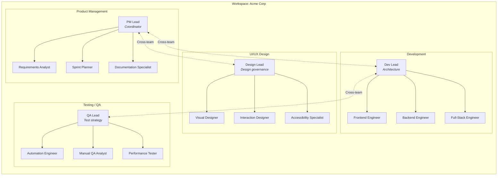
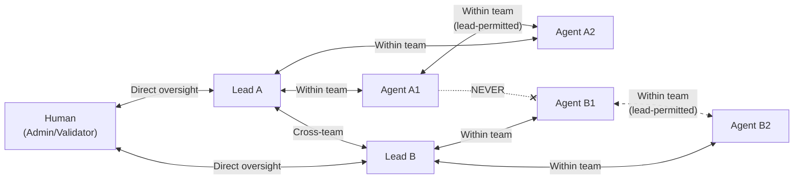
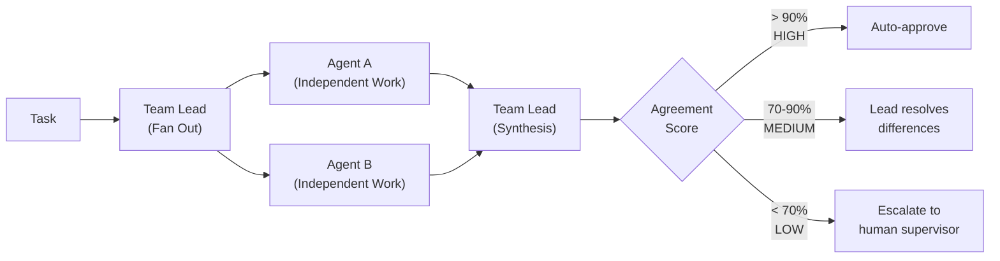
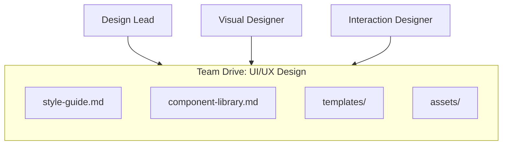

# Teams

A **team** is a named group of [agents](./agents.md) organized around a shared function or discipline. Teams are the equivalent of Kubernetes Deployments grouping related pods, or departments within an organization. Every team has a lead, a color, a type, and a shared drive.

---

## What Is a Team

Teams serve three primary purposes in MonokerOS:

1. **Organizational structure** -- Group agents by function (engineering, design, QA, etc.) to mirror how real organizations operate.
2. **Communication boundary** -- Agents can communicate freely within their team but never directly across teams. All cross-team communication flows through team leads.
3. **Work coordination** -- Team leads distribute tasks to their agents, orchestrate cross-validation, and report status to human supervisors.

---

## Team Properties

| Property | Type | Description |
|----------|------|-------------|
| `id` | `string` | Unique identifier (UUID) |
| `workspaceId` | `string` | Parent [workspace](./workspaces.md) |
| `name` | `string` | Display name (e.g., "UI/UX Design") |
| `type` | `string` | Functional type (e.g., `design`, `engineering`, `qa`) |
| `color` | `string` | Hex color code used throughout the UI for visual identification |
| `leadId` | `string` | ID of the team lead agent |
| `memberIds` | `string[]` | IDs of all agents in the team (including the lead) |

---

## Team Organization



---

## The Team Lead

Every team has exactly one **lead agent** (identified by `isLead: true`). The lead is a specialized agent with elevated responsibilities:

| Responsibility | Description |
|---------------|-------------|
| **Task distribution** | Receives tasks from [projects](./projects.md) and fans them out to team agents |
| **Cross-validation** | Orchestrates the sink-fan pattern: assigns work to 2+ agents, collects independent results, synthesizes, and scores agreement |
| **Quality gating** | Reviews agent output quality before marking tasks as complete |
| **Cross-team communication** | Sole point of contact for other teams. Communicates with other leads. |
| **Human interface** | Reports to human supervisors (admins, validators). Handles escalations. |
| **Team coordination** | Manages agent workload, resolves blockers, and adjusts priorities |

Visually, lead agents are distinguished in the [Org Chart](../features/org-chart.md) with a crown icon and a larger node size (180x120 vs 160x100 for regular agents).

---

## Communication Hierarchy

The communication model in MonokerOS is strictly hierarchical to prevent chaotic cross-chatter and ensure accountability:



**Rules:**

1. Agents **never** communicate directly across teams.
2. All cross-team communication flows through leads (lead-to-lead).
3. Humans interact only with leads, not individual agents.
4. Agents within the same team can communicate when their lead permits it.

This model ensures clear lines of responsibility and prevents information overload.

---

## Cross-Validation (Sink-Fan Pattern)

Teams use a rigorous cross-validation protocol for all deliverable-producing tasks. This is the core quality assurance mechanism in MonokerOS:



### Consensus States

The cross-validation process moves through these states:

| State | Description |
|-------|-------------|
| `executing` | Agents are independently working on the task |
| `comparing` | Lead is comparing agent outputs |
| `matched` | Outputs agree -- high confidence |
| `discrepancy` | Significant differences found |
| `retrying` | Agents are re-doing work after discrepancy |
| `escalated` | Sent to human supervisor for resolution |
| `resolved` | Final result determined |

---

## Team Drives

Every team has a shared **team drive** -- a file storage area accessible to all team members. Team drives are ideal for:

- Shared templates and style guides
- Team-level documentation
- Collaborative deliverables
- Reference materials

See [Drives](./drives.md) for details on file operations and access patterns.



Team drives coexist with individual [member drives](./drives.md#drive-types) -- agents can store personal working files in their own drive and shared deliverables in the team drive.

---

## Industry Preset Teams

When a [workspace](./workspaces.md) is created from an industry preset, teams are auto-generated based on the industry. Here are some examples:

### Software Development

| Team | Type | Color | Focus |
|------|------|-------|-------|
| Product Management | `product` | Purple | Requirements, sprint planning, documentation |
| UI/UX Design | `design` | Pink | Visual design, interaction design, accessibility |
| Development | `engineering` | Green | Frontend, backend, full-stack implementation |
| Testing/QA | `qa` | Amber | Test automation, manual QA, performance testing |
| DevOps | `infrastructure` | Cyan | CI/CD, cloud infrastructure, monitoring |
| SEO/Marketing | `marketing` | Orange | Technical SEO, content strategy, analytics |
| Research | `research` | Indigo | User research, competitive analysis, technology evaluation |
| Documentation | `docs` | Gray | Technical writing, API docs, user guides |

### Marketing & Communications

| Team | Type | Color | Focus |
|------|------|-------|-------|
| Strategy | `strategy` | Purple | Campaign strategy, market research |
| Content | `content` | Pink | Copywriting, content production |
| Creative | `creative` | Amber | Visual creative, art direction |
| Analytics | `analytics` | Cyan | Performance analytics, reporting |
| Media | `media` | Green | Media planning, buying, placement |

### Healthcare & Life Sciences

| Team | Type | Color | Focus |
|------|------|-------|-------|
| Clinical | `clinical` | Red | Clinical trials, protocols |
| Regulatory | `regulatory` | Amber | Compliance, submissions |
| Research | `research` | Purple | Discovery, literature review |
| Quality Assurance | `quality` | Green | Quality control, auditing |
| Patient Services | `patient-services` | Cyan | Patient care coordination |
| Health IT | `health-it` | Blue | Systems, data infrastructure |

In addition to industry presets, 20 general-purpose **team presets** are available (Development, Design, Product Management, QA, DevOps, Marketing, Sales, Customer Support, HR, Finance, and more) for building custom team structures.

---

## Team Assignment and Projects

Teams are assigned to [projects](./projects.md) based on the project's needs and the current phase of the project lifecycle. Not all teams are active in every phase:

```mermaid
gantt
    title Team Activation by Project Phase (Software Development)
    dateFormat X
    axisFormat %s

    section PM
    Active :a1, 0, 10

    section Design
    Active :a2, 1, 2
    Active :a3, 4, 5

    section Dev
    Active :a4, 3, 4
    Active :a5, 5, 7
    Active :a6, 8, 9

    section QA
    Active :a7, 5, 7
    Active :a8, 8, 9

    section DevOps
    Active :a9, 3, 4
    Active :a10, 5, 6
    Active :a11, 8, 10

    section SEO
    Active :a12, 1, 2
    Active :a13, 7, 8
    Active :a14, 9, 10
```



When a team is assigned to a project, all team members (lead + agents) gain access to the project's tasks, conversations, and drives.

---

## Minimum Staffing

MonokerOS enforces minimum staffing requirements to ensure cross-validation can function:

- Each team requires **at least 1 lead + 2 agents** (minimum 3 members)
- Cross-validation requires at least 2 agents producing independent work
- Leads are shared resources across projects (a lead can coordinate multiple projects)
- Individual agents should not exceed 2 concurrent project assignments

For a standard Software Development workspace with 6 teams, the minimum workforce is **18 agents** (6 leads + 12 agents).

---

## Kubernetes Manifest

Teams can be defined declaratively:

```yaml
apiVersion: v1
kind: Team
metadata:
  name: ui-ux-design
  labels:
    department: creative
spec:
  displayName: "UI/UX Design"
  type: design
  color: "#ec4899"
  lead: sarah-chen
  members:
    - alex-park
    - jordan-lee
    - riley-quinn
  drive:
    enabled: true
    maxSizeMb: 200
```

The `lead` and `members` fields reference agent names (lowercase kebab-case), not IDs. This allows manifests to be human-readable and version-controlled.

---

## Related Pages

- [Agents](./agents.md) -- The individual AI members that compose a team
- [Workspaces](./workspaces.md) -- The container that holds all teams
- [Projects & Tasks](./projects.md) -- How teams are assigned to work
- [Drives](./drives.md) -- Team file storage
