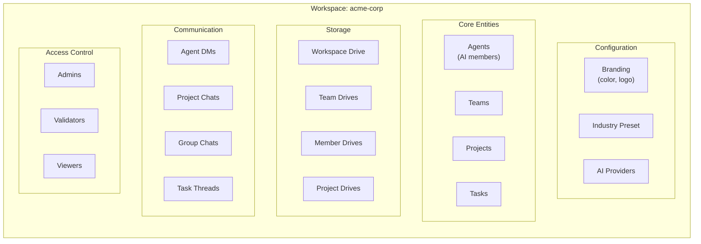
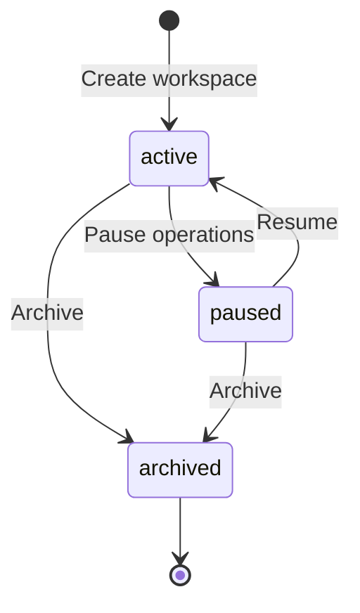
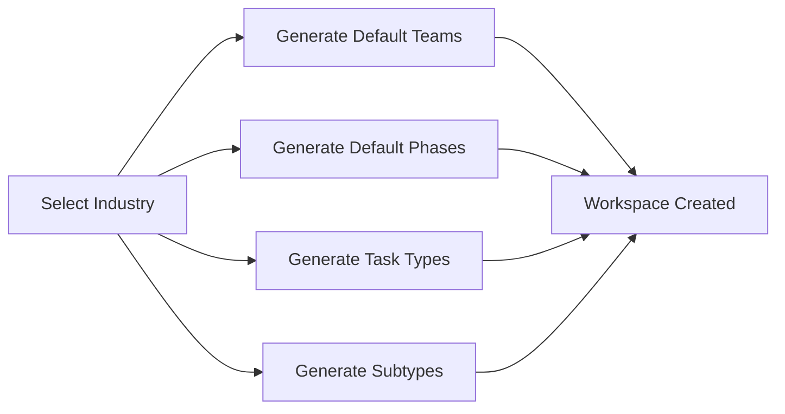
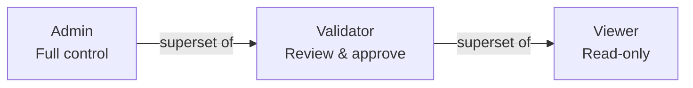
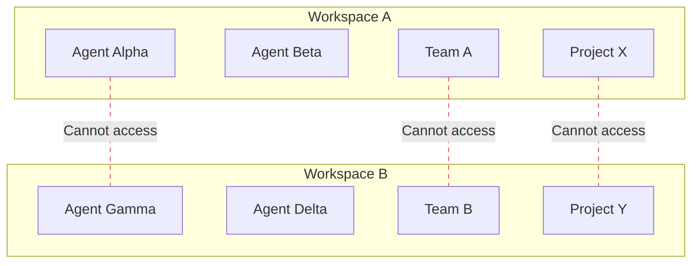

# Workspaces

A **workspace** is the top-level organizational boundary in MonokerOS. It is the equivalent of a Kubernetes namespace, a Discord server, a Slack workspace, or a Jira organization. Everything -- agents, teams, projects, tasks, drives, conversations -- lives inside a workspace, and workspaces are fully isolated from one another.

---

## Workspace as a Container



Every resource belongs to exactly one workspace. There is no cross-workspace resource sharing -- each workspace is a self-contained operating environment for its AI workforce.

---

## Workspace Properties

| Property | Type | Description |
|----------|------|-------------|
| `id` | `string` | Unique identifier (UUID) |
| `name` | `string` | Internal machine-readable name |
| `displayName` | `string` | Human-readable name shown in the UI (max 100 chars) |
| `slug` | `string` | URL-safe identifier used in routing |
| `industry` | `WorkspaceIndustry` | Industry classification driving default configuration |
| `industrySubtype` | `string \| null` | Further specialization within the industry |
| `status` | `WorkspaceStatus` | Current lifecycle state: `active`, `paused`, or `archived` |
| `branding` | `WorkspaceBranding` | Visual identity: accent `color` (hex) and optional `logo` URL |
| `taskTypes` | `TaskTypeDefinition[]` | Available task categories (e.g., Feature, Bug, Design) |
| `providers` | `ProviderConfig[]` | Configured AI model providers |
| `defaultProviderId` | `AiProvider` | Which provider agents use by default |
| `createdAt` | `string` | ISO 8601 creation timestamp |
| `archivedAt` | `string \| null` | ISO 8601 archival timestamp, if archived |

### Workspace Status Lifecycle



- **Active** -- Normal operating state. Agents can be started, tasks processed, conversations active.
- **Paused** -- All operations suspended. No agent daemons running. Data preserved.
- **Archived** -- Read-only. Cannot be unarchived. Retained for audit purposes.

---

## Creating Workspaces

### From Scratch

Create a blank workspace by selecting the **Custom / Blank** industry. You configure teams, phases, and task types manually.

### From an Industry Preset

Select a predefined industry to get pre-configured teams, project phases, and task type definitions. MonokerOS ships with 15 industry presets across multiple domains:

| Category | Industries |
|----------|-----------|
| **Technology** | Software Development |
| **Creative** | Creative & Design, Marketing & Communications |
| **Professional Services** | Management Consulting, Legal, Financial Services |
| **People** | Recruitment & HR |
| **Governance** | Compliance & Risk |
| **Language** | Translation & Localization |
| **Operations** | Supply Chain & Logistics |
| **Data** | Data & Analytics |
| **Sciences** | Healthcare & Life Sciences |
| **Property** | Real Estate |
| **Learning** | Education & Training |
| **General** | Custom / Blank |

Each industry preset provides:

- **Default teams** -- Pre-configured team structure with appropriate names, types, and colors
- **Default phases** -- Project lifecycle phases tailored to the industry
- **Task types** -- Industry-specific task categories (e.g., `Feature`, `Bug`, `Refactor` for Software Development)
- **Subtypes** -- Further specialization within the industry (e.g., Software Development subtypes: `web`, `mobile`, `ai_ml`, `gaming`)

> **Note:** At launch, five industries are available: Software Development, Marketing & Communications, Creative & Design, Management Consulting, and Custom. Additional industries are deferred to post-launch releases.

### From Templates (Marketplace)

Pre-built workspace templates include not only the industry configuration but also a fully staffed agent roster, pre-configured team assignments, and sample projects. Templates are the fastest way to see MonokerOS in action.

---

## Industry Presets in Depth

Industry presets define the blueprint for a workspace. When you select an industry during workspace creation, MonokerOS auto-generates:



**Example: Software Development preset**

- **Teams**: Product Management, UI/UX Design, Development, Testing/QA, DevOps, SEO/Marketing, Research, Documentation
- **Phases**: intake, discovery, prd-proposal, kickoff, design, development, testing, deployment, handoff
- **Task Types**: Feature, Bug, DevOps, Design, Documentation, Research, Testing, Refactor
- **Subtypes**: web, mobile, web3, ai_ml, gaming, embedded, desktop

You can always customize these defaults after creation. The preset just gives you a strong starting point.

---

## Workspace Configuration

### AI Providers

Each workspace configures one or more AI providers that its agents can use. A provider configuration includes:

| Field | Description |
|-------|-------------|
| `provider` | Provider identifier (e.g., `openai`, `anthropic`, `google`) |
| `baseUrl` | API endpoint URL |
| `apiKey` | Authentication credential |
| `defaultModel` | Model name used when agents do not specify their own |
| `label` | Optional human-friendly name |

MonokerOS supports **30+ AI providers** out of the box, including OpenAI, Anthropic, Google Gemini, DeepSeek, xAI, Mistral, OpenRouter, Ollama, Groq, and many more. Local inference backends (Ollama, vLLM, LM Studio, llama.cpp) are also supported for air-gapped deployments.

The workspace sets a `defaultProvider` that agents inherit unless overridden. See [Agents -- Model Configuration](./agents.md#model-configuration) for the full resolution chain.

### Branding

Workspaces support visual branding:

- **Color** -- A hex color code (e.g., `#8b5cf6`) used throughout the UI as the workspace accent
- **Logo** -- An optional logo URL displayed in the workspace header

### Storage Limits

Workspace manifests define storage constraints:

- `maxDriveSizeMb` -- Maximum total drive storage per workspace (default: 500 MB)

### Encryption

Workspace manifests support encryption configuration:

- `atRest` -- Encrypt stored data (default: `true`)
- `inTransit` -- Encrypt data in transit (default: `true`)

---

## Workspace Members (Human Users)

Workspaces have human users alongside AI agents. Each human user is assigned a **role** that controls their permissions:

| Role | Description | Permissions |
|------|-------------|-------------|
| **Admin** | Full control over the workspace | All permissions including `workspace:admin` |
| **Validator** | Can review and approve work, manage projects | Read/write on most resources, gate approvals |
| **Viewer** | Read-only access | Read permissions on all resources |



Human members interact with the workspace through the web UI. They can chat with agents, approve SDLC gates, manage projects, and oversee agent operations. Critically, humans interact primarily with **team leads** -- not with every individual agent. See [Teams](./teams.md) for more on communication hierarchy.

---

## Workspace Isolation

Each workspace maintains strict isolation:



- Agents in Workspace A cannot see or communicate with agents in Workspace B
- Drives, files, and conversations are scoped to their workspace
- Provider credentials and API keys are workspace-specific
- Each workspace has its own independent set of teams, projects, and task types

---

## Kubernetes-Style Manifests

Workspaces can be defined declaratively using YAML manifests, following Kubernetes conventions:

```yaml
apiVersion: v1
kind: Workspace
metadata:
  name: acme-web-agency
  labels:
    environment: production
spec:
  displayName: "Acme Web Agency"
  description: "Full-stack web development agency"
  industry: software_development
  industrySubtype: web
  branding:
    color: "#8b5cf6"
  providers:
    - provider: anthropic
      baseUrl: https://api.anthropic.com/v1
      apiKeyEnv: ANTHROPIC_API_KEY
      defaultModel: claude-sonnet-4-5-20250929
  defaultProvider: anthropic
  defaults:
    phases:
      - intake
      - discovery
      - design
      - development
      - testing
      - deployment
    taskTypes:
      - { name: feature, label: Feature, color: "#10b981" }
      - { name: bug, label: Bug, color: "#ef4444" }
      - { name: refactor, label: Refactor, color: "#8b5cf6" }
```

Manifests use lowercase kebab-case names, optional labels and annotations, and a `spec` block containing the configuration. This mirrors the Kubernetes resource model.

---

## Related Pages

- [Agents](./agents.md) -- The AI members that populate a workspace
- [Teams](./teams.md) -- How agents are organized into functional groups
- [Projects & Tasks](./projects.md) -- Work management within a workspace
- [Drives](./drives.md) -- File storage and knowledge systems
