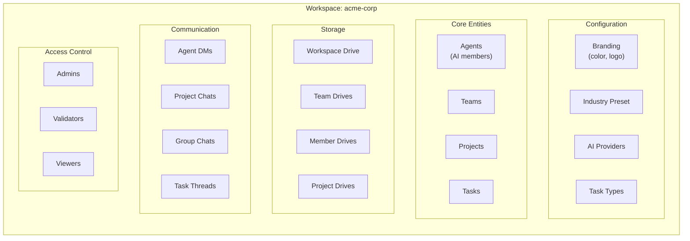
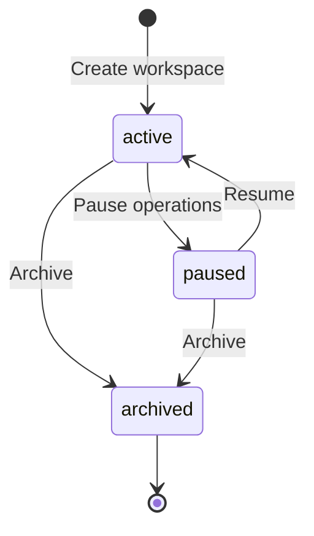
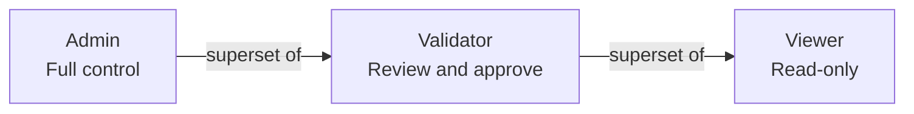
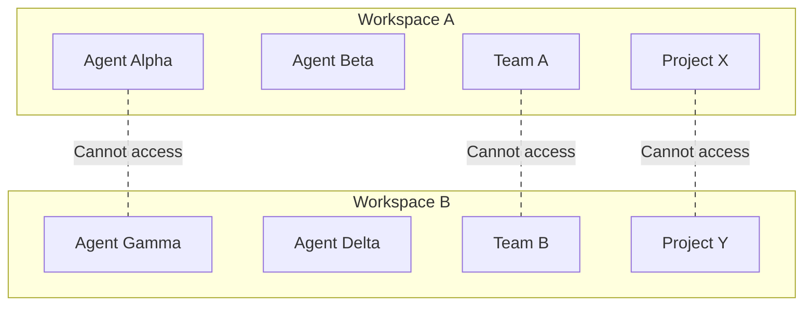

# Workspaces

A **workspace** is the top-level organizational boundary in MonokerOS. Everything -- agents, teams, projects, tasks, files, conversations -- lives inside a workspace, and workspaces are fully isolated from one another. Workspace configuration is stored in Convex and drives the behavior of the entire platform for that organization.

---

## Workspace Structure

Every resource belongs to exactly one workspace. There is no cross-workspace resource sharing -- each workspace is a self-contained operating environment for its AI workforce.

---

## Workspace Schema

Workspace records are stored in the Convex `workspaces` table with the following fields:

| Field | Type | Description |
|-------|------|-------------|
| `name` | `string` | Internal machine-readable name |
| `displayName` | `string` | Human-readable name shown in the UI (max 100 chars) |
| `slug` | `string` | URL-safe identifier used in routing |
| `industry` | `WorkspaceIndustry` | Industry classification driving default configuration |
| `industrySubtype` | `string` | Further specialization within the industry |
| `status` | `WorkspaceStatus` | Lifecycle state: `active`, `paused`, or `archived` |
| `branding` | `object` | Visual identity: accent `color` (hex) and optional `logo` URL |
| `taskTypes` | `TaskTypeDefinition[]` | Available task categories (e.g., Feature, Bug, Design) |
| `providers` | `ProviderConfig[]` | Configured AI model providers |
| `defaultProviderId` | `AiProvider` | Which provider agents use by default |
| `createdAt` | `number` | Creation timestamp |
| `archivedAt` | `number` | Archival timestamp, if archived |

---

## Workspace Lifecycle

| Status | Description |
|--------|-------------|
| **active** | Normal operating state. Agents can be started, tasks processed, conversations active. |
| **paused** | All operations suspended. No agent containers running. Data preserved. |
| **archived** | Read-only. Cannot be unarchived. Retained for audit purposes. |

---

## Creating Workspaces

### From Scratch

Create a blank workspace by selecting the **Custom / Blank** industry. You configure teams, phases, and task types manually.

### From an Industry Preset

Select a predefined industry to get pre-configured teams, project phases, and task type definitions. MonokerOS ships with 15 industry presets:

| Category | Industries |
|----------|-----------|
| **Technology** | Software Development |
| **Creative** | Creative & Design, Marketing & Communications |
| **Professional Services** | Management Consulting, Legal, Financial Services |
| **People** | Recruitment & HR |
| **Governance** | Compliance & Risk |
| **Language** | Translation & Localization |
| **Operations** | Supply Chain & Logistics |
| **Data** | Data & Analytics |
| **Sciences** | Healthcare & Life Sciences |
| **Property** | Real Estate |
| **Learning** | Education & Training |
| **General** | Custom / Blank |

Each industry preset provides:

- **Default teams** -- Pre-configured team structure with appropriate names, types, and colors
- **Default phases** -- Project lifecycle phases tailored to the industry
- **Task types** -- Industry-specific task categories (e.g., `Feature`, `Bug`, `Refactor` for Software Development)
- **Subtypes** -- Further specialization within the industry (e.g., Software Development subtypes: `web`, `mobile`, `ai_ml`, `gaming`)

### From Templates (Marketplace)

Pre-built workspace templates include not only the industry configuration but also a fully staffed agent roster, pre-configured team assignments, and sample projects. Templates are the fastest way to see MonokerOS in action. Available templates include law firm, web development agency, mobile development agency, and article writing team.

---

## AI Provider Configuration

Each workspace configures one or more AI providers that its agents can use. A provider configuration includes:

| Field | Description |
|-------|-------------|
| `provider` | Provider identifier (e.g., `openai`, `anthropic`, `google`) |
| `baseUrl` | API endpoint URL |
| `apiKey` | Authentication credential |
| `defaultModel` | Model name used when agents do not specify their own |
| `label` | Optional human-friendly name |

MonokerOS supports **33+ AI providers** out of the box, including OpenAI, Anthropic, Google Gemini, DeepSeek, xAI, Mistral, OpenRouter, Ollama, Groq, and many more. Local inference backends (Ollama, vLLM, LM Studio, llama.cpp) are also supported for air-gapped deployments.

The workspace sets a `defaultProviderId` that agents inherit unless overridden at the agent level. See [Agents -- Model Configuration](./agents.md#model-configuration) for the full provider resolution chain.

---

## Task Types

Task types are customizable per workspace and define the categories of work available in projects. Each task type has:

| Field | Description |
|-------|-------------|
| `name` | Machine-readable identifier (e.g., `feature`, `bug`) |
| `label` | Human-readable display name (e.g., "Feature", "Bug") |
| `color` | Hex color code for UI display |

Industry presets provide sensible defaults (e.g., Software Development gets Feature, Bug, DevOps, Design, Documentation, Research, Testing, Refactor), but these can be freely customized after workspace creation.

---

## Branding

Workspaces support visual branding:

- **Color** -- A hex color code used throughout the UI as the workspace accent
- **Logo** -- An optional logo image displayed in the workspace header

---

## Human Roles and Permissions

Human users join workspaces through the `workspaceMembers` table, which associates a user with a workspace and a role. Each role defines a permission boundary:

| Role | Description | Permissions |
|------|-------------|-------------|
| **Admin** | Full control over the workspace | All permissions including `workspace:admin`, member management, provider configuration |
| **Validator** | Can review and approve work, manage projects | Read and write on most resources, gate approvals, but no workspace-level admin |
| **Viewer** | Read-only access to the workspace | Read permissions on all resources, no write access |

Granular permission strings include `members:read`, `members:write`, `tasks:read`, `tasks:write`, `files:read`, `files:write`, `workspace:admin`, and more. The role determines which permissions a user receives.

---

## Workspace Scoping (Multi-Tenancy)

Every Convex table has a `workspaceId` field that scopes records to their owning workspace. This is the foundational multi-tenancy mechanism:

- All queries filter by `workspaceId`
- Mutations verify `workspaceId` matches the authenticated user's workspace context
- There is no way to access resources across workspace boundaries

### Workspace Isolation

- Agents in Workspace A cannot see or communicate with agents in Workspace B
- Drives, files, and conversations are scoped to their workspace
- Provider credentials and API keys are workspace-specific
- Each workspace has its own independent set of teams, projects, and task types

---

## Convex Schema Tables

The following Convex tables are scoped to workspaces:

| Table | Description |
|-------|-------------|
| `workspaces` | Workspace configuration and metadata |
| `workspaceMembers` | Human user memberships and roles |
| `members` | Agents and human member records |
| `teams` | Team definitions and composition |
| `projects` | Project definitions, phases, and gates |
| `tasks` | Individual work items |
| `conversations` | Chat conversations |
| `messages` | Chat messages |
| `files` | File metadata and storage references |
| `notifications` | User notifications |
| `apiKeys` | Programmatic access keys |
| `agentRuntimes` | Agent container state tracking |
| `activities` | Activity log / audit trail |

---

## Related Pages

- [Agents](./agents.md) -- The AI members that populate a workspace
- [Teams](./teams.md) -- How agents are organized into functional groups
- [Projects & Tasks](./projects.md) -- Work management within a workspace
- [Drives](./drives.md) -- File storage and knowledge systems
