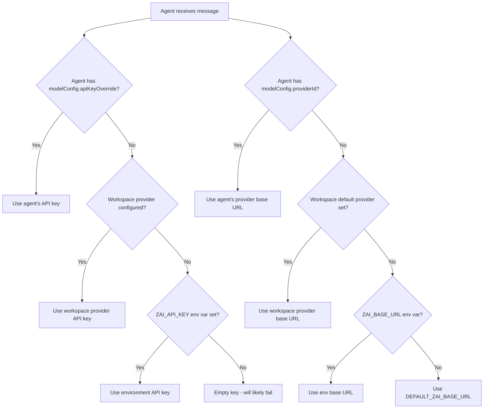

# AI Providers

MonokerOS supports 31+ AI providers through a unified OpenAI-compatible API pattern. Every agent can be configured to use a different provider and model, or fall back to the workspace default.

## OpenAI-Compatible API Pattern

All providers are accessed through the OpenAI chat completions API format:

```
POST {baseUrl}/chat/completions
Authorization: Bearer {apiKey}
Content-Type: application/json

{
  "model": "model-name",
  "messages": [...],
  "stream": false,
  "tools": [...],
  "tool_choice": "auto"
}
```

This means any provider that exposes an OpenAI-compatible endpoint works out of the box with MonokerOS -- no custom adapters needed.

## Supported Providers

### Cloud Providers

| Provider | Default Base URL | Notable Models |
|----------|-----------------|----------------|
| **OpenAI** | `https://api.openai.com/v1` | GPT-4o, GPT-4-turbo, o1, o3 |
| **Anthropic** | Via OpenAI-compat proxy | Claude Opus, Sonnet, Haiku |
| **Google (Gemini)** | `https://generativelanguage.googleapis.com/v1beta/openai` | Gemini 2.0 Flash, Gemini Pro |
| **Groq** | `https://api.groq.com/openai/v1` | LLaMA 3, Mixtral |
| **Mistral** | `https://api.mistral.ai/v1` | Mistral Large, Medium, Small |
| **Cohere** | `https://api.cohere.ai/v1` | Command R+, Command R |
| **Together AI** | `https://api.together.xyz/v1` | Open-source models |
| **Fireworks** | `https://api.fireworks.ai/inference/v1` | Fast inference |
| **DeepSeek** | `https://api.deepseek.com/v1` | DeepSeek V3, Coder |
| **Perplexity** | `https://api.perplexity.ai` | Sonar models |
| **OpenRouter** | `https://openrouter.ai/api/v1` | Multi-provider router |
| **Replicate** | `https://api.replicate.com/v1` | Open-source models |
| **HuggingFace** | `https://api-inference.huggingface.co/v1` | Inference API |
| **xAI (Grok)** | `https://api.x.ai/v1` | Grok models |
| **AI21** | `https://api.ai21.com/studio/v1` | Jamba models |
| **Cerebras** | `https://api.cerebras.ai/v1` | Ultra-fast inference |
| **Lambda** | `https://api.lambda.chat/v1` | GPU cloud inference |
| **Anyscale** | `https://api.anyscale.com/v1` | Open-source models |
| **OctoAI** | `https://text.octoai.run/v1` | Optimized inference |
| **Modal** | Custom | Serverless inference |
| **Lepton** | `https://api.lepton.ai/v1` | Low-latency inference |
| **Cloudflare Workers AI** | `https://api.cloudflare.com/client/v4/accounts/{id}/ai/v1` | Edge inference |
| **Azure OpenAI** | Custom per deployment | OpenAI models on Azure |
| **AWS Bedrock** | Custom per region | Cross-provider on AWS |

### Self-Hosted Providers

| Provider | Default Port | Description |
|----------|-------------|-------------|
| **Ollama** | `http://localhost:11434/v1` | Local model runner |
| **LM Studio** | `http://localhost:1234/v1` | Desktop model server |
| **LocalAI** | `http://localhost:8080/v1` | OpenAI-compatible local server |
| **vLLM** | `http://localhost:8000/v1` | High-throughput serving |
| **text-generation-webui** | `http://localhost:5000/v1` | Gradio-based UI + API |
| **llama.cpp** | `http://localhost:8080/v1` | Lightweight C++ inference |

## Provider Resolution Chain

When an agent needs to make an LLM call, the provider is resolved through a priority chain:



The resolution chain for each component:

| Component | Priority 1 | Priority 2 | Priority 3 | Fallback |
|-----------|-----------|-----------|-----------|----------|
| **API Key** | `member.modelConfig.apiKeyOverride` | `workspaceProvider.apiKey` | `ZAI_API_KEY` env | `''` (empty) |
| **Base URL** | Agent's provider `baseUrl` | Workspace provider `baseUrl` | `ZAI_BASE_URL` env | `DEFAULT_ZAI_BASE_URL` |
| **Model** | `member.modelConfig.model` | Workspace provider `defaultModel` | `ZAI_MODEL` env | `DEFAULT_ZAI_MODEL` |

## Model Configuration Per Agent

Each agent member can have its own model configuration that overrides the workspace defaults:

```json
{
  "modelConfig": {
    "providerId": "openai",
    "model": "gpt-4o",
    "apiKeyOverride": "sk-...",
    "temperature": 0.7,
    "maxTokens": 4096
  }
}
```

| Field | Type | Description |
|-------|------|-------------|
| `providerId` | string | Provider identifier (e.g., `openai`, `anthropic`, `groq`) |
| `model` | string | Model name to use |
| `apiKeyOverride` | string | Agent-specific API key (useful for per-agent cost tracking) |
| `temperature` | number (0-2) | Sampling temperature |
| `maxTokens` | number | Maximum output tokens |

Set `modelConfig` to `null` to use the workspace default.

## Workspace Provider Configuration

Workspace admins can configure providers at the workspace level:

```bash
# List configured providers
curl http://localhost:3001/api/workspaces/:slug/config/providers \
  -H "Authorization: Bearer <token>"

# Add a provider
curl -X POST http://localhost:3001/api/workspaces/:slug/config/providers \
  -H "Authorization: Bearer <token>" \
  -H "Content-Type: application/json" \
  -d '{
    "provider": "openai",
    "baseUrl": "https://api.openai.com/v1",
    "apiKey": "sk-...",
    "defaultModel": "gpt-4o",
    "label": "Production OpenAI"
  }'

# Set default provider for all agents
curl -X PATCH http://localhost:3001/api/workspaces/:slug/config/default-provider \
  -H "Authorization: Bearer <token>" \
  -H "Content-Type: application/json" \
  -d '{"defaultProviderId": "openai"}'
```

## How to Add a New Provider

Because MonokerOS uses the OpenAI-compatible API pattern, adding a new provider requires no code changes if it exposes a compatible endpoint. Simply configure it as a workspace provider:

1. **Find the base URL** -- The provider's OpenAI-compatible chat completions endpoint (everything before `/chat/completions`).
2. **Get an API key** -- Create an API key from the provider's dashboard.
3. **Add via API or UI** -- Use the workspace provider configuration to add the new provider with its base URL, API key, and default model name.
4. **Assign to agents** -- Set the agent's `modelConfig.providerId` to use the new provider, or set it as the workspace default.

For providers that do not natively support OpenAI format, an intermediate proxy (like LiteLLM) can be used to translate.

## Environment Variables

These environment variables are read by the API server and passed to [daemons](../technical/daemon.md):

| Variable | Description |
|----------|-------------|
| `ZAI_API_KEY` | Default API key for LLM calls |
| `ZAI_BASE_URL` | Default base URL for LLM API |
| `ZAI_MODEL` | Default model name |

Set these in `apps/api/.env` for local development.

## Related Documentation

- [Daemon System](../technical/daemon.md) -- How daemons use provider config for LLM calls
- [Agents](../core-concepts/agents.md) -- Agent model configuration
- [REST API](../technical/api.md) -- Provider management endpoints
- [MCP Server](../technical/mcp.md) -- `workspace.add_provider` and `workspace.list_providers` tools
