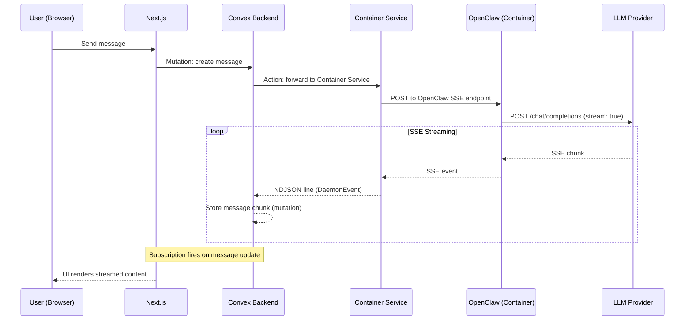
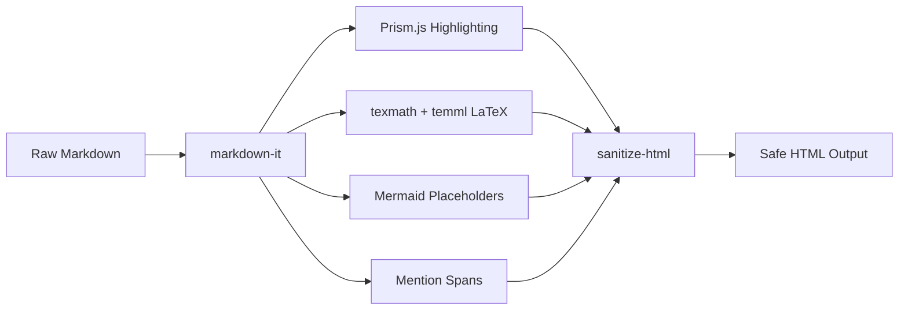

# Chat and Messaging

MonokerOS provides a real-time chat system for communicating with AI agents. Messages are stored in Convex and delivered to the UI through real-time subscriptions. Agent responses are streamed from OpenClaw inside the agent's Docker container, proxied through the Container Service, and persisted in Convex as they arrive.

---

## Architecture Overview



Key points:

- **No direct WebSocket connection** between browser and agent. All real-time updates flow through Convex subscriptions.
- The Container Service acts as a proxy between Convex actions and the OpenClaw instance running inside the agent's Docker container.
- The response flows as SSE from OpenClaw, gets converted to NDJSON by the Container Service, and is stored in Convex via mutations. The UI updates automatically through Convex's real-time subscription system.

---

## Data Model

### Messages

Messages are stored in the Convex `messages` table:

| Field | Description |
|-------|-------------|
| `conversationId` | Parent conversation reference |
| `senderId` | Member ID of the sender (agent or human) |
| `role` | Message role: `user`, `agent`, `system`, or `thinking` |
| `content` | Markdown text content |
| `references` | Array of entity references (agents, projects, tasks, files) |
| `reactions` | Emoji reactions from participants |
| `attachments` | File attachments via Convex storage |
| `toolCalls` | Inline tool call records with status |
| `createdAt` | Timestamp |

### Conversations

Conversations are stored in the `conversations` table and come in several types:

| Type | Description |
|------|-------------|
| `agent_dm` | 1-on-1 conversation between a human user and a single agent |
| `project_chat` | Conversation scoped to a specific project, visible to all project participants |
| `group_chat` | Multi-participant chat with 2+ agents and/or humans |
| `task_thread` | Discussion thread attached to a specific task |

Conversations are workspace-scoped. All messages within a conversation are ordered chronologically and persisted for history retrieval.

---

## Message Roles

| Role | Description |
|------|-------------|
| `user` | Sent by the human user |
| `agent` | Generated by the AI agent via OpenClaw |
| `system` | Generated by the platform for events like agent joins, status changes, or errors |
| `thinking` | Internal reasoning from the agent (shown in the thinking thread UI) |

---

## Streaming Flow

The full lifecycle of a chat message follows this path:

1. **User sends message** -- The Next.js frontend calls a Convex mutation to create the user message in the `messages` table.
2. **Convex action** -- A Convex action is triggered that calls the Container Service HTTP API with the message content and target agent ID.
3. **Container Service forwards** -- The Container Service locates the agent's running Docker container and sends the message to the OpenClaw SSE endpoint inside that container.
4. **OpenClaw calls LLM** -- OpenClaw assembles the prompt (SOUL.md + history + tools + message) and calls the LLM provider with `stream: true`.
5. **SSE response** -- The LLM streams back SSE chunks. OpenClaw processes them (handling tool calls, thinking phases, content deltas) and re-emits as SSE events.
6. **NDJSON conversion** -- The Container Service parses the SSE stream and converts each event to an NDJSON line (one `DaemonEvent` per line).
7. **Convex storage** -- Each NDJSON event is sent back to Convex via mutations, updating the agent's message content incrementally.
8. **Subscription update** -- The Convex real-time subscription fires, and the Next.js UI re-renders with the latest message content.

### DaemonEvent Types

The streaming protocol uses `DaemonEvent` objects:

| Event Type | Description |
|------------|-------------|
| `status` | Phase indicator: `thinking`, `reflecting`, or `done` |
| `content` | Text delta from the LLM response (incremental content) |
| `tool_start` | Agent is invoking a tool (includes tool name and arguments) |
| `tool_end` | Tool execution completed (includes tool name and duration) |
| `done` | Final complete response |
| `error` | Error occurred during processing |

### Thinking Phases

Agents go through visible thinking phases during response generation:

1. **thinking** -- The agent is processing the request and formulating a response
2. **reflecting** -- The agent is reviewing its own output for quality
3. **done** -- Response generation is complete

The thinking thread UI shows these phases in real time, giving users visibility into the agent's reasoning process.

---

## Client-Side Hook

The chat UI is powered by the `use-chat-stream.ts` hook, which:

- Subscribes to the Convex `messages` query for the active conversation
- Handles optimistic updates when the user sends a message
- Tracks streaming state (which agent is currently responding)
- Manages the thinking thread display
- Handles tool call rendering inline

This hook replaces the legacy WebSocket-based chat approach with Convex's built-in real-time subscription model.

---

## Mention System

MonokerOS supports four types of inline mentions that are parsed by the rendering pipeline:

| Prefix | Type | Example | Navigation Target |
|--------|------|---------|-------------------|
| `@` | Agent | `@alice` | Agent detail panel |
| `#` | Project | `#website-redesign` | Project view |
| `~` | Task | `~fix-login-bug` | Task detail |
| `:` | File | `:readme.md` | File browser |

### Autocomplete

When typing a mention trigger character (`@`, `#`, `~`, `:`), the chat input shows an inline autocomplete dropdown filtered by the typed text. Selecting an item inserts the full mention token.

### Rendering

Mentions are rendered as styled, clickable spans with data attributes:

```html
<span class="mention mention-agent"
      data-mention-type="agent"
      data-mention-name="alice">@alice</span>
```

Clicking a mention navigates the user to the relevant view (agent profile, project board, task detail, or file browser).

---

## Attachments

Files can be attached to messages via Convex storage. The attachment flow:

1. User selects a file in the chat input
2. File is uploaded to Convex storage
3. A storage ID is attached to the message record
4. The attachment preview renders in the message bubble (with file type detection for images, code, documents, etc.)

---

## Reactions

Messages support emoji reactions. Any conversation participant can add or remove reactions. Reactions are stored as an array on the message record with the reactor's member ID and the emoji.

---

## Tool Calls

When an agent invokes a tool during response generation, the tool call is displayed inline in the message:

- **`tool_start`** events show the tool name and arguments with a loading indicator
- **`tool_end`** events update the display with the result and duration
- Multiple tool calls within a single response are shown sequentially

Tool calls are part of the agent's reasoning process and provide transparency into what actions the agent is taking.

---

## Rich Rendering

All message content is rendered through the MonokerOS rendering pipeline (`@monokeros/renderer`), which supports:

- **Markdown** -- Full CommonMark with typographer and linkify
- **Code blocks** -- Syntax highlighting via Prism.js for 16+ languages
- **LaTeX math** -- Inline (`$...$`) and display (`$$...$$`) math rendered to MathML
- **Mermaid diagrams** -- Fenced `mermaid` blocks rendered as interactive diagrams
- **Mentions** -- Clickable `@agent`, `#project`, `~task`, `:file` links



---

## UI Layout

The chat interface uses a split-pane layout:

- **Left pane** -- Conversation list showing all conversations for the current workspace, with unread indicators, participant avatars, and last message preview
- **Right pane** -- Active chat area with the message history, streaming responses, typing indicators, and the message input

### Pop-Out Windows

Conversations can be opened in a pop-out window that floats independently from the main application. This allows users to continue chatting while navigating other parts of the workspace (file browser, org chart, project boards). Pop-out state is managed by the `use-popout.ts` hook and renders via a portal.

---

## Related Pages

- [Agents](../core-concepts/agents.md) -- The AI members that respond to messages
- [Architecture Overview](../architecture/overview.md) -- System-wide data flow
- [Drives](../core-concepts/drives.md) -- File storage referenced by attachments
