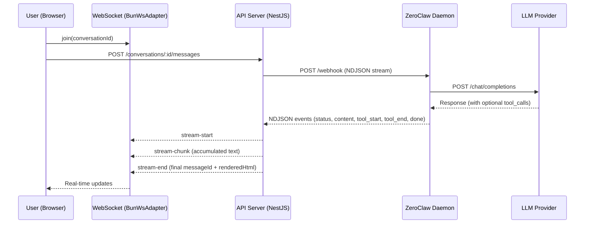
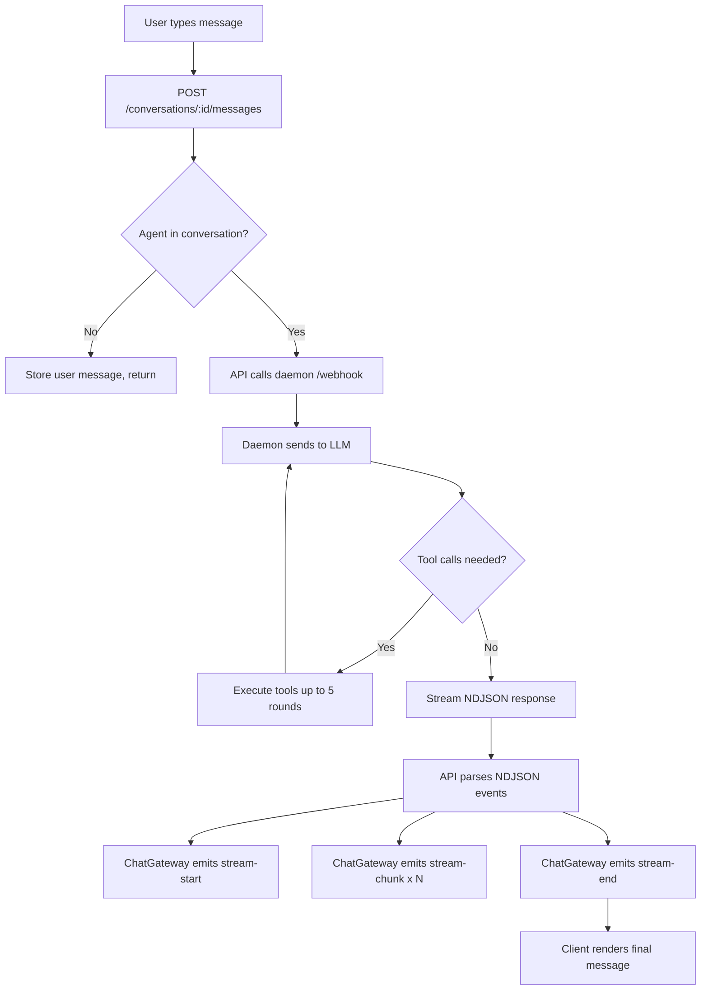
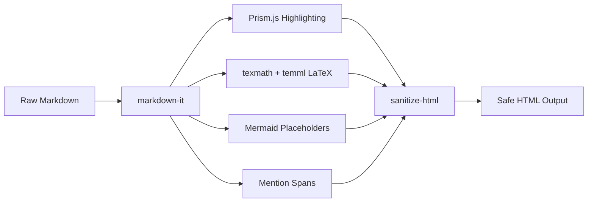

# Chat & Messaging

MonokerOS provides a real-time chat system that allows users to converse with AI agents. Messages are streamed in real time via WebSocket, with rich rendering support for markdown, code, math, and diagrams.

## Architecture Overview



## Conversation Model

Every conversation is tied to one or more participants (agent members and/or human users). Conversations come in several flavors:

| Type | Description |
|------|-------------|
| **DM** | 1-on-1 conversation between a user and a single agent |
| **Group** | Multi-participant chat with 2+ agents |
| **Project** | Conversation scoped to a specific project |

Conversations are workspace-scoped. All messages within a conversation are ordered chronologically and persisted for history retrieval.

### Creating a Conversation

```bash
curl -X POST http://localhost:3001/api/workspaces/:slug/conversations \
  -H "Authorization: Bearer <token>" \
  -H "Content-Type: application/json" \
  -d '{"participantIds": ["agent-member-id"]}'
```

For DMs, pass a single participant ID. For group chats, pass two or more IDs and an optional `title`.

## Message Flow

The full lifecycle of a chat message follows this path:



### NDJSON Event Types

The daemon streams newline-delimited JSON events back to the API server:

| Event | Description |
|-------|-------------|
| `status` | Phase indicator: `thinking` or `reflecting` |
| `tool_start` | Agent is calling a tool (name, args) |
| `tool_end` | Tool call completed (name, durationMs) |
| `content` | Accumulated response text so far |
| `done` | Final complete response |
| `error` | Error message if something failed |

## Streaming Responses

Agent responses are delivered in real time through the [WebSocket protocol](../technical/websocket.md). The client receives three types of events during a response:

1. **`stream-start`** -- Signals that the agent has begun generating a response. The UI shows a typing indicator.
2. **`stream-chunk`** -- Contains the accumulated text so far. Each chunk includes all previously sent text plus new content, enabling smooth character-by-character reveal on the client.
3. **`stream-end`** -- Signals completion. Contains the final `messageId` and optionally pre-rendered `renderedHtml` from the [rendering pipeline](../technical/rendering.md).

## Message Types

| Sender | Description |
|--------|-------------|
| **User message** | Sent by the human user. Stored with `role: "user"`. |
| **Agent message** | Generated by the AI agent via its [daemon](../technical/daemon.md). Stored with `role: "assistant"`. |
| **System message** | Generated by the platform for events like agent joins, status changes, or errors. |

Each message has a unique `id`, `content` (markdown text), `senderId`, `timestamp`, and optional `references` array.

## Mention System

MonokerOS supports four types of inline mentions that are parsed by the [rendering pipeline](../technical/rendering.md):

| Prefix | Type | Example | Navigation Target |
|--------|------|---------|-------------------|
| `@` | Agent | `@alice` | Agent detail panel |
| `#` | Project | `#website-redesign` | Project view |
| `~` | Task | `~fix-login-bug` | Task detail |
| `:` | File | `:readme.md` | File browser |

### Autocomplete

When typing a mention trigger character (`@`, `#`, `~`, `:`), the chat input shows an inline autocomplete dropdown filtered by the typed text. Selecting an item inserts the full mention token.

### Rendering

Mentions are rendered as styled, clickable spans with data attributes:

```html
<span class="mention mention-agent"
      data-mention-type="agent"
      data-mention-name="alice">@alice</span>
```

Clicking a mention navigates the user to the relevant view (agent profile, project board, task detail, or file browser).

## Message References

Messages can include structured references to workspace entities:

```json
{
  "content": "Can you review this file?",
  "references": [
    { "type": "file", "id": "file-abc", "display": "readme.md" }
  ]
}
```

Supported reference types: `agent`, `issue`, `project`, `task`, `file`.

## Rich Rendering

All message content is rendered through the MonokerOS [rendering pipeline](../technical/rendering.md), which supports:

- **Markdown** -- Full CommonMark with typographer and linkify
- **Code blocks** -- Syntax highlighting via Prism.js for 16+ languages
- **LaTeX math** -- Inline (`$...$`) and display (`$$...$$`) math rendered to MathML
- **Mermaid diagrams** -- Fenced `mermaid` blocks rendered as interactive diagrams
- **Mentions** -- Clickable `@agent`, `#project`, `~task`, `:file` links



## Popout Chat Windows

Conversations can be opened in a popout window that floats independently from the main application layout. This allows users to continue chatting while navigating other parts of the workspace (file browser, org chart, project boards).

## Conversation History

All messages are persisted and available through the REST API:

```bash
# List all conversations
curl http://localhost:3001/api/workspaces/:slug/conversations \
  -H "Authorization: Bearer <token>"

# Get a conversation with full message history
curl http://localhost:3001/api/workspaces/:slug/conversations/:id \
  -H "Authorization: Bearer <token>"
```

The daemon maintains a bounded conversation history per agent (configured by `DAEMON_MAX_HISTORY`), keeping the system prompt plus the most recent messages to stay within LLM context limits.

## Related Documentation

- [WebSocket Protocol](../technical/websocket.md) -- Connection and event details
- [Daemon System](../technical/daemon.md) -- How agent processes handle LLM calls
- [Rendering Pipeline](../technical/rendering.md) -- Markdown, code, math, and diagram rendering
- [AI Providers](ai-providers.md) -- Configuring which LLM backs each agent
- [REST API](../technical/api.md) -- Conversation and message endpoints
