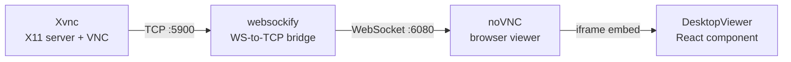
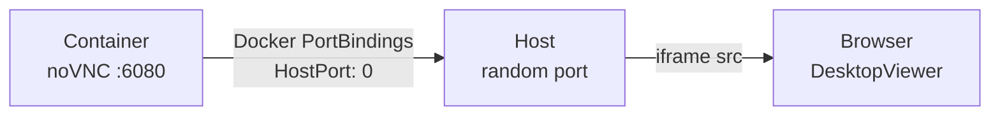

# Desktop Viewer

The Desktop Viewer gives users a live, browser-based window into an AI agent's desktop environment. Each agent runs inside its own Docker container with a full Linux desktop, and the Desktop Viewer streams that desktop to the MonokerOS web interface in real time.

## Overview

When an agent is running, it has an actual graphical desktop session -- complete with a window manager, taskbar, and web browser. The Desktop Viewer embeds this desktop directly into the MonokerOS UI so users can observe what agents are doing: browsing the web, editing files, running tools, or interacting with external services.

The viewer appears in the detail panel when selecting an agent member. If the agent is not running, it shows a placeholder prompting the user to start the agent.

## Desktop Stack

Each agent container runs a minimal but complete desktop environment:

| Layer | Component | Purpose |
|-------|-----------|---------|
| OS | Ubuntu 24.04 | Base system |
| Window Manager | OpenBox | Lightweight WM with minimal config (no menus or keybinds) |
| Taskbar | Tint2 | Shows open windows and system tray |
| Browser | Google Chrome | Web browsing, UI automation, screenshots |
| Runtime | Bun + OpenClaw | Agent LLM gateway and tool execution |

The desktop runs at 1024x768 resolution with 24-bit color depth by default (configurable via `RESOLUTION` and `COLOR_DEPTH` environment variables).

## VNC Stack

The desktop is streamed to the browser through a three-layer VNC pipeline:



**Xvnc** is a combined X11 display server and VNC server in a single process. It renders the desktop and exposes it as a VNC stream on port 5900.

**websockify** bridges the TCP-based VNC protocol to WebSockets. It listens on port 6080 and proxies connections to the local Xvnc on port 5900. It also serves the noVNC static files.

**noVNC** is a browser-based VNC client. It connects to websockify via WebSocket and renders the desktop in a `<canvas>` element. It is loaded as a static web page from the websockify server.

## Read-Only Mode

By default, VNC viewers can watch but cannot interact with the agent's desktop. This is enforced server-side by Xvnc flags in the container's entrypoint:

| Flag | Value | Effect |
|------|-------|--------|
| `-AcceptKeyEvents` | `0` | VNC viewers cannot send keyboard input |
| `-AcceptPointerEvents` | `0` | VNC viewers cannot send mouse input |
| `-SendCutText` | `1` | Agent clipboard is forwarded to viewers |
| `-AcceptCutText` | `0` | Viewers cannot paste into the agent's clipboard |
| `-AlwaysShared` | (set) | Multiple viewers can connect simultaneously |

The noVNC URL also includes `view_only=true` as a client-side reinforcement, but the real enforcement is at the Xvnc level.

## Port Mapping

Each agent container exposes noVNC on internal port 6080. When the container is created, Docker maps this to a random available host port:



The Container Service discovers the mapped port by inspecting the container after startup and stores it in the agent's runtime record. The `GET /containers/:agentId/desktop` endpoint returns the mapped port and status.

The noVNC URL constructed by the component:

```
http://localhost:{vncPort}/vnc.html?autoconnect=true&resize=scale&view_only=true
```

## React Component

The `DesktopViewer` component (`apps/web/src/components/desktop/desktop-viewer.tsx`) handles three states:

1. **Agent not running** -- shows a desktop icon with a message to start the agent
2. **Loading** -- shows a spinner while fetching the desktop info
3. **Desktop not available** -- the container may still be starting up (noVNC not ready yet)
4. **Connected** -- renders the noVNC iframe with a header bar

The header bar shows:
- A desktop icon with "Desktop (read-only)" label
- A live indicator with a pulsing green dot

The iframe uses the `sandbox="allow-scripts allow-same-origin"` attribute for security isolation.

## Use Cases

- **Debugging agent behavior**: watch what an agent does when it uses browser-based tools
- **Monitoring web browsing**: see which pages the agent visits and what information it extracts
- **Observing tool use**: watch file editors, terminal sessions, or other GUI tools in action
- **Demonstrations**: show stakeholders how agents work in real time
- **Audit**: review what actions an agent took during a task

## Startup Sequence

The container entrypoint (`docker/openclaw-desktop/entrypoint.sh`) starts processes in order:

1. **Xvnc** -- X display server with VNC, waits up to 3 seconds for readiness
2. **OpenBox** -- window manager
3. **Tint2** -- taskbar
4. **websockify + noVNC** -- WebSocket bridge and browser viewer
5. **OpenClaw** -- agent LLM gateway

A health-check loop monitors Xvnc and OpenClaw. If either exits, the container shuts down all processes and exits.

## Future

- **Read-write toggle**: allow users to interact directly with the agent's desktop when needed (pair programming, manual corrections, guided workflows)
- **Session recording**: capture desktop sessions for later playback and review
