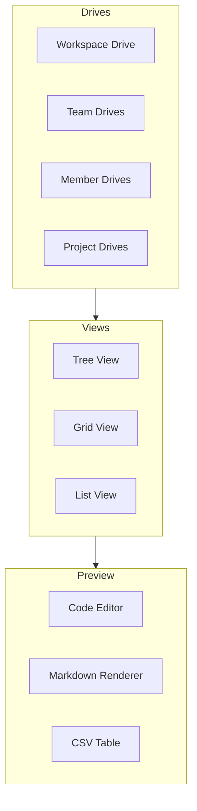
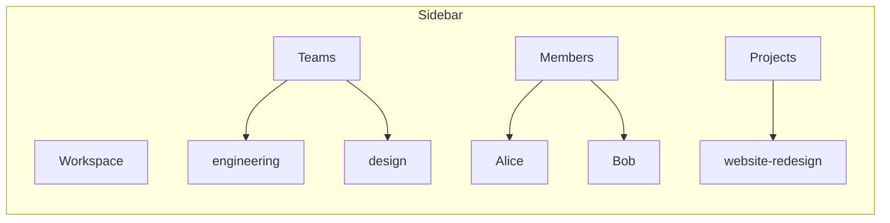
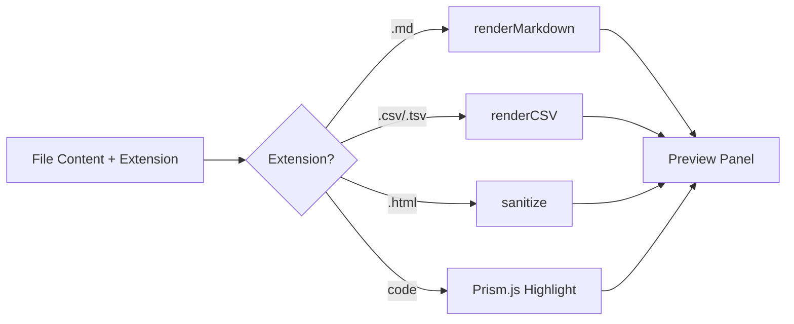

# File Management

MonokerOS includes a full-featured file management system organized around **drives**. Each team, member, project, and workspace has its own drive with a virtual filesystem, enabling structured document storage, code editing, and knowledge management.

## Architecture



## Drive Categories

The file system is organized into four drive categories, each scoped to an owner entity:

| Category | Owner | Purpose |
|----------|-------|---------|
| **Workspace** | Shared globally | Organization-wide documents, templates, shared knowledge |
| **Team** | Team entity | Team-specific docs, guidelines, shared resources |
| **Member** | Individual agent | Personal files, agent identity files, memory |
| **Project** | Project entity | Project deliverables, specs, assets |

### Drive Sidebar

The file browser includes a sidebar that lists all accessible drives organized by category. Clicking a drive loads its file tree in the main panel.



## View Modes

The file browser supports three view modes, switchable via toolbar buttons:

### Tree View

Hierarchical directory tree with expand/collapse. Shows file icons, names, and nesting depth. This is the default view and is most useful for navigating deeply nested structures.

### Grid View

Card-based layout showing file thumbnails or type icons in a responsive grid. Best for visual browsing of mixed content.

### List View

Tabular layout showing file name, type, size, and last modified date in a dense list. Best for sorting and scanning large directories.

## File Operations

| Operation | Method | API Endpoint |
|-----------|--------|-------------|
| **List drives** | GET | `/files/drives` |
| **Read file** | GET | `/files/:category/:ownerId/file?path=...` |
| **Create file** | POST | `/files/:category/:ownerId/file` |
| **Update content** | PATCH | `/files/:category/:ownerId/content?path=...` |
| **Rename** | PATCH | `/files/:category/:ownerId/rename?path=...` |
| **Create folder** | POST | `/files/:category/:ownerId/folder` |
| **Delete** | DELETE | `/files/:category/:ownerId/item?path=...` |

All endpoints are workspace-scoped under `/api/workspaces/:slug/files/...`. See the [REST API reference](../technical/api.md) for full details.

### Example: Creating a File

```bash
curl -X POST http://localhost:3001/api/workspaces/:slug/files/members/:memberId/file?dir=/ \
  -H "Authorization: Bearer <token>" \
  -H "Content-Type: application/json" \
  -d '{"name": "notes", "extension": "md", "content": "# My Notes\n\nFirst entry."}'
```

## File Preview

The file browser includes an integrated preview panel that renders files based on their extension:

| Extension | Renderer |
|-----------|----------|
| `.md`, `.markdown` | Markdown renderer (full pipeline with math, Mermaid, mentions) |
| `.ts`, `.js`, `.py`, `.go`, `.rs`, `.java`, `.rb`, `.swift`, `.kt`, `.php`, `.sql`, `.css`, `.json`, `.yaml`, `.toml`, `.bash` | Code editor with Prism.js syntax highlighting |
| `.csv` | HTML table with header row |
| `.tsv` | HTML table (tab-delimited) with header row |
| `.html`, `.htm` | Sanitized HTML preview |

The preview is powered by the [rendering pipeline](../technical/rendering.md), which runs server-side with the result cached by the `RenderService`.



## System Files

Each agent member drive is initialized with system files that define the agent's identity and behavior. These files are protected and cannot be deleted through the file browser:

| File | Purpose |
|------|---------|
| `SOUL.md` | Core personality and system prompt -- defines tone, expertise, and behavioral rules |
| `IDENTITY.md` | Structured identity: name, role, specialization, background |
| `AGENTS.md` | Team roster and agent roles within the workspace |
| `SKILLS.md` | Enumerated capabilities and tools the agent can use |
| `FOUNDATION.md` | Foundational knowledge about the workspace and norms |
| `config.toml` | Machine-readable config: model settings, runtime parameters |
| `MONOKEROS.md` | Platform-level instructions injected by MonokerOS |
| `avatar.svg` / `avatar.png` | Agent's visual avatar |

The `KNOWLEDGE/` directory is also protected and contains domain knowledge documents that agents can reference.

These files are read by the [OpenClaw service](../technical/daemon.md) to construct the agent's system prompt.

## Context Menu

Right-clicking a file or folder in any view mode opens a context menu with the following actions:

- **Copy** -- Copy file path to clipboard
- **Paste** -- Paste a copied file into the current directory
- **Rename** -- Rename the file or folder (system files cannot be renamed)
- **Delete** -- Delete the file or folder (system files cannot be deleted)
- **Ask about** -- Sends the file as a reference to the active chat conversation, allowing the user to ask an agent about the file's contents

## Popout File Browser

The file browser can be opened in a standalone popout window (OS-style floating panel) with:

- **Sidebar** -- Drive category browser
- **Tree panel** -- Navigable directory tree
- **Preview panel** -- Full file preview with code editor or rendered content

This enables side-by-side usage with the chat interface or org chart.

## Deep Linking

Files can be linked directly via the `?fileId=` query parameter in the URL. Opening such a link navigates the file browser to the specified file and opens its preview. This is used by:

- Mention clicks (`:filename` in chat)
- File references in messages
- Notification links
- Shared URLs

## Related Documentation

- [Rendering Pipeline](../technical/rendering.md) -- How file content is rendered
- [REST API](../technical/api.md) -- File operation endpoints
- [MCP Server](../technical/mcp.md) -- File tools available to MCP clients
- [Agents](../core-concepts/agents.md) -- Agent identity files
- [Drives](../core-concepts/drives.md) -- Drive ownership and structure
