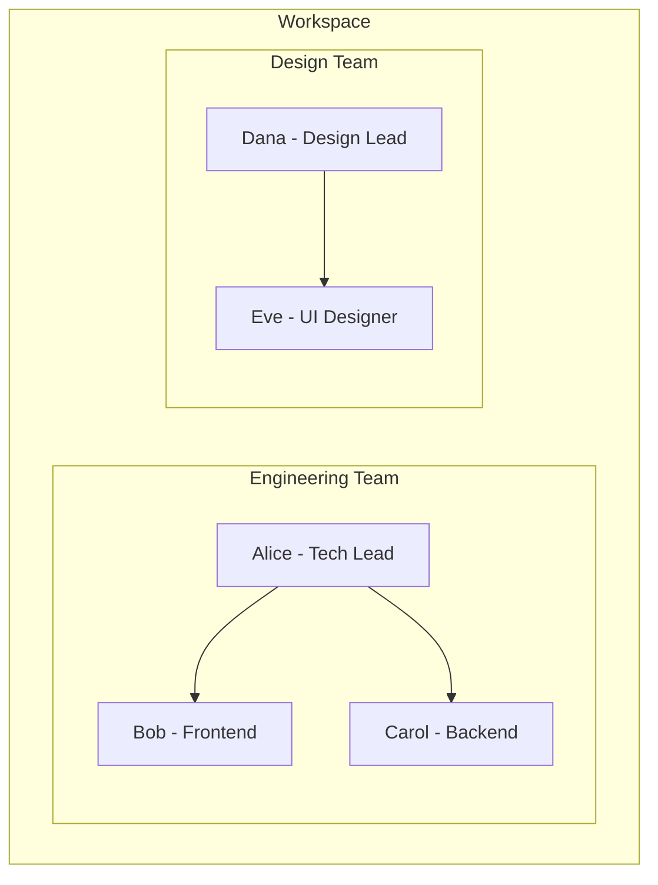
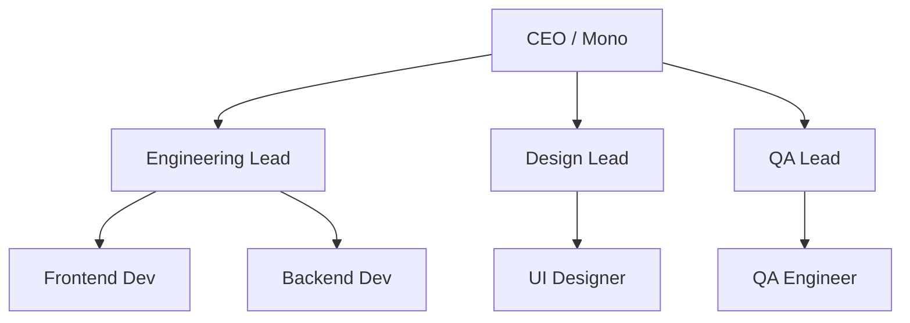
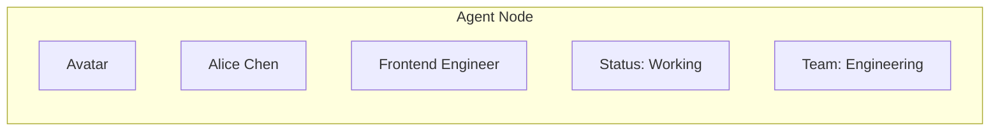
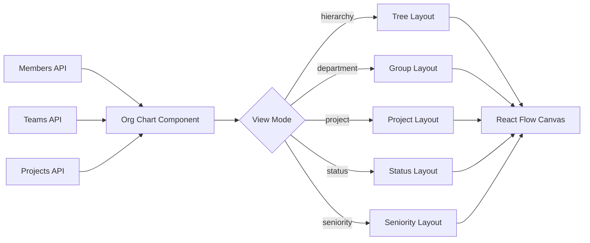

# Organization Chart

The MonokerOS org chart provides an interactive, visual representation of the workspace's agent hierarchy. Built on React Flow, it renders agents as nodes and teams as visual containers, offering multiple layout modes for different perspectives on organizational structure.

## Overview

## View Modes

The org chart supports five distinct view modes, each providing a different lens on the organization:

### Hierarchy View

The default view. Displays agents in a top-down tree structure based on reporting lines. Team leads are at the top of each branch, with their team members below. This is the classic org chart layout.

### Department View

Groups agents by their team (department). Each team is rendered as a visual container (group node) with its members inside. Teams are laid out side by side for comparison.

### Project View

Organizes agents by their project assignments. Agents appear under each project they are assigned to (an agent may appear in multiple projects). Useful for understanding resource allocation.

### Status View

Groups agents by their current status (idle, working, reviewing, blocked, offline). Provides a quick overview of workforce utilization.

### Seniority View

Arranges agents by their seniority level or role hierarchy, showing the distribution of experience across the organization.

## Agent Nodes

Each agent is rendered as an interactive node displaying:

| Element | Description |
|---------|-------------|
| **Avatar** | Agent's profile image or generated avatar |
| **Name** | Display name |
| **Role/Title** | Job title (e.g., "Frontend Engineer") |
| **Status indicator** | Colored dot showing current status |
| **Team badge** | Team name with team color |

### Status Colors

| Status | Color |
|--------|-------|
| Idle | Gray |
| Working | Green |
| Reviewing | Blue |
| Blocked | Red |
| Offline | Dark gray |

## Team Grouping

Teams are rendered as visual containers that wrap their member nodes. Each team container includes:

- **Team name** in the header
- **Team color** as the border/background accent
- **Team lead** indicator (star or crown icon)
- **Member count** badge

Teams can be collapsed to save space when focusing on other parts of the organization.

## Interactions

### Click Agent

Clicking an agent node opens a detail panel on the right side showing:

- Full agent profile (name, title, specialization, skills)
- Current status and activity
- Team assignment
- Project assignments
- Quick action buttons (open chat, view files, start/stop agent)

### Search and Filter

A search bar at the top of the org chart allows filtering agents by:

- Name
- Title
- Specialization
- Team name
- Status

Matching agents are highlighted while non-matching agents are dimmed.

### Navigation Controls

The org chart toolbar provides standard canvas controls:

| Control | Description |
|---------|-------------|
| **Zoom in/out** | Mouse wheel or +/- buttons |
| **Pan** | Click and drag on empty canvas |
| **Fit to view** | Resets zoom and position to show all nodes |
| **View mode switcher** | Dropdown to switch between the five view modes |
| **Fullscreen** | Expand the org chart to fill the browser window |

## Data Flow

The org chart fetches data from the Members, Teams, and Projects REST API endpoints, then computes the appropriate layout based on the selected view mode. The layout engine positions nodes and edges, which React Flow renders on an HTML5 canvas.

## Related Documentation

- [Agents](../core-concepts/agents.md) -- Agent properties and lifecycle
- [Teams](../core-concepts/teams.md) -- Team structure and membership
- [REST API](../technical/api.md) -- Data endpoints used by the org chart
- [WebSocket Protocol](../technical/websocket.md) -- Real-time status updates via `member:status-changed`
