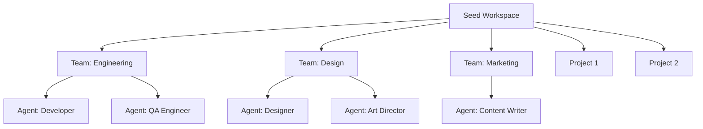
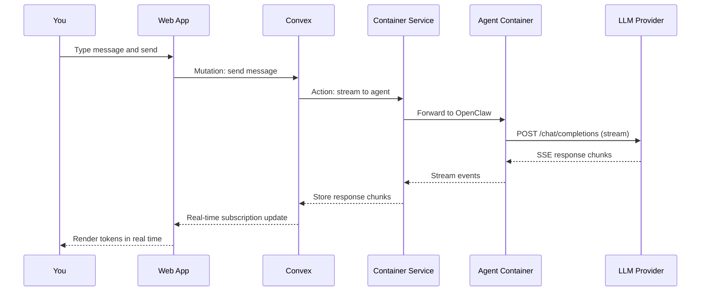

# Quick Start

This guide walks you through MonokerOS from first login to chatting with an AI agent. It assumes you have completed the [Installation](./installation.md) steps and have the Docker Compose stack running.

---

## Log In

1. Open [http://localhost:3000](http://localhost:3000).
2. Click **Sign up** to create an account.
3. Enter your **email address** and choose a **password**.
4. Click **Sign up** to register.

MonokerOS uses Convex Auth with password-based authentication. Your account is stored in the Convex backend.

---

## Explore the Seed Workspace

MonokerOS ships with a pre-loaded seed workspace generated by `convex/seed.ts`. This workspace contains a realistic setup with pre-configured agents, teams, and projects so you can explore the platform immediately.



The seed data provides a foundation for testing every feature without manual configuration.

---

## Navigate the UI

The MonokerOS interface is organized into primary tabs accessible from the top navigation bar. Each tab exposes a different dimension of your AI workforce.

### Main Navigation Tabs

| Tab | Purpose |
|-----|---------|
| **Org** | Interactive org chart (ReactFlow) showing team structure, agent status, and reporting lines. |
| **Projects** | Browse projects with kanban, gantt, list, and queue views. Create and manage tasks. |
| **Chat** | Converse with individual agents or groups. Real-time streaming responses. |
| **Files** | Explore file drives across four scopes: member, team, project, and workspace. |
| **Wiki** | Collaborative documentation space for workspace-level knowledge. |
| **Roles** | View and manage roles and permissions within the workspace. |

The **detail panel** on the right side of the screen shows contextual information for whatever you have selected -- an agent's profile, a task's details, a file's contents, a desktop viewer, and so on.

---

## Start an Agent

Agents do not run until you start them. Each agent is provisioned as its own Docker container by the Container Service.

1. Navigate to the **Org** tab.
2. Click on an agent node in the org chart (or select an agent from the member list).
3. In the detail panel, click **Start**.
4. The Container Service provisions a new Docker container for the agent with:
   - An Ubuntu 24.04 desktop environment (OpenBox + Xvnc + noVNC)
   - A Chrome browser
   - An OpenClaw runtime connected to the configured LLM provider
   - Access to the agent's drive and workspace files

The agent's status indicator changes from offline to online once the container is ready.

---

## Observe an Agent's Desktop

Once an agent is running, you can watch it work in real time.

1. Select a running agent in the **Org** tab.
2. In the detail panel, switch to the **Desktop Viewer** tab.
3. A live noVNC feed of the agent's containerized desktop appears -- you can see the agent browsing, writing code, using tools, and performing tasks.

The Desktop Viewer is read-only by default. It provides full visibility into what the agent is doing at any moment.

---

## Chat with Agents

The **Chat** tab is where you interact with AI agents directly.

### Send Your First Message

1. Click the **Chat** tab.
2. Click **New Conversation** (or select an existing one from the conversation list).
3. Select which agent(s) to include in the conversation.
4. Type a message in the input field at the bottom.
5. Press **Enter** or click **Send**.

You will see the agent's response stream in real time. Behind the scenes, the message is routed to the agent's OpenClaw runtime inside its Docker container, which calls the configured LLM provider and streams the response back.



### Mention Syntax

MonokerOS supports a rich mention syntax in chat messages for referencing workspace entities:

| Syntax | Entity | Example |
|--------|--------|---------|
| `@name` | Agent or team member | `@developer what's your status?` |
| `#name` | Project | `Check the timeline for #website-redesign` |
| `~name` | Task | `Is ~fix-header-bug done yet?` |
| `:name` | File | `Review the contents of :design-spec.md` |

Mentions create contextual links that agents can use to pull in relevant information when formulating their responses.

---

## Manage Projects

The **Projects** tab provides four view modes for managing work:

| View | Description |
|------|-------------|
| **Kanban** | Drag-and-drop cards between status columns. Classic board view. |
| **Gantt** | Timeline view showing task durations, dependencies, and scheduling. |
| **List** | Sortable table view with all task fields. |
| **Queue** | Agent-centric view showing each agent's task backlog. |

### Create a Task

1. Navigate to the **Projects** tab.
2. Select a project (or create a new one with the **+** button).
3. Click **Create Task**.
4. Fill in the title, description, assignee, priority, and status.
5. Save. The task appears in all view modes.

Tasks can be assigned to specific agents, given priorities, linked with dependencies, and moved between statuses via drag-and-drop on the kanban board.

---

## Browse Files

The **Files** tab provides access to the workspace's file system across four drive scopes:

| Drive Scope | Description |
|-------------|-------------|
| **Member** | Personal drive for an individual agent. |
| **Team** | Shared drive for all members of a team. |
| **Project** | Drive scoped to a specific project. |
| **Workspace** | Global drive accessible to everyone in the workspace. |

You can:

- Navigate the file tree in the sidebar.
- Switch between **grid**, **list**, and **tree** views.
- Click a file to preview its contents.
- Create new files or folders.
- Edit file content inline with the built-in code editor.

---

## Create a Workspace from Template

Beyond the seed workspace, you can create additional workspaces from the **template marketplace**:

1. Open the marketplace (from the workspace selector or the `/marketplace` route).
2. Browse available templates -- industry-specific configurations with pre-built teams, agent roles, and project structures.
3. Select a template and click **Create**.
4. The new workspace is created with the template's agents, teams, drives, and project structure.
5. Start agents individually from the Org tab to provision their containers.

Templates are available for 15 industry presets including software development, marketing agencies, law firms, consulting firms, and more.

---

## Command Palette

Press **Cmd+K** (or **Ctrl+K** on non-Mac) to open the command palette. This provides quick navigation to:

- Agents and team members
- Projects and tasks
- Files and drives
- Workspace settings
- Any entity in the workspace

The command palette supports fuzzy search, so you can type partial names to quickly find what you need.

---

## Tips for Development

### Typecheck and Lint

Keep your code clean while developing:

```bash
# Typecheck all packages (uses tsgo, not tsc)
bun run typecheck

# Lint all packages
bun run lint
```

### Convex Dashboard

Visit [http://localhost:6791](http://localhost:6791) to inspect your Convex data, run ad-hoc queries, view function logs, and debug real-time subscriptions.

### Hot Reloading

For the fastest development loop, run Convex via Docker and the web app locally:

```bash
docker compose up -d convex-backend convex-dashboard container-service
bun run dev
```

---

## Next Steps

- [Self-Hosting](./self-hosting.md) -- Docker Compose deployment, security, and operations
- [Agents](../core-concepts/agents.md) -- understand agent configuration, personas, and capabilities
- [Chat & Messaging](../features/chat.md) -- advanced chat features including streaming, context, and multi-agent conversations
- [Drives](../core-concepts/drives.md) -- file system architecture and drive scopes
- [AI Providers](../features/ai-providers.md) -- configuring LLM providers at workspace and agent level
