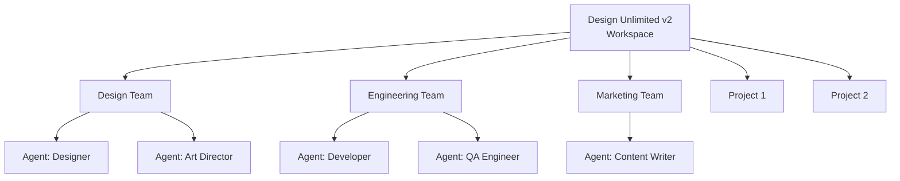
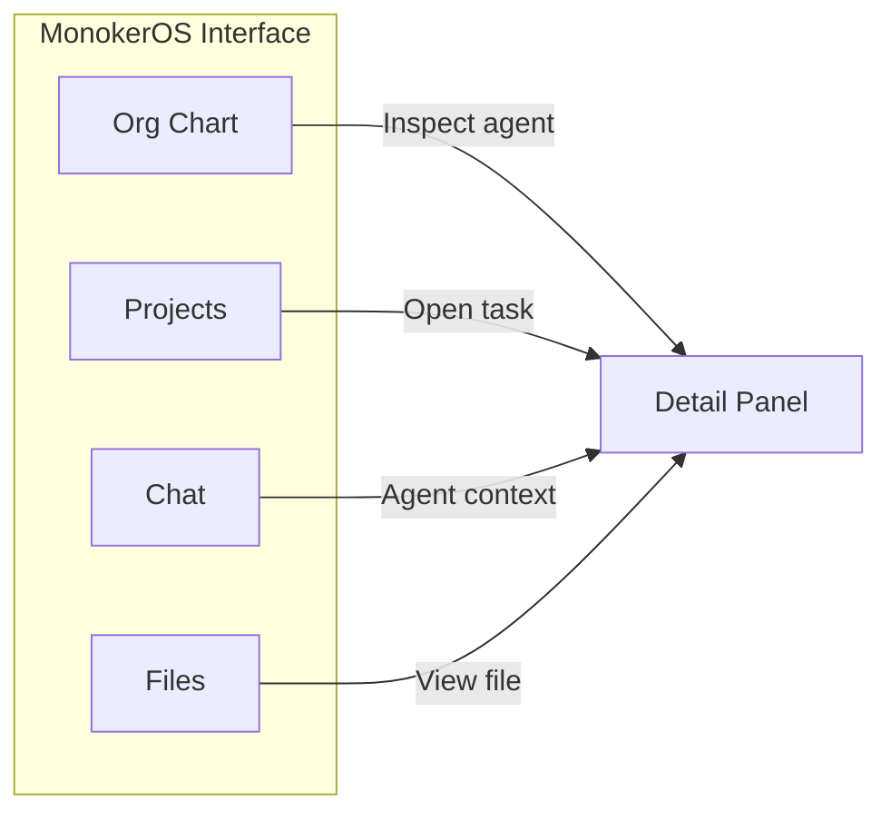
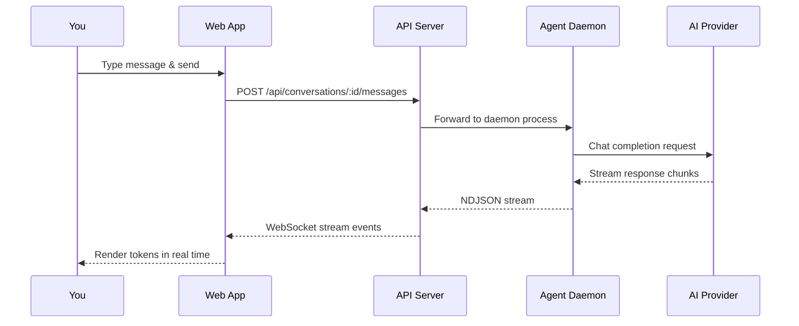
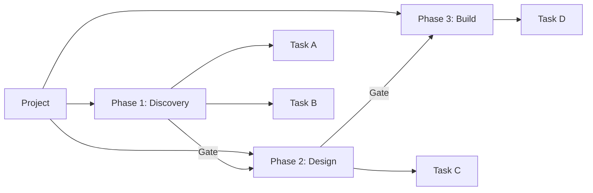

# Quick Start

This guide walks you through MonokerOS from first login to chatting with an AI agent. It assumes you have completed the [Installation](./installation.md) steps and have both the API and web app running.

---

## Log In

1. Open [http://localhost:3000](http://localhost:3000).
2. Enter **any email address** (e.g., `you@example.com`).
3. Enter the password **`password`**.
4. Click **Log in**.

In development mode, authentication accepts any email with the default password. No account registration is needed.

---

## Explore the Seed Workspace

MonokerOS ships with a pre-loaded seed workspace called **Design Unlimited v2**. This workspace contains a realistic setup with pre-configured agents, teams, and projects so you can explore the platform immediately.



The seed data provides a foundation for testing every feature without manual configuration.

---

## Navigate the UI

The MonokerOS interface is organized into several primary tabs, each exposing a different dimension of your AI workforce.

### Main Navigation

| Tab | Purpose |
|-----|---------|
| **Org Chart** | Visualize team structure as an interactive node graph. Drag to rearrange, click to inspect agents. |
| **Projects** | Browse projects, view phases and gates, manage tasks on a Kanban board. |
| **Chat** | Converse with individual agents or teams. Streaming responses in real time. |
| **Files** | Explore team and agent file drives. View, create, and edit files. |



The **detail panel** on the right side of the screen shows contextual information for whatever you have selected -- an agent's profile, a task's details, a file's contents, and so on.

---

## Chat with an Agent

The Chat tab is where you interact with AI agents directly.

### Send Your First Message

1. Click the **Chat** tab.
2. Select an agent from the sidebar (e.g., **Developer** or **Content Writer**).
3. Type a message in the input field at the bottom.
4. Press **Enter** or click **Send**.

You will see the agent's response stream in real time. Behind the scenes, MonokerOS spawns a daemon process for the agent, routes your message through the configured AI provider, and streams the response back via WebSocket.



### Mention Syntax

MonokerOS supports a rich mention syntax in chat messages for referencing workspace entities:

| Syntax | Entity | Example |
|--------|--------|---------|
| `@name` | Agent or team member | `@developer what's your status?` |
| `#name` | Project | `Check the timeline for #website-redesign` |
| `~name` | Task | `Is ~fix-header-bug done yet?` |
| `:name` | File | `Review the contents of :design-spec.md` |

Mentions create contextual links that agents can use to pull in relevant information when formulating their responses.

---

## Create a Project

1. Navigate to the **Projects** tab.
2. Click **Create Project** (or the `+` button).
3. Fill in the project name, description, and any initial configuration.
4. Assign agents or teams to the project.
5. Save.

Projects contain **phases** (logical stages of work) and **gates** (approval checkpoints between phases). Tasks live within phases and can be assigned to specific agents.



Tasks can be viewed on a **Kanban board** and moved between statuses via drag-and-drop. See [Projects & Tasks](../core-concepts/projects.md) for full details.

---

## Browse Files

The **Files** tab provides access to two kinds of drives:

- **Team drives** -- shared file spaces scoped to a team.
- **Agent drives** -- personal file spaces for individual agents.

You can:
- Navigate the file tree in the sidebar.
- Click a file to view its contents in the detail panel.
- Create new files or folders.
- Edit file content inline.

For more on the file system, see [Drives](../core-concepts/drives.md) and [File Management](../features/file-management.md).

---

## Explore the Org Chart

The **Org Chart** tab renders your entire workforce as an interactive graph powered by `@xyflow/react`.

- **Zoom and pan** to navigate the graph.
- **Click a node** to open the agent or team detail panel.
- **Observe status indicators** -- agents show their current status (online, busy, idle, offline).
- **Layout modes** -- switch between different graph layouts to find the view that works best.

This is a great way to get a high-level understanding of how your AI teams are organized. See [Org Chart](../features/org-chart.md) for advanced usage.

---

## Create a Workspace from Template

Beyond the seed workspace, you can create additional workspaces from the **template marketplace**:

1. Open the workspace selector or marketplace view.
2. Browse available templates (industry-specific configurations with pre-built teams, roles, and workflows).
3. Select a template and click **Create**.
4. The new workspace is created with the template's agents, teams, and project structure.

> **Note:** Template-created workspaces require you to manually start their agents. After creating a workspace from a template, trigger `POST /api/members/:id/start` for each agent, or use the UI to start them.

---

## Tips for Power Users

### Keyboard Shortcuts

Explore the interface for keyboard shortcuts that speed up navigation and actions. Common patterns include `Cmd/Ctrl + K` for quick search and `Escape` to close panels.

### API Keys

For programmatic access, MonokerOS supports API keys with the `mk_` prefix. These can be used to authenticate REST API calls from external tools and scripts.

### WebSocket Events

If you are building integrations, the API server exposes WebSocket events for real-time updates on agent status, task changes, project progress, and chat streams. See the [WebSocket Protocol](../technical/websocket.md) reference.

### Running Individual Apps

For faster iteration during development, you can run just the app you are working on:

```bash
# API only (with hot reload)
cd apps/api && bun --watch src/main.ts

# Web only (with TurboPack)
cd apps/web && bunx next dev --port 3000 --turbopack
```

### Typecheck and Lint

Keep your code clean while developing:

```bash
# Typecheck all packages (uses tsgo, not tsc)
bun run typecheck

# Lint all packages
bun run lint
```

---

## Next Steps

- [Self-Hosting](./self-hosting.md) -- environment variables, provider config, and deployment considerations
- [Agents](../core-concepts/agents.md) -- understand agent configuration, personas, and capabilities
- [Chat & Messaging](../features/chat.md) -- advanced chat features including streaming, context, and multi-agent conversations
- [REST API](../technical/api.md) -- full API reference for programmatic access
- [Daemon System](../technical/daemon.md) -- how agent processes are managed under the hood
