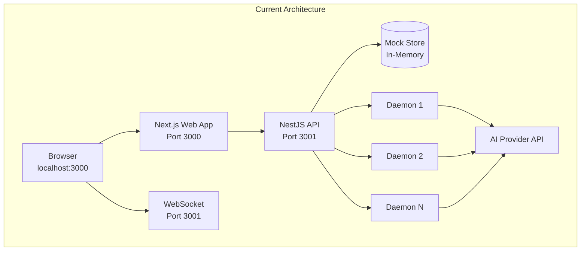
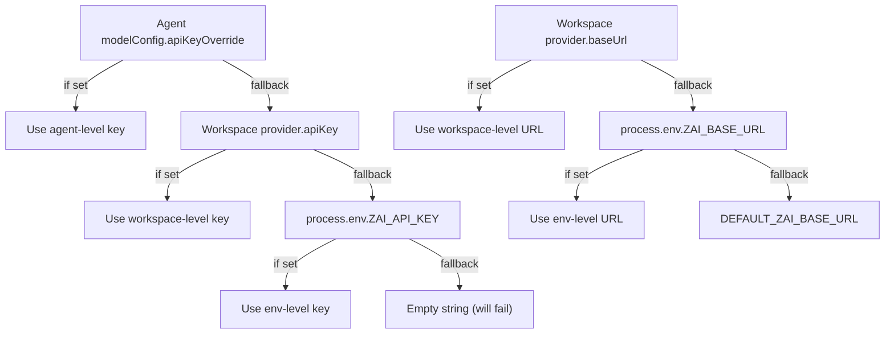
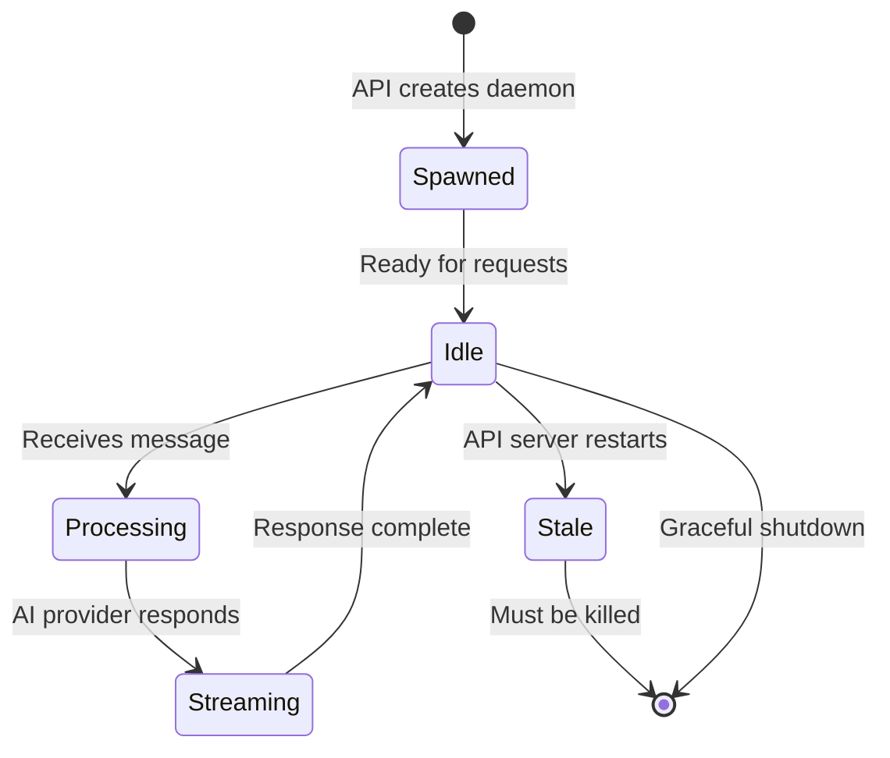

# Self-Hosting

This guide covers configuring and deploying MonokerOS outside of a local development setup. MonokerOS is currently in **pre-release** -- some sections describe planned infrastructure that is not yet implemented. These are marked accordingly.

---

## Current State

MonokerOS currently runs as a development/preview platform with:

- **In-memory mock store** -- all data lives in process memory and is lost on restart.
- **Seed data** -- the Design Unlimited v2 workspace is auto-loaded on every API server boot.
- **Single-user dev auth** -- any email + the password `password` grants access.
- **Bun runtime** -- both the API and agent daemons run on Bun.



For a deeper look, see [System Overview](../architecture/overview.md) and [Daemon System](../technical/daemon.md).

---

## Environment Variables Reference

All environment variables are configured in `apps/api/.env`. Copy from `apps/api/.env.example` as a starting point.

### Core Variables

| Variable | Required | Default | Description |
|----------|----------|---------|-------------|
| `ZAI_API_KEY` | Yes | -- | API key for the AI provider. |
| `ZAI_BASE_URL` | Yes | `https://api.z.ai/api/coding/paas/v4` | Base URL for the provider's OpenAI-compatible endpoint. |
| `ZAI_MODEL` | Yes | `glm-5` | Model identifier sent in chat completion requests. |

### Authentication

| Variable | Required | Default | Description |
|----------|----------|---------|-------------|
| `JWT_SECRET` | Recommended | Hard-coded dev fallback | Secret key for signing JWT tokens. **Must be set in any non-local deployment.** |

### Agent Runtime (Optional)

| Variable | Required | Default | Description |
|----------|----------|---------|-------------|
| `ZEROCLAW_PATH` | No | System default | Path to the ZeroClaw binary. |
| `ZEROCLAW_DATA_DIR` | No | `./data/agents` | Directory for agent runtime data. |

### Internal (Auto-Generated)

| Variable | Scope | Description |
|----------|-------|-------------|
| `ZEROCLAW_WEBHOOK_SECRET` | Per daemon | UUID generated at daemon spawn time. Used to authenticate daemon-to-API webhook calls. Stale after API restart -- see [daemon lifecycle](#daemon-lifecycle). |

---

## Authentication Configuration

### JWT Tokens

MonokerOS uses JWT for session authentication. In development, a fallback secret is used automatically. For any exposed deployment, set a strong `JWT_SECRET`:

```dotenv
JWT_SECRET=your-256-bit-secret-here
```

Tokens are issued at login and must be included in subsequent API requests as a Bearer token:

```
Authorization: Bearer <token>
```

### API Keys

For programmatic access (scripts, CI/CD, external integrations), MonokerOS supports API keys with the `mk_` prefix. These bypass the JWT flow and authenticate directly against the API.

### Future: OAuth2 (Planned)

Support for third-party identity providers is planned:

| Provider | Status |
|----------|--------|
| Google OAuth2 | Planned |
| GitHub OAuth | Planned |
| Microsoft Entra ID | Planned |

These will integrate as additional authentication strategies alongside JWT.

---

## AI Provider Configuration

MonokerOS connects to LLM providers through an OpenAI-compatible chat completions interface. The three `ZAI_*` variables control which provider, model, and credentials are used.

### Provider Resolution Chain

The API resolves provider settings per agent using a fallback chain:



This allows you to:
- Set a global default in `.env` for all agents.
- Override at the workspace level for multi-provider setups.
- Override at the individual agent level for specialized models.

For a list of supported providers and their URLs, see the [Installation guide](./installation.md#ai-provider-setup).

---

## Database

### Current: Mock Store (In-Memory)

The mock store is a development convenience. It provides:
- Instant startup with zero configuration.
- Auto-loaded seed data (Design Unlimited v2 workspace).
- Full CRUD operations through the same API surface that will be used with a real database.

**Limitations:**
- Data is lost on every API server restart.
- No persistence, no migrations, no backups.
- Single-process only (no horizontal scaling).

### Planned: Persistent Database

When production database support is implemented, the target is:

| Option | Use Case |
|--------|----------|
| **PostgreSQL** | Multi-user production deployments. |
| **SQLite** | Single-user or small-team self-hosted deployments. |

The API is designed with a repository abstraction layer, so swapping the mock store for a real database will not change the API surface.

---

## Running in Production (Planned)

> **Note:** Production deployment tooling is not yet available. The following is a conceptual architecture for when it is implemented.

### Docker Compose

A planned Docker Compose setup would include:

```yaml
# Conceptual -- not yet implemented
version: "3.9"

services:
  web:
    build:
      context: .
      dockerfile: apps/web/Dockerfile
    ports:
      - "3000:3000"
    environment:
      - API_URL=http://api:3001
    depends_on:
      - api

  api:
    build:
      context: .
      dockerfile: apps/api/Dockerfile
    ports:
      - "3001:3001"
    env_file:
      - apps/api/.env
    environment:
      - JWT_SECRET=${JWT_SECRET}
      - ZAI_API_KEY=${ZAI_API_KEY}
      - ZAI_BASE_URL=${ZAI_BASE_URL}
      - ZAI_MODEL=${ZAI_MODEL}
    # volumes:
    #   - agent-data:/app/data/agents
    #   - db-data:/app/data/db

  # postgres:
  #   image: postgres:16-alpine
  #   environment:
  #     POSTGRES_DB: monokeros
  #     POSTGRES_USER: monokeros
  #     POSTGRES_PASSWORD: ${DB_PASSWORD}
  #   volumes:
  #     - db-data:/var/lib/postgresql/data
```

Both containers use the Bun runtime. The web app container would run `bunx next start`, and the API container would run `bun src/main.ts`.

---

## Reverse Proxy Setup

When deploying behind a reverse proxy, you need to handle:
- HTTP routing to both web (port 3000) and API (port 3001).
- WebSocket upgrade for the API server (same port 3001).
- TLS termination.

### Nginx Example

```nginx
# Conceptual configuration
upstream web {
    server 127.0.0.1:3000;
}

upstream api {
    server 127.0.0.1:3001;
}

server {
    listen 443 ssl;
    server_name monokeros.example.com;

    ssl_certificate     /etc/ssl/certs/monokeros.pem;
    ssl_certificate_key /etc/ssl/private/monokeros.key;

    # Web app
    location / {
        proxy_pass http://web;
        proxy_set_header Host $host;
        proxy_set_header X-Real-IP $remote_addr;
        proxy_set_header X-Forwarded-For $proxy_add_x_forwarded_for;
        proxy_set_header X-Forwarded-Proto $scheme;
    }

    # API routes
    location /api/ {
        proxy_pass http://api;
        proxy_set_header Host $host;
        proxy_set_header X-Real-IP $remote_addr;
        proxy_set_header X-Forwarded-For $proxy_add_x_forwarded_for;
        proxy_set_header X-Forwarded-Proto $scheme;
    }

    # WebSocket (Socket.IO)
    location /socket.io/ {
        proxy_pass http://api;
        proxy_http_version 1.1;
        proxy_set_header Upgrade $http_upgrade;
        proxy_set_header Connection "upgrade";
        proxy_set_header Host $host;
        proxy_read_timeout 86400;
    }
}
```

### Caddy Example

```caddyfile
# Conceptual configuration
monokeros.example.com {
    # API and WebSocket
    handle /api/* {
        reverse_proxy localhost:3001
    }
    handle /socket.io/* {
        reverse_proxy localhost:3001
    }

    # Web app (default)
    handle {
        reverse_proxy localhost:3000
    }
}
```

Caddy automatically provisions TLS certificates via Let's Encrypt and handles WebSocket upgrades natively.

---

## Security Considerations

### CORS

The API server is configured with CORS allowing `localhost:3000` by default. For production deployments, update the CORS origin to match your actual domain:

```typescript
// In apps/api/src/main.ts or CORS config
origin: 'https://monokeros.example.com'
```

### Webhook Secrets

Each agent daemon receives a `ZEROCLAW_WEBHOOK_SECRET` (a UUID) at spawn time. The daemon includes this secret in its webhook callbacks to the API server, which validates it before processing. This prevents unauthorized processes from injecting events.

**Important:** These secrets are generated in-memory. After an API server restart, running daemons hold stale secrets and their webhook calls will fail with 401 errors. Always kill daemons before restarting the API:

```bash
pkill -f "bun run.*daemon.ts"
```

### Rate Limiting

Rate limiting is not yet implemented in the API. For production deployments, apply rate limiting at the reverse proxy layer:

- Nginx: `limit_req_zone` directive.
- Caddy: `rate_limit` plugin.
- Cloud: Use your provider's WAF or API gateway.

### JWT Secret

Never use the development fallback secret in a deployed environment. Generate a strong random secret:

```bash
openssl rand -base64 32
```

Set it as `JWT_SECRET` in your environment.

---

## Daemon Lifecycle

Agent daemons are spawned as child processes using `Bun.spawn`. Each daemon:

1. Receives environment variables including `ZEROCLAW_WEBHOOK_SECRET`, AI provider credentials, and agent configuration.
2. Runs an HTTP server (`Bun.serve` with `idleTimeout: 255`) to handle incoming requests from the API.
3. Forwards chat messages to the configured AI provider.
4. Streams responses back via NDJSON.
5. Outlives individual requests but does **not** outlive API server restarts gracefully.



### Health Checks

Daemons expose a health endpoint. The API server can verify daemon liveness before routing requests. A healthy daemon at 0% CPU that is not responding to messages is likely stuck due to the `idleTimeout` issue -- ensure `idleTimeout: 255` is set in the daemon's `Bun.serve` configuration.

### Monitoring Daemons

List running daemon processes:

```bash
ps aux | grep "daemon.ts"
```

Kill all daemons:

```bash
pkill -f "bun run.*daemon.ts"
```

---

## Backup Strategy

### Current (Mock Store)

No backup is needed or possible -- data exists only in memory and is regenerated from seed data on startup.

### Future (Persistent Database)

When a real database is implemented, the backup strategy will depend on the chosen engine:

| Database | Backup Method |
|----------|--------------|
| PostgreSQL | `pg_dump` on a cron schedule, WAL archiving for point-in-time recovery. |
| SQLite | File-system copy of the `.sqlite` file (ensure no active writes), or Litestream for continuous replication. |

Additional data to back up:
- Agent runtime data (`ZEROCLAW_DATA_DIR`).
- File drive contents (team and agent drives).
- Environment configuration (`.env` file -- store securely, not in version control).

---

## Summary

| Aspect | Current State | Planned |
|--------|--------------|---------|
| Data store | In-memory mock | PostgreSQL / SQLite |
| Auth | JWT with dev fallback | JWT + OAuth2 (Google, GitHub, Microsoft) |
| Deployment | Local `bun run dev` | Docker Compose |
| TLS | None (localhost) | Reverse proxy (nginx/Caddy) |
| Scaling | Single process | Horizontal (API) + daemon pool |
| Backups | N/A | pg_dump / Litestream |

MonokerOS is under active development. Production deployment tooling, persistent storage, and multi-user auth will be added in upcoming releases. Check the [Roadmap](../roadmap/future.md) for planned milestones.

---

## Related Pages

- [Installation](./installation.md) -- initial setup and provider configuration
- [Quick Start](./quick-start.md) -- first steps with the platform
- [System Overview](../architecture/overview.md) -- architecture deep dive
- [Daemon System](../technical/daemon.md) -- detailed daemon internals
- [WebSocket Protocol](../technical/websocket.md) -- real-time event reference
- [Authentication](../technical/auth.md) -- JWT and API key details
