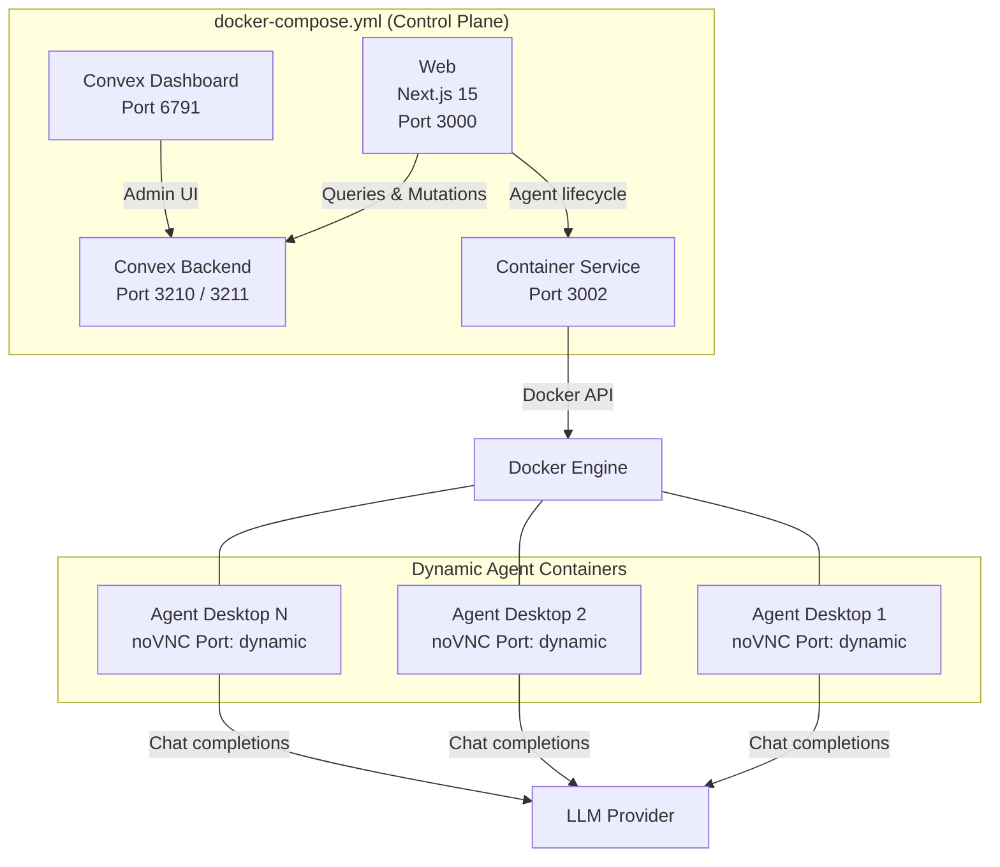
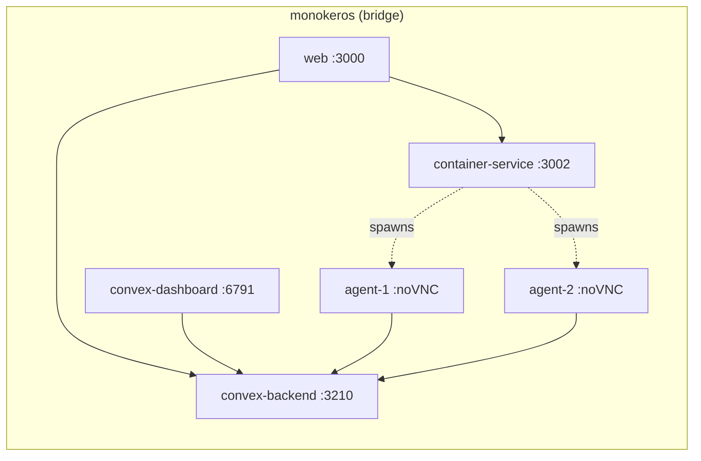

# Self-Hosting

MonokerOS is designed to run entirely on your own infrastructure via Docker Compose. This guide covers the full deployment architecture, configuration reference, security hardening, and operational procedures.

---

## Architecture Overview

The MonokerOS stack consists of four Docker Compose services plus dynamically spawned agent containers.



**Key design decision:** Agent containers are NOT defined in `docker-compose.yml`. They are spawned dynamically by the Container Service using the Podman/Docker API. This allows the platform to scale agents up and down on demand.

---

## Services Reference

### convex-backend (Port 3210 / 3211)

The self-hosted Convex backend is the real-time database and function runtime. It replaces traditional REST APIs with reactive queries, mutations, and actions.

| Property | Value |
|----------|-------|
| Image | `ghcr.io/get-convex/convex-backend:latest` |
| Ports | `3210` (API), `3211` (site) |
| Volume | `convex-data` (persistent database) |
| Health check | `curl -f http://localhost:3210/version` |
| Restart policy | `unless-stopped` |

### convex-dashboard (Port 6791)

Admin dashboard for inspecting data, running queries, viewing function logs, and managing the Convex deployment.

| Property | Value |
|----------|-------|
| Image | `ghcr.io/get-convex/convex-dashboard:latest` |
| Port | `6791` |
| Depends on | `convex-backend` (healthy) |
| Restart policy | `unless-stopped` |

### container-service (Port 3002)

A Bun HTTP server that manages container lifecycles for agents (Podman or Docker). Called by Convex actions (not directly by the browser).

| Property | Value |
|----------|-------|
| Build | `docker/container-service/Dockerfile` |
| Port | `3002` |
| Container socket | Mounted at `/var/run/docker.sock` (auto-detects Podman or Docker) |
| Volumes | `agent-data:/data`, `./packages/mcp:/opt/monokeros/mcp:ro` |
| Restart policy | `unless-stopped` |

### web (Port 3000)

The Next.js 15 web application with TurboPack. Serves the entire MonokerOS UI.

| Property | Value |
|----------|-------|
| Build | `docker/web/Dockerfile` |
| Port | `3000` |
| Depends on | `convex-backend`, `container-service` |
| Restart policy | `unless-stopped` |

---

## Environment Variables

### Required Variables

These must be set in a `.env` file at the project root (or passed to Docker Compose via the shell).

| Variable | Service(s) | Description |
|----------|-----------|-------------|
| `CONVEX_SELF_HOSTED_ADMIN_KEY` | convex-backend | Admin key for the Convex backend. Generate: `openssl rand -hex 32` |
| `CONTAINER_SERVICE_SECRET` | container-service, web | Shared Bearer token between Convex actions and Container Service. Generate: `openssl rand -hex 32` |
| `LLM_API_KEY` | container-service | API key for the LLM provider. Passed to agent containers at runtime. |

### Optional Variables

| Variable | Service(s) | Default | Description |
|----------|-----------|---------|-------------|
| `LLM_BASE_URL` | container-service | `https://api.openai.com/v1` | LLM provider base URL. Can be overridden per-workspace in Convex. |
| `LLM_MODEL` | container-service | `gpt-4o` | Default model identifier. Can be overridden per-workspace. |
| `NEXT_PUBLIC_CONVEX_URL` | web | `http://127.0.0.1:3210` | URL where the browser reaches Convex. Must be publicly accessible in production. |
| `CONVEX_CLOUD_ORIGIN` | convex-backend | `http://127.0.0.1:3210` | Origin URL the Convex backend uses for itself. |
| `CONVEX_SITE_ORIGIN` | convex-backend | `http://127.0.0.1:3211` | Site origin URL for Convex. |
| `NEXT_PUBLIC_DEPLOYMENT_URL` | convex-dashboard | `http://127.0.0.1:3210` | Convex backend URL for the dashboard. |
| `RUST_LOG` | convex-backend | `info` | Log level for the Convex backend. |
| `TELEGRAM_BOT_TOKEN` | container-service | -- | Telegram bot token for agent channel integration. |

### Port Override Variables

| Variable | Default | Description |
|----------|---------|-------------|
| `CONVEX_PORT` | `3210` | Convex backend API port. |
| `CONVEX_SITE_PORT` | `3211` | Convex site port. |
| `CONVEX_DASHBOARD_PORT` | `6791` | Convex dashboard port. |
| `CONTAINER_SERVICE_PORT` | `3002` | Container Service port. |
| `WEB_PORT` | `3000` | Web app port. |

### Container Service Agent Variables

| Variable | Default | Description |
|----------|---------|-------------|
| `AGENT_IMAGE` | `monokeros/openclaw-desktop:latest` | Container image for agent desktops. Legacy name `AGENT_DOCKER_IMAGE` also works. |
| `AGENT_DOCKER_NETWORK` | `monokeros` | Bridge network for agent containers. |
| `CONTAINER_SOCKET` | _(auto-detected)_ | Container engine socket URL. Legacy name `DOCKER_HOST` also works. Auto-detection probes Podman sockets first, then Docker. |
| `CONTAINER_RUNTIME` | _(auto-detected)_ | Force `podman` or `docker`. Skips auto-detection. |
| `DATA_DIR` | `/data` | Agent data directory inside the Container Service. |

---

## Agent Container Specifications

Each agent container is spawned with the following resource limits and configuration:

### Resource Limits

| Resource | Limit |
|----------|-------|
| Memory | 512 MB |
| CPU | 1 core |
| Shared memory (`/dev/shm`) | 256 MB |
| tmpfs (`/tmp`) | 100 MB |

### Container Contents

Each agent container is built from the `monokeros/openclaw-desktop` image, which includes:

- **Ubuntu 24.04** base image
- **OpenBox** window manager
- **Xvnc** virtual display server
- **noVNC** for browser-based VNC access (unique port per agent)
- **Chrome** browser
- **OpenClaw** agent runtime
- **Bun** runtime for MCP tools

### Security

- Containers run as a **non-root user**
- `--security-opt=no-new-privileges` is applied
- Each container is isolated on the `monokeros` bridge network
- File system access is limited to the agent's own data directory

---

## Volumes

| Volume | Mount Points | Description |
|--------|-------------|-------------|
| `convex-data` | convex-backend: `/convex/data` | Persistent Convex database storage. **Back up this volume.** |
| `agent-data` | container-service: `/data`, agent containers: `/data/<agent-id>` | Workspace files for agents (SOUL.md, AGENTS.md, etc.). Shared between the Container Service and individual agent containers. |
| `chromium-cache` | agent containers: shared mount | Shared Chromium cache (~250MB) across all agent containers to reduce disk usage and startup time. |

---

## Network

All services communicate on the `monokeros` bridge network.



- The web app communicates with Convex for data and Container Service for agent lifecycle.
- Agent containers communicate with Convex directly for tool calls via the MCP server.
- The Container Service communicates with the container engine (Podman or Docker) via the mounted socket to spawn/stop agents.

---

## Provider Configuration

LLM provider settings can be configured at multiple levels:

1. **Environment variables** (`.env`) -- global defaults for `LLM_API_KEY`, `LLM_BASE_URL`, `LLM_MODEL`.
2. **Workspace level** -- override provider settings per-workspace via the Convex data store.
3. **Agent level** -- override per-agent for specialized models (e.g., a code agent using a different model than a writing agent).

The resolution chain is: agent override > workspace override > environment variable default.

For a list of supported providers and their base URLs, see the [Installation guide](./installation.md#ai-provider-setup).

---

## Building the Agent Desktop Image

The agent desktop image must be built before agents can be started:

```bash
# Podman (recommended)
podman build -t monokeros/openclaw-desktop docker/openclaw-desktop/

# Docker
docker build -t monokeros/openclaw-desktop docker/openclaw-desktop/
```

To use a custom image name, set the `AGENT_IMAGE` environment variable:

```dotenv
AGENT_IMAGE=your-registry/openclaw-desktop:v1.0
```

For production deployments, push the image to a container registry and reference it by digest for reproducibility:

```bash
podman build -t your-registry/openclaw-desktop:v1.0 docker/openclaw-desktop/
podman push your-registry/openclaw-desktop:v1.0
```

---

## Deploying the Convex Schema

After starting the stack for the first time (or after schema changes), push the Convex functions and schema:

```bash
bunx convex deploy \
  --admin-key $CONVEX_SELF_HOSTED_ADMIN_KEY \
  --url http://localhost:3210
```

Seed data is automatically loaded via `convex/seed.ts` on first deployment.

---

## Reverse Proxy Considerations

When deploying behind a reverse proxy (nginx, Caddy, Traefik, etc.), you need to handle:

- **Web app** on port 3000 -- standard HTTP proxy.
- **Convex backend** on port 3210 -- must support HTTP upgrades for Convex's real-time protocol.
- **noVNC ports** -- each agent container exposes a unique noVNC port for desktop streaming. These are dynamically assigned and must be accessible to the browser.

### Nginx Example

```nginx
upstream web {
    server 127.0.0.1:3000;
}

upstream convex {
    server 127.0.0.1:3210;
}

server {
    listen 443 ssl;
    server_name monokeros.example.com;

    ssl_certificate     /etc/ssl/certs/monokeros.pem;
    ssl_certificate_key /etc/ssl/private/monokeros.key;

    # Web app
    location / {
        proxy_pass http://web;
        proxy_set_header Host $host;
        proxy_set_header X-Real-IP $remote_addr;
        proxy_set_header X-Forwarded-For $proxy_add_x_forwarded_for;
        proxy_set_header X-Forwarded-Proto $scheme;
    }
}

server {
    listen 443 ssl;
    server_name convex.monokeros.example.com;

    ssl_certificate     /etc/ssl/certs/monokeros.pem;
    ssl_certificate_key /etc/ssl/private/monokeros.key;

    # Convex backend (supports HTTP upgrades)
    location / {
        proxy_pass http://convex;
        proxy_http_version 1.1;
        proxy_set_header Upgrade $http_upgrade;
        proxy_set_header Connection "upgrade";
        proxy_set_header Host $host;
        proxy_read_timeout 86400;
    }
}
```

### Caddy Example

```caddyfile
monokeros.example.com {
    reverse_proxy localhost:3000
}

convex.monokeros.example.com {
    reverse_proxy localhost:3210
}
```

Caddy automatically provisions TLS certificates via Let's Encrypt and handles protocol upgrades natively.

> **Important:** Set `NEXT_PUBLIC_CONVEX_URL` and `CONVEX_CLOUD_ORIGIN` to the publicly accessible Convex URL when deploying behind a reverse proxy.

---

## Monitoring

### Convex Dashboard

The Convex dashboard at port 6791 provides:

- Data browser for all tables
- Function logs with execution times
- Real-time subscription inspector
- Schema and index viewer

### Container Service Health

The Container Service exposes a health endpoint:

```bash
curl http://localhost:3002/health
```

This returns the service status and can be used for external health monitoring or load balancer probes.

### Docker Container Monitoring

Monitor running agent containers:

```bash
# List all agent containers
docker ps --filter "label=monokeros.agent"

# View logs for a specific agent container
docker logs <container-id>

# Inspect resource usage
docker stats --filter "label=monokeros.agent"
```

---

## Backup Strategy

### Convex Data

The `convex-data` volume contains all persistent data (workspaces, agents, teams, projects, tasks, conversations, files, etc.). Back up this volume regularly:

```bash
# Stop Convex to ensure consistency
docker compose stop convex-backend

# Back up the volume
docker run --rm -v convex-data:/data -v $(pwd)/backups:/backup \
  alpine tar czf /backup/convex-data-$(date +%Y%m%d).tar.gz /data

# Restart
docker compose start convex-backend
```

### Agent Data

The `agent-data` volume contains agent workspace files (SOUL.md, AGENTS.md, etc.). These are regenerated from Convex data when agents start, but backing up the volume preserves any runtime artifacts:

```bash
docker run --rm -v agent-data:/data -v $(pwd)/backups:/backup \
  alpine tar czf /backup/agent-data-$(date +%Y%m%d).tar.gz /data
```

### Environment Configuration

Store your `.env` file securely. Never commit it to version control. Use a secrets manager (Vault, AWS Secrets Manager, etc.) for production deployments.

---

## Upgrading

To upgrade MonokerOS to a new version:

```bash
# Pull latest source
git pull origin main

# Install updated dependencies
bun install

# Pull latest Convex images
docker compose pull convex-backend convex-dashboard

# Rebuild Container Service and Web images
docker compose build container-service web

# Rebuild agent desktop image
docker build -t monokeros/openclaw-desktop docker/openclaw-desktop/

# Restart the stack
docker compose up -d

# Push updated Convex schema
bunx convex deploy \
  --admin-key $CONVEX_SELF_HOSTED_ADMIN_KEY \
  --url http://localhost:3210
```

Running agent containers are not affected by the upgrade. They will use the new image on next restart.

---

## Security Checklist

| Item | Recommendation |
|------|---------------|
| `CONVEX_SELF_HOSTED_ADMIN_KEY` | Generate a strong random key. Never expose publicly. |
| `CONTAINER_SERVICE_SECRET` | Generate a strong random key. Used as Bearer token for all Container Service requests. |
| `LLM_API_KEY` | Store securely. Rotated regularly. Never commit to version control. |
| Agent containers | Run as non-root, `no-new-privileges`, resource-limited (512MB RAM, 1 CPU). |
| Container socket | The Container Service requires access to the Podman or Docker socket. Podman's rootless mode reduces exposure. In production with Docker, consider using a Docker socket proxy with restricted permissions. |
| Network isolation | All services on the `monokeros` bridge network. Agent containers cannot access the host network. |
| TLS | Terminate TLS at the reverse proxy. All internal communication is over the Docker bridge network. |
| Convex admin key | Only used for schema deployment. Not exposed to the web app or end users. |

---

## Related Pages

- [Installation](./installation.md) -- initial setup and provider configuration
- [Quick Start](./quick-start.md) -- first steps with the platform
- [Drives](../core-concepts/drives.md) -- file system architecture and drive scopes
- [AI Providers](../features/ai-providers.md) -- configuring LLM providers
