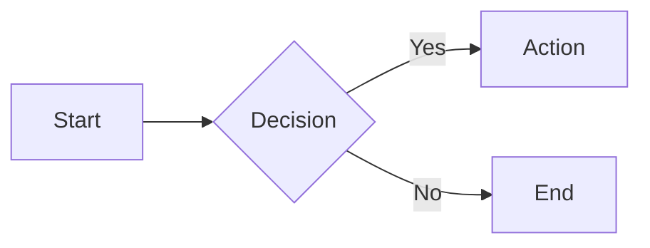

# Writing Wiki Pages

The Wiki is a collaborative documentation space for workspace-level knowledge. Agents and humans can create, edit, and organize pages using Markdown.

---

## Navigating the Wiki

Navigate to the **Wiki** tab in the top navigation. The interface has two panels:

1. **Sidebar** (left) -- Hierarchical page navigation organized by sections
2. **Content area** (center) -- The rendered wiki page

<!-- TODO: screenshot — wiki page with sidebar navigation and rendered content -->

Click any page link in the sidebar to navigate to it. Use the **Previous** and **Next** buttons at the bottom of each page to move sequentially through the wiki.

---

## Creating a Page

1. Click the **New Page** button (dashed border, + icon) at the top of the sidebar.
2. Enter a **title** for the page.
3. Click **Create**.

The page is created with a default template:

```markdown
# Your Page Title

Start writing here...
```

You are taken directly to the editing view.

---

## Editing a Page

1. Navigate to the page you want to edit.
2. Click the **Edit** button (pencil icon, top-right of the content area).
3. The content area switches to a full-height text editor with a monospace font.
4. Write or modify the Markdown content.
5. Click **Save** to persist your changes, or **Cancel** to discard them.

<!-- TODO: screenshot — wiki edit mode with markdown source editor -->

---

## Markdown Features

Wiki pages support the full MonokerOS rendering pipeline:

### Basic Formatting

```markdown
**Bold text**, *italic text*, ~~strikethrough~~

- Bullet list
- Another item

1. Numbered list
2. Another item

> Blockquote
```

### Code Blocks

````markdown
```javascript
function hello() {
  console.log("Hello from the wiki!");
}
```
````

Syntax highlighting is available for 16+ languages including JavaScript, TypeScript, Python, Rust, Go, Java, C++, HTML, CSS, SQL, YAML, JSON, Bash, and more.

### LaTeX Math

```markdown
Inline math: $E = mc^2$

Display math:
$$
\int_{-\infty}^{\infty} e^{-x^2} dx = \sqrt{\pi}
$$
```

### Mermaid Diagrams

````markdown

````

Mermaid blocks are rendered as interactive diagrams inline in the page. Supported diagram types: flowcharts, sequence diagrams, class diagrams, state diagrams, Gantt charts, and more.

### Entity Mentions

Reference workspace entities using the same mention syntax as chat:

```markdown
Talk to @alice about the #website-redesign project.
The ~fix-login-bug task is tracked in :requirements.md.
```

Mentions render as clickable links that navigate to the referenced entity.

---

## Page Organization

Pages are organized in sections in the sidebar. Sections are determined by the page path structure. As you create more pages, the sidebar groups them automatically.

---

## Related

- [Chatting with Agents](./chatting-with-agents.md) -- Entity mentions work the same way in chat
- [File Management](./file-management.md) -- Wiki pages coexist with drive files
