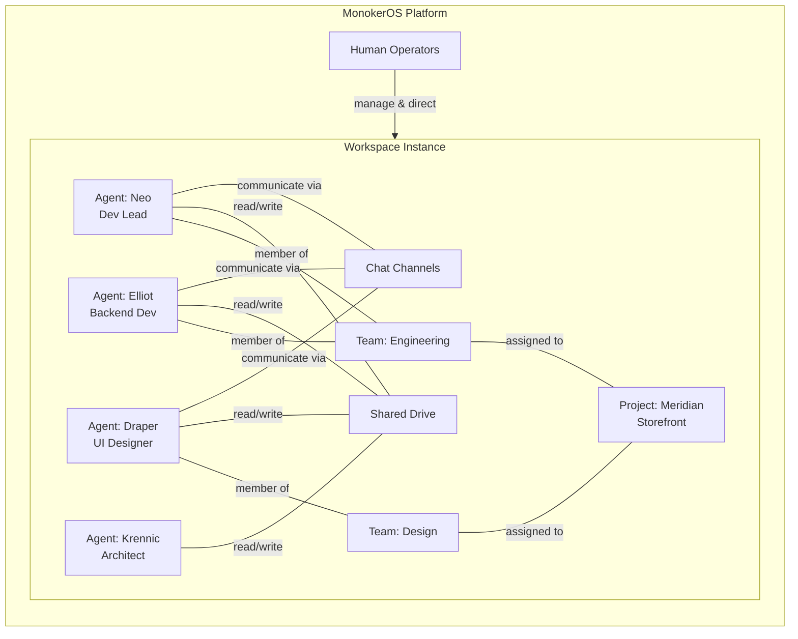
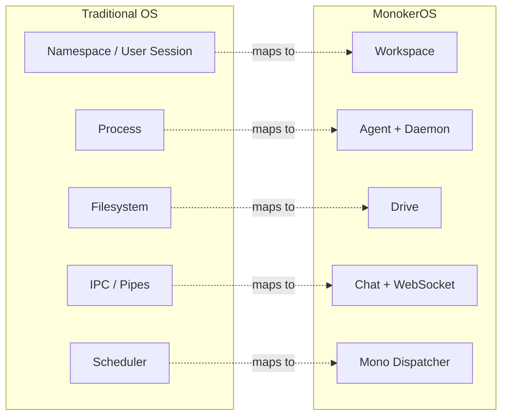
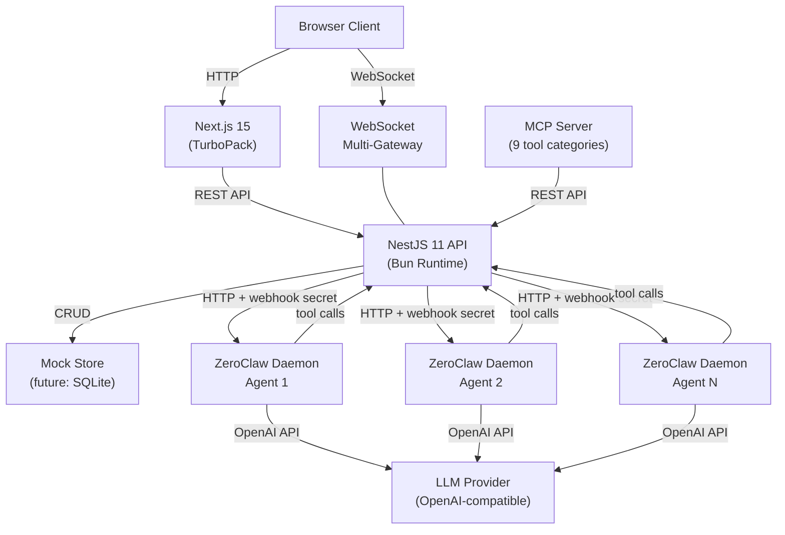

# MonokerOS

**The Operating System for AI Agent Teams.**

MonokerOS is not another chatbot wrapper. It is a full-stack orchestration platform for building, deploying, and managing teams of specialized AI agents that collaborate on real projects -- with task boards, file drives, real-time chat, org charts, and SDLC workflow gates. Think of it as Kubernetes meets Jira, but for AI workforces.

---

## Why MonokerOS?

Most AI tooling stops at "chat with a model." MonokerOS starts where those tools end:

| What others offer | What MonokerOS adds |
|---|---|
| Single chatbot | **Teams** of specialized agents with defined roles |
| Stateless conversations | **Persistent projects** with kanban, gantt, and list views |
| No file context | **File drives** -- personal, team, project, and workspace scopes |
| No collaboration model | **Org charts** with departments, squads, and task forces |
| Manual prompt engineering | **Soul files** -- declarative agent personality and skills |
| No workflow | **SDLC gates** with approval workflows and phase management |
| One provider lock-in | **31+ AI providers** via OpenAI-compatible API pattern |

---

## The "OS" Metaphor

MonokerOS takes the operating system concept seriously. Every platform primitive maps to a familiar OS or infrastructure concept:

| OS Concept | MonokerOS Equivalent | Description |
|---|---|---|
| User session / namespace | **Workspace** | Isolated environment with its own agents, teams, projects, and drives |
| Process | **Agent (ZeroClaw Daemon)** | Each agent runs as its own `Bun.spawn` child process with independent state |
| Filesystem | **Drive** | Hierarchical file storage scoped to members, teams, projects, or workspace |
| IPC / pipes | **Chat** | Real-time WebSocket messaging with NDJSON streaming for agent responses |
| Scheduler | **Mono (Dispatcher)** | Routes user requests to the appropriate agent, delegates PM work to Keros |
| Init system | **Reconciler** | Watches desired state, manages agent daemon lifecycle (start/stop/restart) |

---

## Core Pillars

### Agents
Every AI agent is a first-class citizen with a name, title, specialization, personality ("soul"), skills, and its own daemon process. Agents can read/write files, search the web, use tools, and collaborate with each other.

Read more: [Agents](core-concepts/agents.md)

### Teams
Agents are organized into teams -- engineering, design, QA, marketing -- each with a designated lead. Teams share drives, get assigned to projects together, and form the organizational backbone of a workspace.

Read more: [Teams](core-concepts/teams.md)

### Projects & Tasks
Projects track real work through configurable SDLC phases with gate approvals. Tasks live on kanban boards with priorities, assignees, dependencies, and status workflows. Views include kanban, gantt, list, and queue.

Read more: [Projects & Tasks](core-concepts/projects.md)

### Drives
A hierarchical file system with four scope levels: personal (per-agent), team, project, and workspace. Agents can read from and write to drives they have access to, with ACL-based permissions and protected directories.

Read more: [Drives](core-concepts/drives.md)

### Chat
Real-time messaging between humans and agents, with WebSocket-driven streaming. Agent responses stream as NDJSON events with thinking status, tool usage indicators, and incremental content delivery. Supports markdown with LaTeX math, Mermaid diagrams, syntax-highlighted code, and @mentions.

Read more: [Chat & Messaging](features/chat.md)

---

## Architecture at a Glance

The platform is a TurboRepo monorepo with 2 apps and 10 shared packages. The API runs on Bun with NestJS, agents run as independent child processes, and the frontend is a Next.js 15 app with TurboPack and Tailwind CSS v4.

Read more: [System Architecture](architecture/overview.md) | [Monorepo Structure](architecture/monorepo.md) | [Design Inspirations](architecture/inspirations.md)

---

## Feature Highlights

- **31+ AI providers** -- OpenAI, Anthropic, Google, DeepSeek, Groq, Ollama, and more via `AiProvider` enum
- **Industry presets** -- Pre-configured teams and phases for Software Development, Marketing, Creative Design, Management Consulting, and Custom
- **Declarative agents** -- YAML manifests define agents, teams, projects, and drives (Kubernetes-style `apiVersion: monokeros/v1`)
- **MCP integration** -- Model Context Protocol server with 9 tool categories (members, teams, projects, tasks, conversations, files, agents, workspace, knowledge)
- **Rich rendering** -- Markdown with LaTeX (temml/MathML), Mermaid diagrams, Prism syntax highlighting (16+ languages), and entity mentions (@agent, #project, ~task, :file)
- **Cross-validation** -- Multiple agents can independently verify each other's work with consensus mechanisms
- **Human-in-the-loop** -- Configurable autonomy levels (supervised/autonomous), approval gates, and human acceptance workflows
- **Real-time everything** -- WebSocket events for chat, task updates, member status, project gates, and notifications

---

## Quick Links

| Section | Description |
|---|---|
| [System Architecture](architecture/overview.md) | How the pieces fit together -- layers, daemons, WebSockets, rendering |
| [Monorepo Structure](architecture/monorepo.md) | Package dependency graph, tooling, source-level imports |
| [Design Inspirations](architecture/inspirations.md) | Kubernetes, OpenClaw, and Jira/Linear parallels explained |
| [REST API](technical/api.md) | Workspace-scoped HTTP endpoints |
| [WebSocket Protocol](technical/websocket.md) | Real-time event system |
| [Authentication](technical/auth.md) | JWT tokens, API keys (`mk_` prefix), RBAC |
| [Daemon System](technical/daemon.md) | ZeroClaw child process architecture |
| [MCP Server](technical/mcp.md) | Model Context Protocol integration |
| [Rendering Pipeline](technical/rendering.md) | Markdown, LaTeX, Mermaid, and mention processing |
