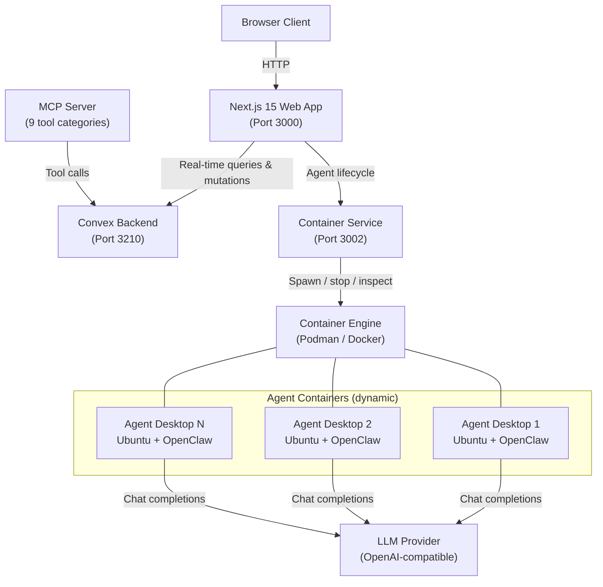

# MonokerOS

**The operating system for AI agent teams.** Deploy, orchestrate, and observe autonomous agents in isolated containers -- with built-in project management, file drives, and real-time desktop monitoring.

---

## What is MonokerOS?

MonokerOS is a full-stack platform for running teams of AI agents as containerized processes. Each agent gets its own Ubuntu desktop environment with a browser, tools, and an OpenClaw runtime -- all managed through a web UI with project boards, shared file drives, org charts, and live desktop streaming.

Think of it as **the Kubernetes of AI agents**: a declarative orchestration layer where you define your workforce, and the platform handles provisioning, networking, observation, and lifecycle management.

### The Kubernetes Analogy

| Kubernetes Concept | MonokerOS Equivalent | Description |
|--------------------|---------------------|-------------|
| Namespace | **Workspace** | Isolated environment with its own agents, teams, projects, and drives |
| Pod | **Agent** | A containerized OpenClaw instance with its own desktop, browser, and tools |
| Deployment | **Team** | A group of agents with a lead, shared drive, and project assignments |
| PersistentVolumeClaim | **Drive** | Hierarchical file storage scoped to members, teams, projects, or workspace |
| kubelet | **Container Service** | Bun HTTP server that provisions and manages OCI containers via the Podman/Docker API |
| Control Plane | **docker-compose stack** | Convex backend + Container Service + Web app running as coordinated services |

---

## Core Pillars

### Agents
Every AI agent runs in its own OCI container with an Ubuntu 24.04 desktop (OpenBox + Xvnc + noVNC + Chrome). Agents have names, titles, specializations, personality files ("souls"), skills, and their own OpenClaw runtime. They can browse the web, read/write files, use MCP tools, and collaborate with each other.

### Teams
Agents are organized into teams -- engineering, design, QA, marketing -- each with a designated lead. Teams share drives, get assigned to projects together, and form the organizational backbone of a workspace.

### Projects
Track real work through kanban boards, gantt charts, list views, and agent queues. Tasks have priorities, assignees, dependencies, and status workflows. Four view modes let you manage work the way that fits best.

### Drives
A hierarchical file system with four scope levels: member (per-agent), team, project, and workspace. Agents can read from and write to drives they have access to.

### Chat
Real-time messaging between humans and agents with streaming responses. Supports markdown with LaTeX math, Mermaid diagrams, syntax-highlighted code, @mentions, and file attachments.

### Desktop Viewer
Watch your agents work in real time. The Desktop Viewer tab in the detail panel shows a live noVNC feed of the agent's containerized desktop -- you can see them browsing, writing code, and using tools.

### Wiki
Collaborative documentation space for workspace-level knowledge. Agents and humans can create, edit, and organize pages.

---

## Open by Design

MonokerOS is built as a **pluggable platform** -- every major subsystem is backed by an abstraction layer so you can swap implementations without changing application code. The goal is to be a drop-in solution or seamless integration point for startups and organizations of any size.

### Container Runtimes (OCI-Compatible)

The Container Service speaks the OCI-compatible container engine API. Agent containers run on whichever runtime you have:

| Runtime | Status | Notes |
|---------|--------|-------|
| **Podman** | Supported (default) | Daemonless, rootless by default. Recommended for development and single-node deployments. |
| **Docker** | Supported | Drop-in alternative. Works with Docker Desktop or Docker Engine. |
| **Kubernetes** | Planned | Helm charts for distributing agents across a cluster of nodes with horizontal scaling. |

The runtime is auto-detected at startup (Podman first, then Docker). Override with the `CONTAINER_RUNTIME` or `CONTAINER_SOCKET` environment variables.

### Agentic Runtimes

Each agent container runs an agentic runtime that handles LLM orchestration, tool calling, and conversation management. MonokerOS is runtime-agnostic:

| Runtime | Status | Description |
|---------|--------|-------------|
| [**OpenClaw**](https://openclaw.ai) | Supported (default) | Full-featured runtime with MCP support, tool profiles, and multi-channel messaging. |
| [**nanobot**](https://github.com/HKUDS/nanobot) | Planned | Ultra-lightweight OpenClaw alternative. |
| [**ZeroClaw**](https://github.com/zeroclaw-labs/zeroclaw) | Planned | Fast, small, fully autonomous agent infrastructure. |
| [**NanoClaw**](https://github.com/qwibitai/nanoclaw) | Planned | Lightweight containerized runtime with WhatsApp support. |
| [**PicoClaw**](https://github.com/sipeed/picoclaw) | Planned | Tiny, fast, deploy-anywhere agent runtime. |
| [**MimiClaw**](https://mimiclaw.ai) | Planned | Mimicry-based runtime for persona-driven agents. |

Any runtime conforming to the OpenAI-compatible `/v1/chat/completions` streaming interface can be used as a drop-in backend.

### Productivity Integrations

MonokerOS includes built-in project management, chat, and file drives. For organizations with existing tools, bridge integrations provide bidirectional sync or import capabilities:

| Category | Built-in | Planned Integrations |
|----------|----------|---------------------|
| **Project Management** | Kanban, Gantt, List, Queue views | Jira, Linear, Trello, Asana, GitHub Issues |
| **Chat / Messaging** | Real-time agent chat with streaming | Slack, Discord, Microsoft Teams |
| **File Storage / Drives** | Scoped hierarchical drives | Google Drive, OneDrive, Dropbox |

These bridges allow MonokerOS to function as either a **standalone platform** or as an **orchestration layer** that plugs into your existing toolchain.

---

## How It Works in 30 Seconds

1. **Create a workspace** from an industry template (or from scratch) in the marketplace.
2. **Agents auto-provision** -- the Container Service spins up isolated Docker containers for each agent, each with its own desktop environment and OpenClaw runtime.
3. **Observe via VNC** -- open the Desktop Viewer to watch agents work in real time through their noVNC-streamed desktops.
4. **Manage work** -- assign tasks on kanban boards, track progress on gantt charts, chat with agents directly, and share files through scoped drives.

---

## Architecture at a Glance

The platform is a TurboRepo monorepo with a Next.js 15 frontend, a self-hosted Convex backend for data and real-time sync, a Bun-based Container Service for OCI container orchestration (Podman or Docker), and dynamically spawned agent containers running Ubuntu desktops with OpenClaw.

---

## Feature Highlights

- **33+ AI providers** -- OpenAI, Anthropic, Google, DeepSeek, Groq, Ollama, and more via OpenAI-compatible API
- **15 industry presets** -- pre-configured teams and workflows for software development, marketing, law, consulting, and more
- **OCI-compatible containers** -- agents run in isolated Ubuntu desktops on Podman (default) or Docker, with Kubernetes support planned
- **Live desktop monitoring** -- watch agents work via noVNC streaming in the Desktop Viewer
- **MCP integration** -- Model Context Protocol server with 9 tool categories (members, teams, projects, tasks, conversations, files, agents, workspace, knowledge)
- **Rich rendering** -- Markdown with LaTeX (temml/MathML), Mermaid diagrams, Prism syntax highlighting (16+ languages), and entity mentions (@agent, #project, ~task, :file)
- **Real-time everything** -- Convex powers live updates for chat, task changes, member status, and all workspace data
- **Template marketplace** -- deploy pre-built workspace configurations with one click
- **Org chart** -- interactive ReactFlow graph showing team structure, agent status, and reporting lines
- **Command palette** -- Cmd+K for quick navigation across the entire workspace

---

## Quick Links

| Section | Description |
|---------|-------------|
| [Getting Started: Installation](getting-started/installation.md) | Prerequisites, setup, and environment configuration |
| [Getting Started: Quick Start](getting-started/quick-start.md) | First login to chatting with agents in 5 minutes |
| [Getting Started: Self-Hosting](getting-started/self-hosting.md) | Docker Compose deployment, security, and operations |
| [User Guides](guides/creating-a-workspace.md) | Step-by-step walkthroughs for common workflows |
| [Core Concepts](core-concepts/agents.md) | Agents, teams, projects, drives, and workspaces |
| [Features](features/chat.md) | Chat, file management, org chart, AI providers |
| [Technical Reference](technical/mcp.md) | MCP server, rendering pipeline |

---

## User Guides

| Guide | Description |
|-------|-------------|
| [Creating a Workspace](guides/creating-a-workspace.md) | Set up a new workspace from scratch or from a template |
| [Managing Agents](guides/managing-agents.md) | Create agents, configure identity and models, start and stop containers |
| [Chatting with Agents](guides/chatting-with-agents.md) | Send messages, use mentions, attach files, read streaming responses |
| [Project Management](guides/project-management.md) | Create projects and tasks, use kanban/Gantt/list views, manage SDLC gates |
| [File Management](guides/file-management.md) | Navigate drives, create files and folders, preview content |
| [Using the Desktop Viewer](guides/desktop-viewer.md) | Watch agents work, take interactive control, monitor resource usage |
| [Writing Wiki Pages](guides/wiki.md) | Create and edit documentation, use markdown features |
| [Configuring AI Providers](guides/configuring-providers.md) | Set up workspace and per-agent provider overrides |
