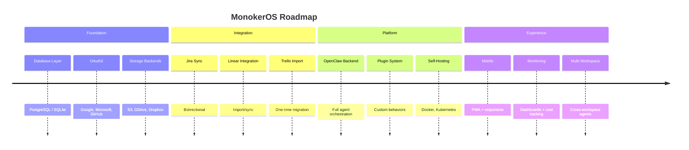
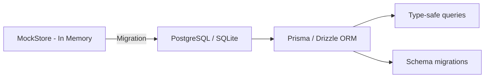
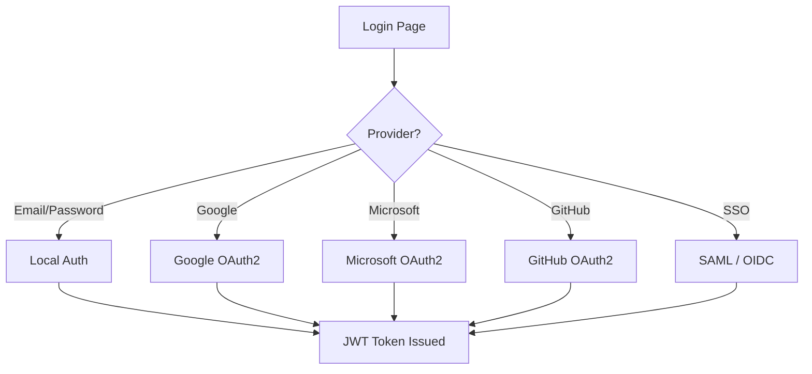
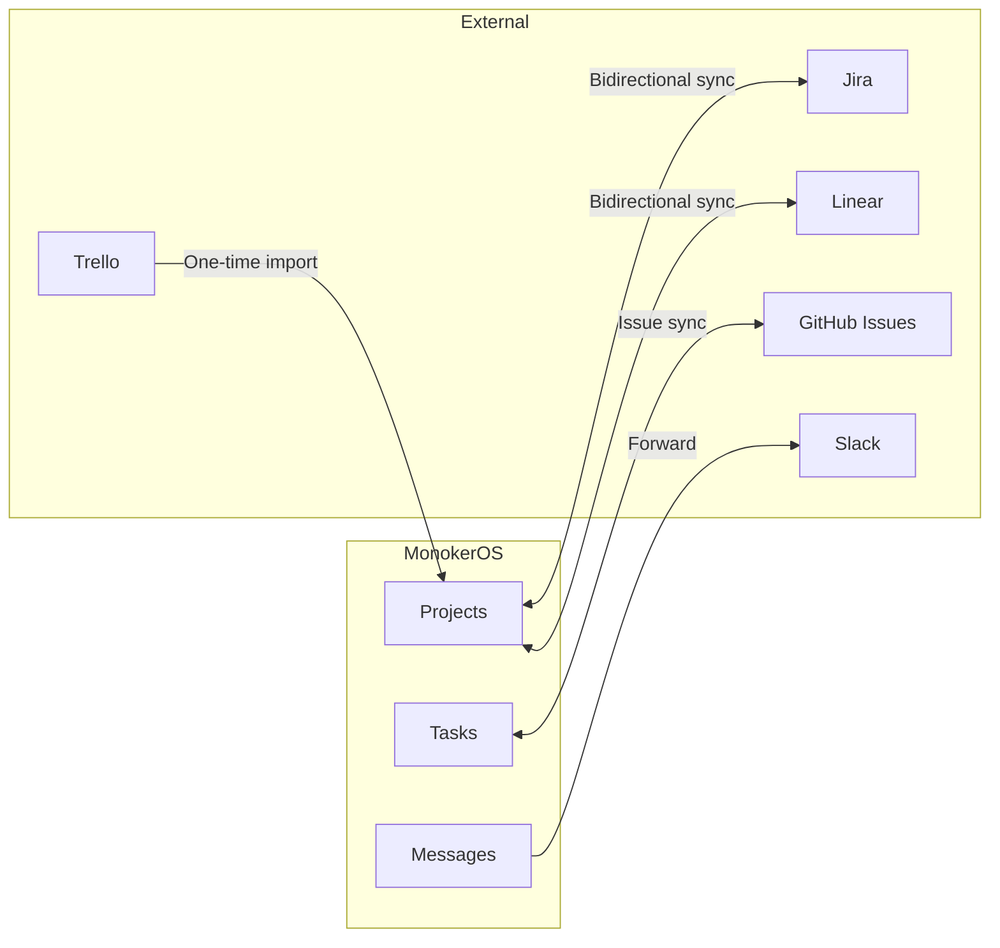
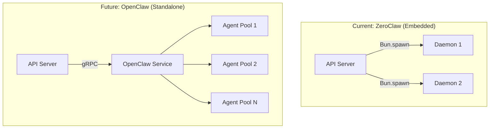
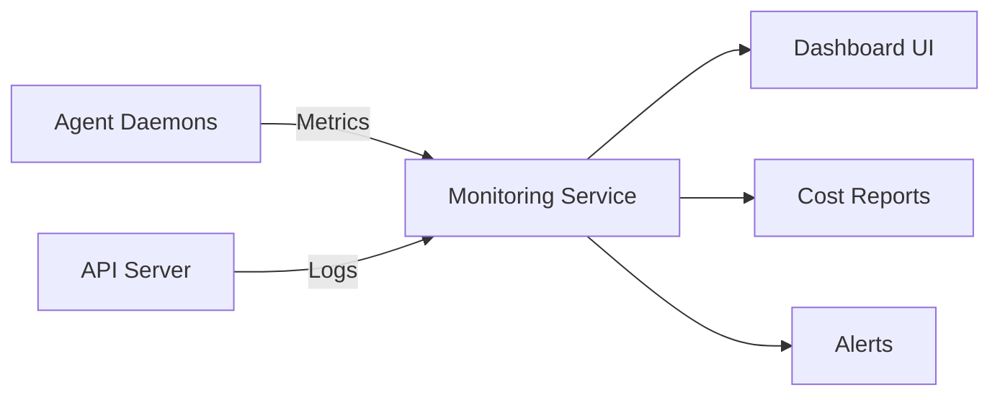
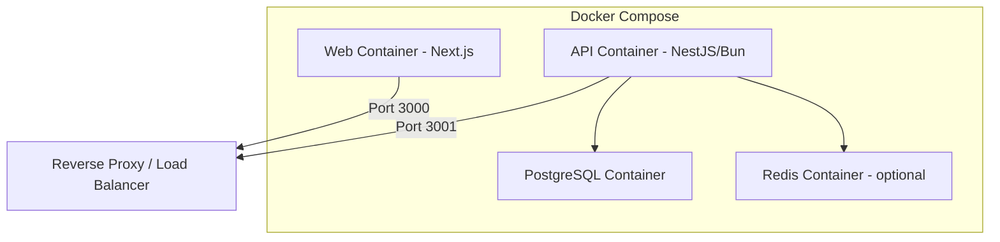

# Future Plans & Roadmap

This document outlines the planned features and improvements for MonokerOS. Items are grouped by category and roughly prioritized within each section.

## Overview

## Database

**Current state**: All data is stored in an in-memory mock store (`MockStore`). Server restarts wipe all data, and seed data is auto-loaded on boot.

**Planned**:

| Feature | Description | Priority |
|---------|-------------|----------|
| **PostgreSQL support** | Full relational database for production deployments | High |
| **SQLite support** | Lightweight alternative for self-hosted / single-machine deployments | High |
| **Migration system** | Schema versioning and migration tooling | High |
| **Data persistence** | Conversations, files, members, projects all survive restarts | High |

## Authentication

**Current state**: Dev-mode login (any email + "password"), JWT tokens, `mk_` API keys. See [Authentication](../technical/auth.md) for current details.

**Planned**:

| Feature | Description | Priority |
|---------|-------------|----------|
| **Google OAuth2** | Sign in with Google accounts | High |
| **Microsoft OAuth2** | Sign in with Microsoft / Azure AD | Medium |
| **GitHub OAuth2** | Sign in with GitHub accounts | Medium |
| **SSO (SAML)** | Enterprise SAML-based single sign-on | Medium |
| **SSO (OIDC)** | OpenID Connect for generic identity providers | Medium |
| **Magic links** | Passwordless email login | Low |
| **MFA / 2FA** | Multi-factor authentication | Low |

## Storage Backends

**Current state**: Files are stored in the in-memory mock store as virtual file entries. See [File Management](../features/file-management.md).

**Planned**:

| Feature | Description | Priority |
|---------|-------------|----------|
| **Local filesystem** | Store files on disk for self-hosted deployments | High |
| **Amazon S3** | S3-compatible object storage | High |
| **Google Drive** | Sync workspace drives with Google Drive | Medium |
| **Dropbox** | Sync workspace drives with Dropbox | Medium |
| **Azure Blob** | Azure Blob Storage integration | Low |

The storage layer will use a pluggable adapter pattern, allowing different backends per workspace or globally.

## Integration Bridges

**Current state**: MonokerOS operates as a standalone platform with no external tool integrations.

**Planned**:

| Feature | Description | Priority |
|---------|-------------|----------|
| **Jira sync** | Bidirectional sync of projects and tasks with Jira | High |
| **Trello import** | One-time import of Trello boards into MonokerOS projects | Medium |
| **Linear integration** | Sync issues and projects with Linear | Medium |
| **GitHub Issues** | Sync tasks with GitHub issues | Medium |
| **Slack bridge** | Forward agent messages to Slack channels | Low |
| **Webhooks (outbound)** | Notify external systems of MonokerOS events | Medium |

## OpenClaw / ZeroClaw Evolution

**Current state**: Agents run as embedded [ZeroClaw daemons](../technical/daemon.md) -- child processes spawned by the API server. See the daemon documentation for details.

**Planned**:

| Feature | Description | Priority |
|---------|-------------|----------|
| **OpenClaw backend** | Standalone agent orchestration service replacing embedded daemons | High |
| **Agent pools** | Pre-warmed agent processes for faster cold starts | Medium |
| **Distributed execution** | Run agents across multiple machines | Medium |
| **Agent-to-agent communication** | Direct messaging between agent daemons | Medium |
| **Persistent daemon state** | Survive API restarts without losing conversation context | High |

## Agent Capabilities

**Current state**: Agents can search the web, read/write files, search knowledge, and (with admin context) manage workspace entities. See [Daemon System](../technical/daemon.md) for current tools.

**Planned**:

| Feature | Description | Priority |
|---------|-------------|----------|
| **Code execution sandboxes** | Agents can run code in isolated containers | High |
| **Web browsing** | Full browser automation for research tasks | Medium |
| **API integrations** | Agents call external APIs (REST, GraphQL) | Medium |
| **Image generation** | Agents create images via DALL-E, Midjourney, etc. | Low |
| **Document generation** | Agents produce PDFs, slides, spreadsheets | Medium |
| **Custom tools** | User-defined tools via plugin system | Medium |

## Multi-Workspace

**Current state**: Each workspace is independent with its own members, teams, projects, and files.

**Planned**:

| Feature | Description | Priority |
|---------|-------------|----------|
| **Cross-workspace agent sharing** | Reuse agent configurations across workspaces | Medium |
| **Organization-level admin** | Manage multiple workspaces from a single org account | Medium |
| **Agent marketplace** | Browse and install pre-configured agents | Low |
| **Template marketplace** | Community-contributed workspace templates | Low |

## Monitoring & Observability

**Current state**: Basic health check endpoints on daemons. No centralized monitoring.

**Planned**:

| Feature | Description | Priority |
|---------|-------------|----------|
| **Agent performance dashboards** | Response times, token usage, error rates per agent | High |
| **Cost tracking** | Per-agent and per-workspace LLM cost monitoring | High |
| **Audit logs** | Track all workspace changes with who/what/when | Medium |
| **Usage analytics** | Message volume, active agents, project progress metrics | Medium |
| **Alerting** | Notifications when agents error, costs spike, or daemons crash | Medium |

## Mobile & Responsive

**Current state**: Desktop-optimized web application.

**Planned**:

| Feature | Description | Priority |
|---------|-------------|----------|
| **Responsive design** | Adapt UI for tablet and mobile viewports | Medium |
| **PWA** | Progressive Web App for installable mobile experience | Medium |
| **Push notifications** | Browser and mobile push for messages and alerts | Medium |
| **Offline support** | Cache recent conversations for offline reading | Low |

## Self-Hosting

**Current state**: Run locally with `bun run dev`. No production deployment tooling.

**Planned**:

| Feature | Description | Priority |
|---------|-------------|----------|
| **Docker Compose** | Single-command deployment with docker compose | High |
| **Kubernetes Helm charts** | Production-grade K8s deployment | Medium |
| **One-click deploy** | Railway, Render, Fly.io templates | Medium |
| **Configuration guide** | Environment variables, secrets, networking docs | High |
| **Backup/restore** | Database and file backup tooling | Medium |

## Plugin System

**Current state**: No plugin or extension mechanism.

**Planned**:

| Feature | Description | Priority |
|---------|-------------|----------|
| **Custom agent behaviors** | Plugins that extend agent tool sets | Medium |
| **UI extensions** | Custom panels, widgets, and views | Low |
| **Custom renderers** | Plugin-defined content renderers | Low |
| **Event hooks** | React to workspace events with custom logic | Medium |
| **Plugin registry** | Discover and install community plugins | Low |

## Contributing

Interested in contributing to any of these features? Check the repository for open issues tagged with `roadmap` or `help-wanted`.

## Related Documentation

- [System Overview](../architecture/overview.md) -- Current architecture
- [Daemon System](../technical/daemon.md) -- Current agent execution model
- [Authentication](../technical/auth.md) -- Current auth system
- [File Management](../features/file-management.md) -- Current file storage
- [AI Providers](../features/ai-providers.md) -- Current provider support
