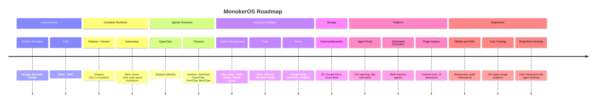
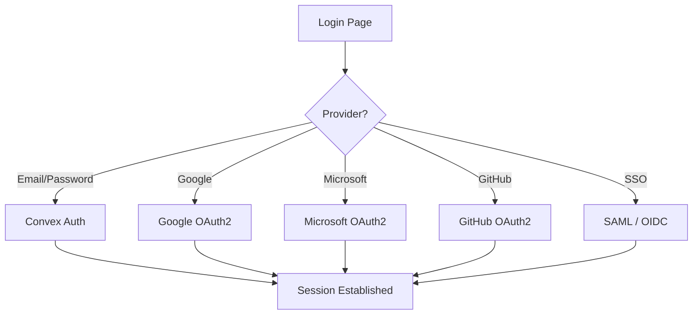
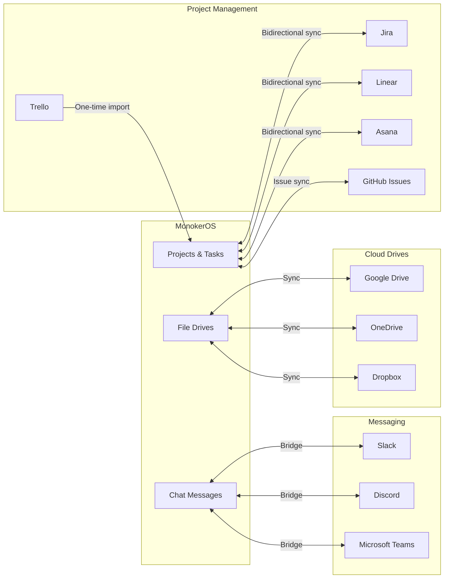

# Future Plans and Roadmap

This document outlines planned features and improvements for MonokerOS. Items are grouped by category and roughly prioritized within each section.

---

## Overview

---

## Authentication

**Current state**: Convex Auth with password-based login, `mk_` API keys for programmatic access.

**Planned**:

| Feature | Description | Priority |
|---------|-------------|----------|
| **Google OAuth2** | Sign in with Google accounts | High |
| **Microsoft OAuth2** | Sign in with Microsoft / Azure AD | High |
| **GitHub OAuth2** | Sign in with GitHub accounts | Medium |
| **SSO (SAML)** | Enterprise SAML-based single sign-on | Medium |
| **SSO (OIDC)** | OpenID Connect for generic identity providers | Medium |
| **Magic links** | Passwordless email login | Low |
| **MFA / 2FA** | Multi-factor authentication | Low |

---

## Container Runtimes (OCI-Compatible)

**Current state**: The Container Service auto-detects Podman or Docker at startup via the OCI-compatible engine API. Podman is the preferred default (daemonless, rootless).

| Runtime | Status | Notes |
|---------|--------|-------|
| **Podman** | **Shipped** | Default. Daemonless, rootless, ideal for dev and single-node deployments. |
| **Docker** | **Shipped** | Drop-in alternative. Docker Desktop or Docker Engine. |
| **Kubernetes** | Planned (High) | Helm charts for distributing agent containers across a cluster of nodes. Enables horizontal scaling, node affinity, and resource scheduling for large agent workforces. |

The `CONTAINER_RUNTIME` and `CONTAINER_SOCKET` environment variables allow explicit override. See [Container Service](../technical/container-service.md) for detection details.

---

## Agentic Runtimes

**Current state**: OpenClaw is the default agentic runtime. The architecture is runtime-agnostic -- any runtime exposing an OpenAI-compatible `/v1/chat/completions` streaming endpoint can be used.

| Runtime | Status | Description |
|---------|--------|-------------|
| [**OpenClaw**](https://openclaw.ai) | **Shipped** (default) | Full-featured agent runtime with MCP support, tool profiles, and multi-channel messaging. |
| [**nanobot**](https://github.com/HKUDS/nanobot) | Planned | Ultra-lightweight OpenClaw alternative. |
| [**ZeroClaw**](https://github.com/zeroclaw-labs/zeroclaw) | Planned | Fast, small, fully autonomous agent infrastructure. |
| [**NanoClaw**](https://github.com/qwibitai/nanoclaw) | Planned | Lightweight containerized runtime with WhatsApp support and scheduled jobs. |
| [**PicoClaw**](https://github.com/sipeed/picoclaw) | Planned | Tiny, fast, deploy-anywhere agent runtime. |
| [**MimiClaw**](https://mimiclaw.ai) | Planned | Mimicry-based agent runtime for persona-driven agents. |

Any runtime that implements the `/v1/chat/completions` streaming interface and reads the agent provisioning files (SOUL.md, AGENTS.md, TOOLS.md, config JSON) can be used as a drop-in backend.

---

## Storage Backends

**Current state**: Files are stored in Convex native file storage.

**Planned**:

| Feature | Description | Priority |
|---------|-------------|----------|
| **Amazon S3** | S3-compatible object storage for large file volumes | High |
| **Google Drive** | Sync workspace drives with Google Drive | Medium |
| **Azure Blob** | Azure Blob Storage integration | Medium |
| **Dropbox** | Sync workspace drives with Dropbox | Low |

The storage layer will use a pluggable adapter pattern, allowing different backends per workspace or globally.

---

## Integration Bridges

**Current state**: MonokerOS ships with built-in project management (kanban, Gantt, list, queue views), real-time chat, and scoped file drives. Integration bridges will allow organizations to connect their existing tools for a seamless workflow.

The goal is for MonokerOS to function as either a **standalone platform** or as an **orchestration layer** that plugs into existing toolchains -- providing drop-in replacement or bidirectional integration for startups and enterprises alike.

### Project Management

| Feature | Description | Priority |
|---------|-------------|----------|
| **Jira sync** | Bidirectional sync of projects and tasks with Jira | High |
| **Linear integration** | Bidirectional sync of issues and projects with Linear | High |
| **Asana sync** | Bidirectional sync of projects and tasks with Asana | Medium |
| **Trello import** | One-time import of Trello boards into MonokerOS projects | Medium |
| **GitHub Issues** | Bidirectional sync of tasks with GitHub issues | Medium |

### Chat / Messaging

| Feature | Description | Priority |
|---------|-------------|----------|
| **Slack bridge** | Bidirectional message bridge -- agent messages appear in Slack channels, Slack messages reach agents | High |
| **Discord bridge** | Bridge agent conversations to Discord servers and channels | Medium |
| **Microsoft Teams bridge** | Bridge agent conversations to Teams channels | Medium |
| **Webhooks (outbound)** | Notify external systems of MonokerOS events (messages, task changes, agent status) | Medium |

### File Storage / Drives

| Feature | Description | Priority |
|---------|-------------|----------|
| **Google Drive sync** | Bidirectional sync of workspace drives with Google Drive folders | Medium |
| **OneDrive sync** | Bidirectional sync with Microsoft OneDrive / SharePoint | Medium |
| **Dropbox sync** | Bidirectional sync with Dropbox folders | Low |

---

## Agent Scaling

**Current state**: Each agent runs in a single OCI container managed by the Container Service. Containers are created on demand using Podman or Docker.

**Planned**:

| Feature | Description | Priority |
|---------|-------------|----------|
| **Agent pools / pre-warming** | Maintain a pool of pre-warmed containers for faster cold starts | High |
| **Kubernetes distribution** | Run agent containers across a cluster of nodes via Helm charts, with pod scheduling, node affinity, and horizontal scaling | High |
| **Agent-to-agent direct communication** | Allow agents to message each other directly without routing through the human-facing chat | Medium |

---

## Monitoring and Analytics

**Current state**: Basic agent status tracking via the `agentRuntimes` table. No centralized cost or usage monitoring.

**Planned**:

| Feature | Description | Priority |
|---------|-------------|----------|
| **Cost tracking** | Per-agent and per-workspace LLM token cost monitoring | High |
| **Usage analytics** | Message volume, active agents, project progress metrics | High |
| **Agent performance dashboards** | Response times, token usage, error rates per agent | Medium |
| **Audit logs** | Track all workspace changes with who/what/when | Medium |
| **Alerting** | Notifications when agents error or costs spike | Medium |

---

## Mobile and Responsive

**Current state**: Desktop-optimized web application.

**Planned**:

| Feature | Description | Priority |
|---------|-------------|----------|
| **Responsive design** | Adapt UI for tablet and mobile viewports | Medium |
| **PWA** | Progressive Web App for installable mobile experience | Medium |
| **Push notifications** | Browser and mobile push for messages and alerts | Medium |
| **Offline support** | Cache recent conversations for offline reading | Low |

---

## Deployment

**Current state**: Docker Compose (or Podman Compose) for local and single-machine deployment. The Container Service auto-detects the OCI-compatible runtime.

**Planned**:

| Feature | Description | Priority |
|---------|-------------|----------|
| **Kubernetes Helm charts** | Production-grade K8s deployment distributing agent containers across nodes, with the control plane (Convex, Container Service, Web) running as Kubernetes services | High |
| **One-click deploy** | Railway, Render, Fly.io templates | Medium |
| **Backup/restore** | Automated database and file backup tooling | Medium |

---

## Plugin System

**Current state**: No plugin or extension mechanism.

**Planned**:

| Feature | Description | Priority |
|---------|-------------|----------|
| **Custom agent tools** | Plugins that extend agent tool sets via MCP | High |
| **UI extensions** | Custom panels, widgets, and views | Medium |
| **Custom renderers** | Plugin-defined content renderers for the markdown pipeline | Low |
| **Event hooks** | React to workspace events with custom logic | Medium |
| **Plugin registry** | Discover and install community plugins | Low |

---

## Agent Desktop

**Current state**: Read-only VNC access to agent desktops via noVNC. Humans can observe but not interact.

**Planned**:

| Feature | Description | Priority |
|---------|-------------|----------|
| **Read-write desktop mode** | Allow authorized users to interact with the agent's desktop (mouse, keyboard) for collaborative work or debugging | Medium |
| **Desktop recording** | Record agent desktop sessions for audit and review | Low |
| **Clipboard sharing** | Bidirectional clipboard between user browser and agent desktop | Low |

---

## Contributing

Interested in contributing to any of these features? Check the repository for open issues tagged with `roadmap` or `help-wanted`.

---

## Related Pages

- [Architecture Overview](../architecture/overview.md) -- Current system architecture
- [Agents](../core-concepts/agents.md) -- Agent container architecture
- [Workspaces](../core-concepts/workspaces.md) -- Workspace configuration
- [Chat](../features/chat.md) -- Real-time messaging system
