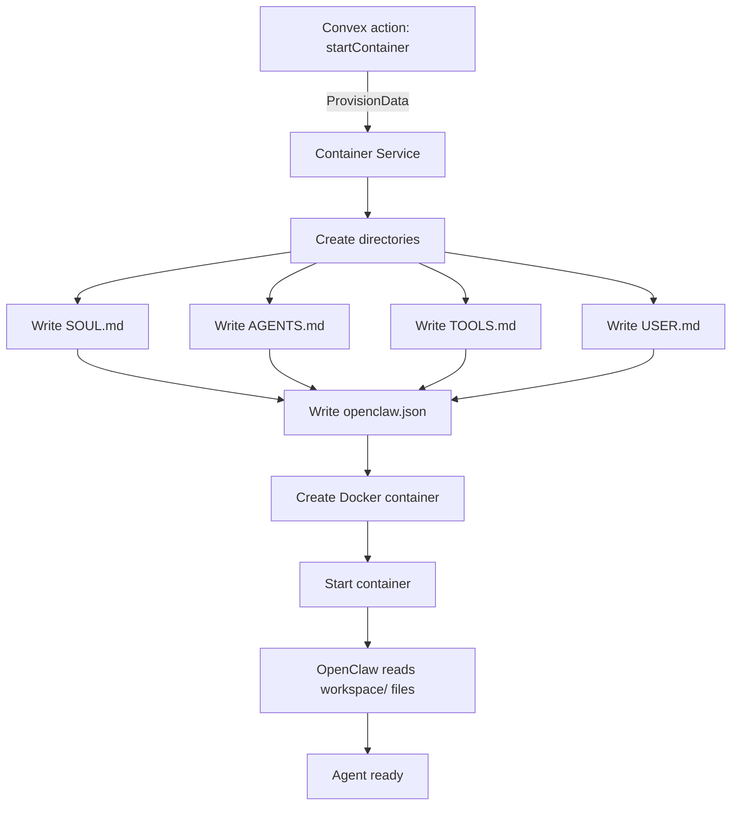

# Agent Provisioning

Before an agent's Docker container starts, the Container Service writes a set of configuration files to the agent's data directory on the host. These files define who the agent is, how it should reason, what tools it can use, and how the OpenClaw gateway should be configured.

Provisioning is defined in `services/container-service/src/provision.ts`.

## Directory Structure

Each agent gets a directory at `/data/{agentId}/` with the following layout:

```
/data/{agentId}/
  workspace/
    SOUL.md         -- Agent identity, soul text, skills, memory
    AGENTS.md       -- Reasoning framework, team roster, escalation
    TOOLS.md        -- MCP tool catalog, drive permissions
    USER.md         -- User context (updated over time)
  memory/           -- Persistent memory across sessions
  sessions/         -- Session-specific state
  KNOWLEDGE/        -- Shared knowledge base documents
  openclaw.json     -- OpenClaw gateway configuration
```

The `workspace/` directory contains the four markdown files that OpenClaw reads as the agent's system context. The `memory/`, `sessions/`, and `KNOWLEDGE/` directories are created empty and populated during the agent's operation.

## ProvisionData

The Container Service receives provisioning data from Convex actions when starting an agent. The data includes everything needed to generate all configuration files:

```typescript
interface ProvisionData {
  member: ProvisionMember;       // The agent being provisioned
  allMembers: ProvisionMember[]; // All members in the workspace
  allTeams: ProvisionTeam[];     // All teams in the workspace
  workspace: ProvisionWorkspace; // Workspace metadata
  provider: {                    // LLM provider config
    baseUrl: string;
    model: string;
    apiKey: string;
  };
}
```

If no provisioning data is provided (e.g., restarting a container), only the directory structure is created -- existing files are preserved.

## SOUL.md

The soul file defines the agent's identity and is the first thing the LLM reads when establishing context.

### Structure

```markdown
# {Agent Name}

{Soul text -- the agent's personality and purpose}

## Identity

- **ID**: {member ID}
- **Role**: {title}
- **Specialization**: {specialization}
- **Team**: {team ID}
- **Lead**: Yes/No

## Domain Skills

- {skill 1}
- {skill 2}
- ...

## Memory Context

- {memory item 1}
- {memory item 2}
- ...
```

The soul text comes from `member.identity.soul` -- a free-text paragraph that describes the agent's personality, communication style, and core purpose. Skills and memory items are arrays stored in the member's identity object.

If no identity is configured, the file contains only a header and a notice.

## AGENTS.md

The agents file provides the reasoning framework, team awareness, and behavioral guardrails.

### Reasoning Framework

Every agent gets the same 5-step reasoning process:

1. **Understand** -- re-read the message, identify the core intent
2. **Scope check** -- is this within your role? If not, suggest a teammate
3. **Confidence check** -- 4-5 proceed, 2-3 flag uncertainty, 1 ask for clarification
4. **Tool check** -- would a tool improve your answer? Use it
5. **Respond** -- clear, structured answer using Markdown

### System Agents vs Regular Agents

The team roster section differs based on whether the agent is a system agent or a regular team agent.

**System agents** (Keros, Mono) get:
- Workspace overview: team count, agent count, human count, industry
- List of other system agents
- Full roster of all teams with all members
- Role-specific instructions

**Regular agents** get:
- Their own team roster with `**(You)**` marker
- List of other teams with their leads
- Escalation path: within team -> team lead -> other team's lead -> human supervisor

### Keros vs Mono Roles

**Keros** (Project Manager):
- Break user intents into projects, phases, and tasks
- Create WBS/PRD documents in project drives
- Assign tasks to the right teams and agents
- Builds scaffolding -- teams execute the work

**Mono** (Dispatcher):
- Route user questions to the appropriate agent
- Provide workspace overview and org structure
- Delegate project work to Keros
- Never perform domain-specific work -- always delegate

### Communication Style

All agents share the same output format guidelines:
- Use Markdown: bold, italic, code blocks, tables, lists, headings
- Supported: fenced code blocks with language IDs, Mermaid diagrams, LaTeX math, @mentions
- Mention syntax: `@agent-name`, `#project-slug`, `~task-id`, `:file-name`

### Safety Rules

- System files (`SOUL.md`, `AGENTS.md`) are managed by the platform -- do not modify
- Confirm before irreversible actions (deletions, deployments, external communications)
- Stay in scope -- suggest the right teammate for out-of-scope requests
- Bias toward action, minimize chatter, verify before asserting

## TOOLS.md

The tools file documents available MCP tools and drive access permissions.

### Tool Categories

| Category | Tools | Available To |
|----------|-------|--------------|
| Files | `files.read`, `files.create`, `files.update`, `files.list_drives` | All agents |
| Knowledge | `knowledge_search` | All agents |
| Members | `members.list`, `members.get`, `members.update_status` | All agents |
| Teams | `teams.list`, `teams.get` | All agents |
| Projects | `projects.list`, `projects.get` | All agents |
| Tasks | `tasks.list`, `tasks.get`, `tasks.move` | All agents |
| Conversations | `conversations.send_message` | All agents |
| Workspace | `workspace.get`, `workspace.update` | System agents only |
| Admin | `members.create`, `teams.create`, `projects.create` | System agents only |
| PM | `tasks.create`, `tasks.assign`, `tasks.move`, `projects.update_gate` | Keros only |
| Delegation | `conversations.send_message` (to Keros) | Mono only |

### Drive Access Permissions

Permissions vary by agent type:

**Keros (Project Manager)**:

| Scope | Read | Write |
|-------|------|-------|
| Personal drive (`members/{id}`) | Yes | Yes |
| All team drives | Yes | No |
| All project drives | Yes | Yes |
| Workspace shared drive | Yes | No |

**Mono (Dispatcher)**:

| Scope | Read | Write |
|-------|------|-------|
| Personal drive (`members/{id}`) | Yes | Yes |
| All team drives | Yes | No |
| All project drives | Yes | No |
| Workspace shared drive | Yes | No |

**Regular Team Agents**:

| Scope | Read | Write |
|-------|------|-------|
| Personal drive (`members/{id}`) | Yes | Yes |
| Own team drive (`teams/{teamId}`) | Yes | Yes |
| Assigned project drives | Yes | Yes |
| Other teams' drives | Yes | No |
| Workspace shared drive | Yes | No |

## USER.md

The user file starts as a placeholder:

```markdown
# User

_No user information yet. This file is updated as the agent learns about the user._
```

As the agent interacts with users, it can be updated with preferences, context, and communication patterns. This file is the only workspace file expected to change during runtime.

## openclaw.json

The OpenClaw gateway configuration is a JSON file that tells the OpenClaw instance inside the container how to operate.

### Structure

```json
{
  "agents": {
    "defaults": { "model": "gpt-4o", "provider": "monokeros" },
    "list": [{
      "id": "{agentId}",
      "agentDir": "/data/{agentId}",
      "workspace": "/data/{agentId}/workspace"
    }]
  },
  "providers": {
    "monokeros": {
      "kind": "openai",
      "baseUrl": "{provider.baseUrl}",
      "apiKeyEnv": "LLM_API_KEY",
      "models": ["{provider.model}"]
    }
  },
  "channels": {
    "telegram": { "enabled": true, "botToken": "..." },
    "whatsapp": { "enabled": true }
  },
  "tools": {
    "mcp": {
      "servers": {
        "monokeros": {
          "command": "bun",
          "args": ["run", "/app/mcp/src/index.ts"],
          "env": {
            "MONOKEROS_API_KEY": "{mk_api_key}",
            "MONOKEROS_WORKSPACE": "{workspace_slug}",
            "MONOKEROS_API_URL": "{api_url}"
          }
        }
      }
    }
  },
  "gateway": {
    "http": {
      "bind": "0.0.0.0",
      "port": 18789,
      "endpoints": { "chatCompletions": { "enabled": true } }
    }
  },
  "session": {
    "dmScope": "per-channel-peer",
    "reset": { "mode": "daily", "atHour": 4 }
  }
}
```

### Key Sections

**providers** -- uses the OpenAI-compatible format. The API key is read from the `LLM_API_KEY` environment variable (not hardcoded in the config file).

**channels** -- optional Telegram and WhatsApp integration. Telegram is enabled if `TELEGRAM_BOT_TOKEN` is set. WhatsApp is enabled if `ENABLE_WHATSAPP=true`.

**tools.mcp.servers** -- configures the MonokerOS MCP server as a tool provider. The MCP package is mounted read-only at `/opt/monokeros/mcp` inside the container (mapped from `/app/mcp` in the `Binds` config). The MCP server connects back to the Convex backend (or Container Service) to execute workspace operations.

**gateway.http** -- binds the OpenClaw HTTP gateway to all interfaces on port 18789. This is the endpoint the Container Service's stream proxy connects to.

**session** -- DM scope is per-channel-peer (each conversation partner gets their own session). Sessions reset daily at 4 AM.

## Provisioning Flow



All four markdown files are written in parallel using `Promise.all`. The `openclaw.json` is written after the markdown files. Only then does the Docker container get created and started.
