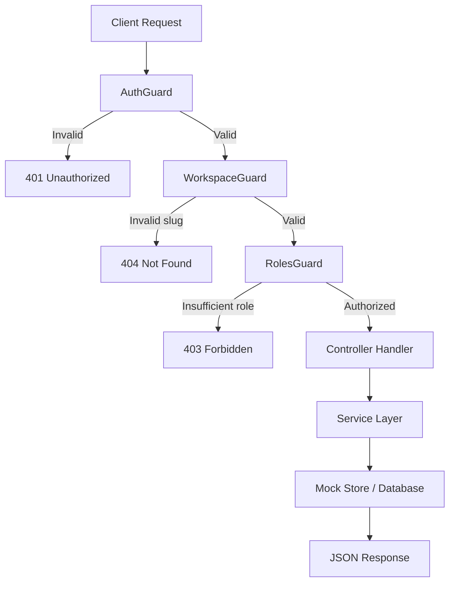

# REST API Reference

The MonokerOS API is a NestJS 11 application running on Bun. It exposes a RESTful JSON API for all workspace operations.

## Base URL

```
http://localhost:3001/api
```

## Authentication

All endpoints (except those marked `@Public()`) require authentication via one of two methods:

| Method | Header | Format |
|--------|--------|--------|
| **JWT Token** | `Authorization: Bearer <jwt>` | Issued on login |
| **API Key** | `Authorization: Bearer mk_<key>` | Workspace-scoped, `mk_` prefix |

See [Authentication](auth.md) for full details.

## Workspace-Scoped Routes

Most endpoints are scoped to a workspace via the URL pattern:

```
/api/workspaces/:slug/<resource>
```

The `:slug` is the workspace's URL-safe identifier (e.g., `my-agency`).

## Request/Response Format

- **Content-Type**: `application/json` for all request and response bodies
- **Error responses**: Standard HTTP status codes with JSON error body

```json
{
  "statusCode": 404,
  "message": "Member not found",
  "error": "Not Found"
}
```

## Endpoints by Resource

### Members

| Method | Path | Description |
|--------|------|-------------|
| GET | `/workspaces/:slug/members` | List all members |
| GET | `/workspaces/:slug/members/:id` | Get member by ID |
| POST | `/workspaces/:slug/members` | Create a new agent member |
| PATCH | `/workspaces/:slug/members/:id` | Update member fields |
| PATCH | `/workspaces/:slug/members/:id/status` | Update member status |
| POST | `/workspaces/:slug/members/:id/start` | Start agent |
| POST | `/workspaces/:slug/members/:id/stop` | Stop agent |
| GET | `/workspaces/:slug/members/:id/runtime` | Get agent runtime info |
| POST | `/workspaces/:slug/members/:id/reroll-name` | Randomize agent name |
| POST | `/workspaces/:slug/members/:id/reroll-identity` | Randomize full identity |

#### Example: Create Agent

```bash
curl -X POST http://localhost:3001/api/workspaces/my-agency/members \
  -H "Authorization: Bearer <token>" \
  -H "Content-Type: application/json" \
  -d '{
    "name": "Alice",
    "title": "Frontend Engineer",
    "specialization": "React, TypeScript",
    "teamId": "team-engineering",
    "isLead": false,
    "identity": {
      "soul": "A meticulous developer who loves clean code.",
      "skills": ["React", "TypeScript", "CSS"],
      "memory": []
    },
    "modelConfig": {
      "providerId": "openai",
      "model": "gpt-4o",
      "temperature": 0.7
    }
  }'
```

### Teams

| Method | Path | Description |
|--------|------|-------------|
| GET | `/workspaces/:slug/teams` | List all teams |
| GET | `/workspaces/:slug/teams/:id` | Get team with members |
| POST | `/workspaces/:slug/teams` | Create a team |
| PATCH | `/workspaces/:slug/teams/:id` | Update team fields |
| DELETE | `/workspaces/:slug/teams/:id` | Delete a team |

### Projects

| Method | Path | Description |
|--------|------|-------------|
| GET | `/workspaces/:slug/projects` | List projects (supports `?status=`, `?type=`, `?search=`) |
| GET | `/workspaces/:slug/projects/:id` | Get project details |
| POST | `/workspaces/:slug/projects` | Create a project |
| PATCH | `/workspaces/:slug/projects/:id` | Update project fields |
| PATCH | `/workspaces/:slug/projects/:id/gate` | Update SDLC gate status |

### Tasks

| Method | Path | Description |
|--------|------|-------------|
| GET | `/workspaces/:slug/tasks` | List tasks (supports `?projectId=`, `?status=`, `?assigneeId=`) |
| GET | `/workspaces/:slug/tasks/:id` | Get task details |
| POST | `/workspaces/:slug/tasks` | Create a task |
| PATCH | `/workspaces/:slug/tasks/:id` | Update task fields |
| PATCH | `/workspaces/:slug/tasks/:id/move` | Change task status |
| PATCH | `/workspaces/:slug/tasks/:id/assign` | Assign members to task |

#### Example: Move a Task

```bash
curl -X PATCH http://localhost:3001/api/workspaces/my-agency/tasks/task-123/move \
  -H "Authorization: Bearer <token>" \
  -H "Content-Type: application/json" \
  -d '{"status": "in_progress"}'
```

### Conversations

| Method | Path | Description |
|--------|------|-------------|
| GET | `/workspaces/:slug/conversations` | List all conversations |
| GET | `/workspaces/:slug/conversations/:id` | Get conversation with messages |
| POST | `/workspaces/:slug/conversations` | Create a conversation |
| PATCH | `/workspaces/:slug/conversations/:id` | Rename a group conversation |
| POST | `/workspaces/:slug/conversations/:id/messages` | Send a message |

#### Example: Send a Message

```bash
curl -X POST http://localhost:3001/api/workspaces/my-agency/conversations/conv-abc/messages \
  -H "Authorization: Bearer <token>" \
  -H "Content-Type: application/json" \
  -d '{
    "content": "Can you review :readme.md and suggest improvements?",
    "references": [
      {"type": "file", "id": "file-123", "display": "readme.md"}
    ]
  }'
```

Note: If the conversation includes an agent, sending a message triggers the [OpenClaw service](daemon.md) to generate a response. This can take up to 2 minutes for complex tool-calling chains.

### Files

| Method | Path | Description |
|--------|------|-------------|
| GET | `/workspaces/:slug/files/drives` | List all drives with file trees |
| GET | `/workspaces/:slug/files/:category/:ownerId/file?path=...` | Read a file |
| POST | `/workspaces/:slug/files/:category/:ownerId/file` | Create a file |
| PATCH | `/workspaces/:slug/files/:category/:ownerId/content?path=...` | Update file content |
| PATCH | `/workspaces/:slug/files/:category/:ownerId/rename?path=...` | Rename file/folder |
| POST | `/workspaces/:slug/files/:category/:ownerId/folder` | Create a folder |
| DELETE | `/workspaces/:slug/files/:category/:ownerId/item?path=...` | Delete file/folder |
| GET | `/workspaces/:slug/files/workspace/file?path=...` | Read workspace file |

Categories: `teams`, `members`, `projects`, `workspace`

### Rendering

| Method | Path | Description |
|--------|------|-------------|
| POST | `/workspaces/:slug/render/markdown` | Render markdown to HTML |
| POST | `/workspaces/:slug/render/file` | Render file content by extension |

See [Rendering Pipeline](rendering.md) for details on what gets rendered and how.

### Knowledge

| Method | Path | Description |
|--------|------|-------------|
| GET | `/workspaces/:slug/knowledge/search?query=...&memberId=...` | Search knowledge files |

Supports optional `scopes` (comma-separated: `workspace,team,project,personal`) and `maxResults` query parameters.

### Workspace Configuration

| Method | Path | Description |
|--------|------|-------------|
| GET | `/workspaces/:slug/config` | Get workspace configuration |
| PATCH | `/workspaces/:slug/config` | Update workspace settings |
| GET | `/workspaces/:slug/config/providers` | List AI providers |
| POST | `/workspaces/:slug/config/providers` | Add/replace a provider |
| PATCH | `/workspaces/:slug/config/providers/:provider` | Update a provider |
| DELETE | `/workspaces/:slug/config/providers/:provider` | Remove a provider |
| PATCH | `/workspaces/:slug/config/default-provider` | Set default AI provider |

### Non-Scoped Routes

These routes are not workspace-scoped:

| Method | Path | Description |
|--------|------|-------------|
| POST | `/auth/login` | Login (returns JWT) |
| POST | `/auth/register` | Register a new user |
| GET | `/workspaces` | List user's workspaces |
| GET | `/templates` | List workspace templates |
| POST | `/templates/:id/create` | Create workspace from template |

## Error Handling

| Status Code | Meaning |
|-------------|---------|
| `200` | Success |
| `201` | Created |
| `400` | Bad request (validation error) |
| `401` | Unauthorized (missing or invalid auth) |
| `403` | Forbidden (insufficient role/permissions) |
| `404` | Resource not found |
| `409` | Conflict (e.g., duplicate name) |
| `500` | Internal server error |

## Request Flow



## Related Documentation

- [Authentication](auth.md) -- JWT and API key details
- [WebSocket Protocol](websocket.md) -- Real-time event delivery
- [MCP Server](mcp.md) -- Programmatic access via MCP tools
- [Chat & Messaging](../features/chat.md) -- Conversation and message flow
- [File Management](../features/file-management.md) -- File operation details
