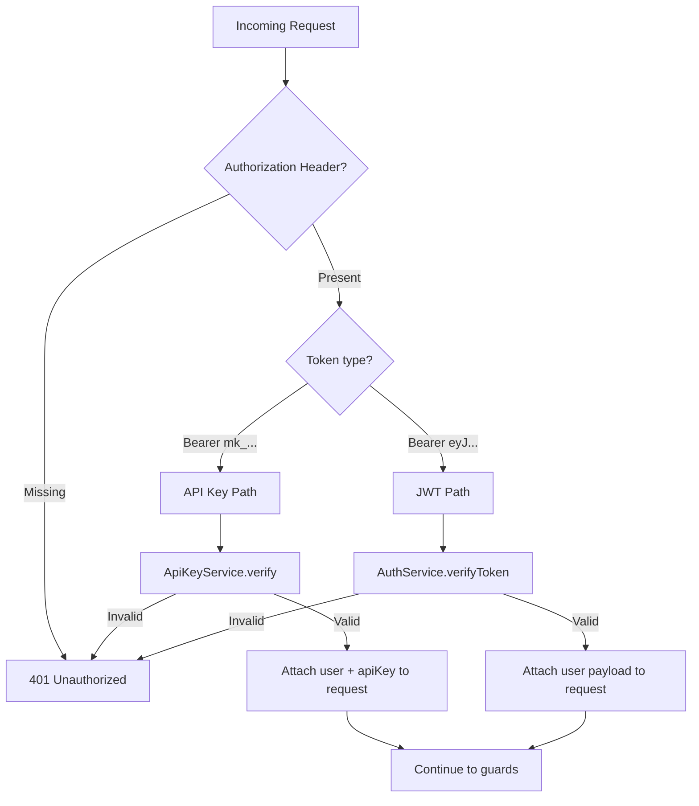
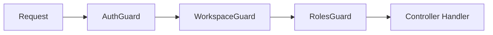
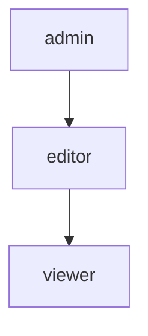

# Authentication & Authorization

MonokerOS uses a layered authentication and authorization system with JWT tokens for user sessions, API keys for programmatic access, and role-based access control (RBAC) for workspace permissions.

## Authentication Methods



### JWT Tokens

JWT tokens are the primary authentication method for browser-based sessions.

| Property | Value |
|----------|-------|
| **Issued on** | `POST /api/auth/login` |
| **Format** | Standard JWT (header.payload.signature) |
| **Storage** | `localStorage` on the client |
| **Sent as** | `Authorization: Bearer <jwt>` header |
| **Contains** | `sub` (user ID), `email`, `name`, `workspaceId`, `role` |

#### Login Flow

```bash
# Login
curl -X POST http://localhost:3001/api/auth/login \
  -H "Content-Type: application/json" \
  -d '{"email": "admin@example.com", "password": "password"}'

# Response
{
  "access_token": "eyJhbGciOiJIUzI1NiIs...",
  "user": {
    "id": "user-abc",
    "email": "admin@example.com",
    "name": "Admin"
  }
}
```

In **dev mode**, any email with the password `"password"` will successfully authenticate.

### API Keys

API keys provide programmatic access to the MonokerOS API, designed for automation, CI/CD pipelines, and [MCP server](mcp.md) integration.

| Property | Value |
|----------|-------|
| **Prefix** | `mk_` |
| **Scope** | Tied to a specific workspace member |
| **Sent as** | `Authorization: Bearer mk_<key>` header |
| **Used by** | MCP server, external scripts, automation |

API keys inherit the role and permissions of the workspace member they are tied to.

#### Using API Keys

```bash
# Use an API key for any API request
curl http://localhost:3001/api/workspaces/my-agency/members \
  -H "Authorization: Bearer mk_abc123def456"
```

## Authorization Guards

MonokerOS uses a chain of NestJS guards to enforce authorization at different levels:



### AuthGuard (Global)

Applied globally to all routes. Verifies that the request has a valid JWT token or API key. Sets `request.user` with the authenticated user's information.

- Checks for `@Public()` decorator first -- public routes bypass authentication entirely.
- Extracts the `Bearer` token from the `Authorization` header.
- Routes to API key verification if the token starts with `mk_`.
- Routes to JWT verification otherwise.

### WorkspaceGuard

Applied to workspace-scoped routes (`/api/workspaces/:slug/...`). Verifies that:

- The workspace identified by `:slug` exists.
- The authenticated user is a member of that workspace.
- Attaches the workspace context to the request.

### RolesGuard

Applied to routes decorated with `@Roles(...)`. Checks that the authenticated user's workspace role meets the minimum required level.

```typescript
@Roles('admin')
@Delete(':id')
deleteTeam(@Param('id') id: string) { ... }
```

### PermissionsGuard

Fine-grained permission checking for specific actions beyond role-based access.

## Role-Based Access Control (RBAC)

Each workspace member is assigned one of three roles:

| Role | Permissions |
|------|-------------|
| **admin** | Full access: create/delete teams, members, projects; manage workspace config; manage providers; manage API keys |
| **editor** | Read/write: create tasks, send messages, edit files, manage projects they are assigned to |
| **viewer** | Read-only: view members, teams, projects, tasks, conversations, and files |



Roles are hierarchical: admin has all editor permissions, and editor has all viewer permissions.

## The @Public() Decorator

Routes that should be accessible without authentication are marked with `@Public()`:

```typescript
@Public()
@Post('login')
async login(@Body() body: LoginDto) { ... }
```

Public routes include:

- `POST /api/auth/login` -- Login
- `POST /api/auth/register` -- Registration
- `GET /api/templates` -- List workspace templates
- Health check endpoints

## Auth in WebSocket Connections

WebSocket connections carry the authentication token from the initial HTTP handshake. The token is validated during the connection upgrade. See [WebSocket Protocol](websocket.md) for details.

## Auth in the MCP Server

The [MCP server](mcp.md) authenticates using an API key:

```bash
# Set via environment variables
export MONOKEROS_API_KEY=mk_your_api_key
export MONOKEROS_WORKSPACE=my-agency

# Or shorthand
export MK_API_KEY=mk_your_api_key
export MK_WORKSPACE=my-agency
```

The MCP server passes this API key as a `Bearer` token on every API request.

## Future Authentication Plans

The following authentication methods are planned for future releases:

- **Google OAuth2** -- Sign in with Google
- **Microsoft OAuth2** -- Sign in with Microsoft
- **GitHub OAuth2** -- Sign in with GitHub
- **SSO (SAML/OIDC)** -- Enterprise single sign-on

See the [roadmap](../roadmap/future.md) for more details.

## Related Documentation

- [REST API](api.md) -- Endpoint reference with auth requirements
- [WebSocket Protocol](websocket.md) -- WebSocket authentication
- [MCP Server](mcp.md) -- MCP authentication with API keys
- [Agents](../core-concepts/agents.md) -- Agent-specific API keys for cost tracking
