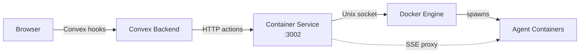
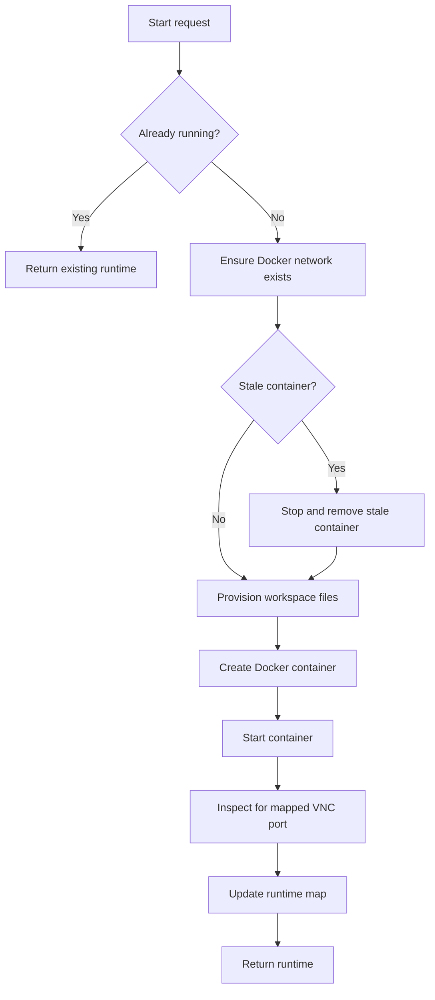

# Container Service

The Container Service is a lightweight Bun HTTP server that manages container lifecycle for AI agents. It supports both **Podman** (preferred) and **Docker** as the container runtime. It runs on port 3002 and acts as the bridge between the Convex backend and the container engine.

## Overview

The Container Service handles three responsibilities:

1. **Container lifecycle** -- start, stop, and restart agent desktop containers via the Podman/Docker Engine API
2. **Agent provisioning** -- write configuration files to the agent's data directory before starting its container
3. **SSE stream proxying** -- forward chat messages to an agent's OpenClaw instance and transform the streaming response

The browser never calls the Container Service directly. All requests originate from Convex actions, which forward to the service using a shared Bearer token.



## Authentication

Every request must include a Bearer token in the `Authorization` header:

```
Authorization: Bearer {CONTAINER_SERVICE_SECRET}
```

The secret is shared between the Convex actions and the Container Service via the `CONTAINER_SERVICE_SECRET` environment variable. If the secret is empty (dev mode), auth is skipped.

## Server Configuration

The server is defined in `services/container-service/src/index.ts`:

| Setting | Value | Notes |
|---------|-------|-------|
| Port | 3002 (configurable via `PORT` env) | |
| `idleTimeout` | 255 (maximum) | Prevents Bun from killing long-running SSE streams |
| Auth | Bearer token | `CONTAINER_SERVICE_SECRET` env var |

The `idleTimeout: 255` setting is critical. Without it, Bun's default 10-second idle timeout would kill SSE connections while waiting for LLM responses that take longer than 10 seconds.

## API Endpoints

### Container Management

#### `POST /containers/:agentId/start`

Starts an agent's Docker container. Provisions workspace files, cleans up any stale container with the same name, creates a new container, and starts it.

**Request body**:
```json
{
  "workspaceSlug": "my-workspace",
  "provision": {
    "member": { "id": "...", "name": "...", ... },
    "allMembers": [...],
    "allTeams": [...],
    "workspace": { "slug": "...", "displayName": "...", "industry": "..." },
    "provider": { "baseUrl": "...", "model": "...", "apiKey": "..." }
  }
}
```

**Response**: `AgentRuntime` object with `memberId`, `containerId`, `containerName`, `vncPort`, `openclawUrl`, `status`.

If the agent is already running, returns the existing runtime immediately.

#### `POST /containers/:agentId/stop`

Stops and removes an agent's Docker container.

**Response**: `{ "status": "stopped" }`

#### `POST /containers/:agentId/restart`

Stops the existing container (if any) and starts a fresh one with updated provisioning.

**Request body**: Same as `/start`.

**Response**: `AgentRuntime` object.

#### `GET /containers/:agentId/health`

Checks if the agent's OpenClaw instance is responding.

**Response**: `{ "healthy": true|false, "status": "running"|"stopped"|"error"|"unknown" }`

Sends a request to `{openclawUrl}/health` with a 5-second timeout.

#### `GET /containers/:agentId/desktop`

Returns the agent's noVNC port and status for the Desktop Viewer.

**Response**: `{ "vncPort": 49152, "status": "running" }`

### Streaming

#### `POST /stream/:conversationId`

Sends a message to an agent and streams back the response as NDJSON.

**Request body**:
```json
{
  "agentId": "member_123",
  "message": "Hello, agent",
  "systemPrompt": "You are a helpful assistant",
  "history": [{ "role": "user", "content": "previous message" }],
  "model": "gpt-4o"
}
```

**Response**: `Content-Type: application/x-ndjson`

Each line is a JSON object:
```jsonl
{"type":"status","data":{"phase":"thinking"}}
{"type":"content","data":{"delta":"Hello"}}
{"type":"content","data":{"delta":" there!"}}
{"type":"tool_start","data":{"id":"call_123","name":"files.read"}}
{"type":"status","data":{"phase":"reflecting"}}
{"type":"done","data":{"response":"Hello there!"}}
```

**Event types**:

| Type | Data | Description |
|------|------|-------------|
| `status` | `{ phase }` | Lifecycle phase: `thinking`, `reflecting` |
| `content` | `{ delta }` | Incremental text content (not accumulated) |
| `tool_start` | `{ id, name }` | Agent started using a tool |
| `tool_end` | `{ id }` | Tool execution completed |
| `error` | `{ message }` | Error occurred during streaming |
| `done` | `{ response }` | Full accumulated response text |

The stream proxy connects to the agent's OpenClaw instance at `{openclawUrl}/v1/chat/completions` using the OpenAI-compatible SSE format, parses the SSE events, and re-emits them as NDJSON. The LLM timeout is 120 seconds.

### Service Health

#### `GET /health`

Basic service health check.

**Response**: `{ "status": "ok" }`

## Container Runtime Detection

The service auto-detects the container runtime at startup (`services/container-service/src/runtime.ts`). Detection order:

1. **`CONTAINER_SOCKET`** or **`DOCKER_HOST`** env var -- use the socket directly
2. **`CONTAINER_RUNTIME=podman|docker`** env var -- probe only the specified runtime's sockets
3. **Auto-detect** -- probe Podman sockets first (rootless `$XDG_RUNTIME_DIR/podman/podman.sock`, macOS `~/.local/share/containers/podman/machine/podman.sock`, rootful `/run/podman/podman.sock`), then Docker (`/var/run/docker.sock`)

The detected runtime also determines the DNS name for host-gateway resolution inside containers: `host.containers.internal` (Podman) or `host.docker.internal` (Docker).

## Container Management

Container operations use the Podman/Docker Engine API via Unix socket. Defined in `services/container-service/src/docker.ts`.

### Container Naming

All agent containers use the prefix `mk-agent-`:

```
mk-agent-{agentId}
```

### Docker Network

All containers run on the `monokeros` bridge network. The service creates this network automatically if it does not exist.

### Container Specification

| Setting | Value |
|---------|-------|
| Image | `AGENT_IMAGE` env (default: `monokeros/openclaw-desktop:latest`) |
| Network | `monokeros` |
| Memory limit | 512 MB |
| CPU limit | 1 CPU (1,000,000,000 NanoCpus) |
| Shared memory | 256 MB |
| Tmpfs | `/tmp` with 100 MB limit |
| Security | `no-new-privileges` |
| Restart policy | `unless-stopped` |
| Label | `monokeros.agent: {agentId}` |

### Port Bindings

Only noVNC (port 6080) is published to the host, using a random available port (`HostPort: "0"`). The VNC (5900) and OpenClaw (18789) ports are exposed but only accessible within the Docker network.

### Volume Mounts

| Host Path | Container Path | Mode |
|-----------|---------------|------|
| `{DATA_DIR}/{agentId}` | `/data/{agentId}` | read-write |
| `chromium-cache` (Docker volume) | `/home/agent/.cache/chromium` | read-write |
| `/opt/monokeros/mcp` | `/opt/monokeros/mcp` | read-only |

### Environment Variables Passed to Containers

| Variable | Source |
|----------|--------|
| `AGENT_ID` | The agent's member ID |
| `LLM_API_KEY` | LLM provider API key |
| `LLM_BASE_URL` | LLM provider base URL |
| `LLM_MODEL` | Default model name |
| `MK_API_KEY` | MonokerOS API key for MCP tools |
| `MK_WORKSPACE` | Workspace slug |
| `MONOKEROS_API_URL` | Container Service URL for callbacks |
| `DISPLAY` | `:1` (X11 display) |
| `HOME` | `/home/agent` |
| `TERM` | `xterm-256color` |

### In-Memory Runtime Map

The Container Service maintains an in-memory `Map<string, AgentRuntime>` tracking the state of all managed containers:

```typescript
interface AgentRuntime {
  memberId: string;
  containerId: string | null;
  containerName: string | null;
  vncPort: number | null;
  openclawUrl: string | null;
  status: "running" | "stopped" | "error";
  error?: string;
}
```

This map is the source of truth for routing stream requests to the correct container. If the Container Service restarts, the map is empty and containers must be re-registered (the `agentRuntimes` table in Convex provides persistent state).

### Startup Flow

When `startContainer` is called:



### Cleanup

`stopContainer` stops the Docker container (with a 15-second timeout), force-removes it, and updates the runtime map to `stopped` status. Both stop and remove are best-effort -- failures are silently caught.
