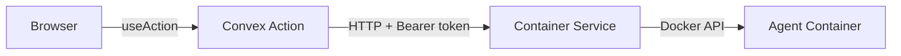

# Convex Backend

MonokerOS uses a self-hosted Convex backend as its real-time database and server-side function runtime. Convex replaces the previous NestJS API + in-memory mock store with a persistent, reactive data layer that pushes updates to the frontend automatically.

## Infrastructure

The Convex backend runs as Docker containers defined in `docker-compose.yml`:

| Service | Image | Port | Purpose |
|---------|-------|------|---------|
| `convex-backend` | `ghcr.io/get-convex/convex-backend` | 3210, 3211 | Database and function runtime |
| `convex-dashboard` | `ghcr.io/get-convex/convex-dashboard` | 6791 | Admin UI for inspecting data, logs, and functions |

Data is persisted in a Docker volume (`convex-data`). The backend exposes a health check at `/version`.

### Environment Variables

| Variable | Purpose |
|----------|---------|
| `CONVEX_CLOUD_ORIGIN` | Backend URL (default: `http://127.0.0.1:3210`) |
| `CONVEX_SITE_ORIGIN` | Site URL for HTTP actions (default: `http://127.0.0.1:3211`) |
| `CONVEX_SELF_HOSTED_ADMIN_KEY` | Admin key for deployment |
| `NEXT_PUBLIC_CONVEX_URL` | Client-side URL for the web app |

## Schema

The database has 13 application tables plus Convex Auth tables. Defined in `convex/schema.ts`.

### Tables

| Table | Description | Key Indexes |
|-------|-------------|-------------|
| `workspaces` | Organizations/workspaces with branding, providers, and industry | `by_slug`, `by_status` |
| `workspaceMembers` | Role assignments linking members to workspaces | `by_workspace`, `by_member`, `by_workspace_member` |
| `members` | Agents and humans with identity, status, and model config | `by_workspace`, `by_workspace_type`, `by_email`, `search_name` |
| `teams` | Agent teams with color, lead, and member list | `by_workspace` |
| `projects` | Projects with SDLC phases, gates, and git bindings | `by_workspace`, `by_workspace_status`, `search_name` |
| `tasks` | Work items with status, priority, cross-validation, and acceptance criteria | `by_workspace`, `by_workspace_project_status`, `search_title` |
| `conversations` | Chat threads (agent DM, project chat, group chat, task thread) | `by_workspace`, `by_workspace_type`, `by_workspace_lastMessage` |
| `messages` | Chat messages with role, content, references, and attachments | `by_conversation` |
| `files` | 4-tier drive system (member, team, project, workspace) | `by_workspace_drive`, `by_drive_path`, `search_knowledge` |
| `notifications` | System notifications with read tracking | `by_recipient_workspace`, `by_recipient_workspace_unread` |
| `apiKeys` | API keys for machine-to-machine auth (`mk_` prefix) | `by_key`, `by_workspace_member` |
| `agentRuntimes` | Docker container state for each agent | `by_member`, `by_workspace` |
| `activities` | Audit log of workspace actions | `by_workspace`, `by_workspace_entity` |

### Notable Embedded Objects

The schema includes several embedded validators used across tables:

- `memberIdentity` -- soul text, skills array, memory array
- `agentModelConfig` -- provider, model, API key override, temperature, max tokens
- `sdlcGate` -- project phase gate with approval workflow
- `crossValidation` -- multi-agent agreement scoring
- `humanAcceptance` -- human review status for tasks
- `taskArtifact` -- file, URL, or git ref linked to a task
- `acceptanceCriterion` -- individual checklist items on tasks

## Authentication

Authentication is handled by `@convex-dev/auth` with a password provider. The web app wraps the Convex client in a `ConvexAuthProvider` (`apps/web/src/components/layout/convex-provider.tsx`).

### Auth Methods

**JWT (browser users)**: The `ConvexReactClient` connects with the user's JWT from Convex Auth. The server resolves the user's email from the identity and looks up the corresponding member.

**API keys (machine-to-machine)**: API keys use the `mk_` prefix (e.g., `mk_prod_a1b2c3...`). Keys are hashed with SHA-256 for storage. Dev mode keys (`mk_dev_` prefix) are matched as raw strings for convenience.

### resolveAuth()

Every Convex query and mutation calls `resolveAuth()` as its first step. Defined in `convex/lib/auth.ts`, it:

1. Checks for a `machineToken` argument (API key path)
2. Falls back to JWT identity from `ctx.auth.getUserIdentity()`
3. Resolves the workspace by ID or slug
4. Looks up the workspace membership record
5. Returns an `AuthContext` with `workspaceId`, `memberId`, `role`, `permissions`, and `authMethod`

### currentUser

The `convex/auth.ts` module exposes a `currentUser` query that resolves the authenticated user's member record for the current session.

## Authorization

### Roles

| Role | Permissions | Description |
|------|-------------|-------------|
| `admin` | `*` (wildcard) | Full access to all operations |
| `validator` | `members:read/write`, `teams:read/write`, `projects:read/write`, `tasks:read/write`, `conversations:read/write`, `files:read/write` | Read and write access to core entities |
| `viewer` | `members:read`, `teams:read`, `projects:read`, `tasks:read`, `conversations:read`, `files:read` | Read-only access |

### requirePermission()

After `resolveAuth()`, functions call `requirePermission(auth, "entity:action")` to check access. If the user's role includes the wildcard `*` permission, all checks pass. Otherwise, the specific permission string must be present.

```
resolveAuth(ctx, { workspaceId })  -->  requirePermission(auth, "tasks:write")
```

## Real-Time Subscriptions

Convex's built-in reactivity replaces the previous WebSocket-based notification system. When data changes in the database, all active `useQuery` subscriptions that reference that data automatically re-render with the new values. There is no manual invalidation or refetch step.

This means:
- Chat messages appear instantly when sent
- Task status changes propagate to all viewers
- Notification counts update in real time
- File system changes are reflected immediately

## Function Modules

Convex functions are organized into modules in the `convex/` directory:

| Module | Functions | Key Operations |
|--------|-----------|----------------|
| `conversations` | 7 | list, get, create, rename, sendMessage, setReaction, storeAgentMessage |
| `tasks` | 7 | list, get, create, update, move, submitAcceptance, assign |
| `members` | 12 | list, get, create, update, updateStatus, remove, getRuntime, getDesktop, startContainer, stopContainer, rerollName, rerollIdentity |
| `workspaces` | 10 | list, getBySlug, create, remove, getConfig, updateConfig, listProviders, addProvider, updateProvider, removeProvider, setDefaultProvider |
| `files` | 11 | drives, memberDrive, teamDrive, projectDrive, workspaceDrive, getContent, createFile, createFolder, renameItem, updateContent, deleteItem, generateUploadUrl |
| `projects` | 5 | list, get, create, update, updateGate |
| `teams` | 5 | list, get, create, update, remove |
| `notifications` | 5 | list, counts, markRead, markAllRead, create, createForMany |
| `wiki` | 4 | nav, page, raw, save |
| `activities` | 2 | feed, log |
| `auth` | 1 | currentUser |
| `models` | 2 | providers, catalog |
| `knowledge` | 1 | search |
| `templates` | 3 | list, get, apply |
| `telegram` | 4 | webhook, resolveWorkspace, setWebhook, getStatus |
| `seed` | 1 | run |

### Function Types

- **Queries** -- read-only, reactive, used with `useQuery` on the client
- **Mutations** -- read-write, transactional, used with `useMutation`
- **Actions** -- can call external services (e.g., Container Service, LLM APIs), used with `useAction`
- **Internal functions** -- only callable from other server functions (e.g., `internalMutation`, `internalQuery`)
- **HTTP actions** -- handle HTTP requests at the site URL (e.g., Telegram webhook)

## Web Integration

### ConvexReactClient

The web app initializes a `ConvexReactClient` connected to the Convex backend URL:

```typescript
// apps/web/src/components/layout/convex-provider.tsx
const convex = new ConvexReactClient(process.env.NEXT_PUBLIC_CONVEX_URL!);
```

This client is wrapped in a `ConvexAuthProvider` for authentication support.

### Compatibility Layer

The adapter in `apps/web/src/lib/convex-helpers.ts` wraps Convex's native hooks to match the `{ data, isLoading, error }` shape used throughout the codebase:

- `useQuery(fn, args)` -- wraps `useConvexQuery`, adds legacy `id` field from `_id`, adds `timestamp`/`createdAt` from `_creationTime`
- `useMutation(fn, opts)` -- wraps `useConvexMutation`, returns `{ mutate, mutateAsync, isPending, error }`
- `useAction(fn, opts)` -- wraps `useConvexAction` with the same interface as mutations

This compatibility layer avoids rewriting the 37+ component files that were built against the previous API client interface.

### Container Service Calls

Convex actions in `members.ts` (e.g., `startContainer`, `stopContainer`) call the Container Service over HTTP. The browser never talks to the Container Service directly -- all container management goes through Convex actions which forward to the service using the shared `CONTAINER_SERVICE_SECRET`.


