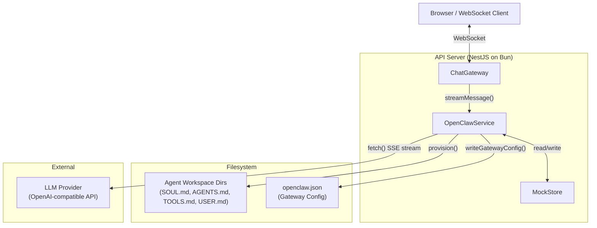
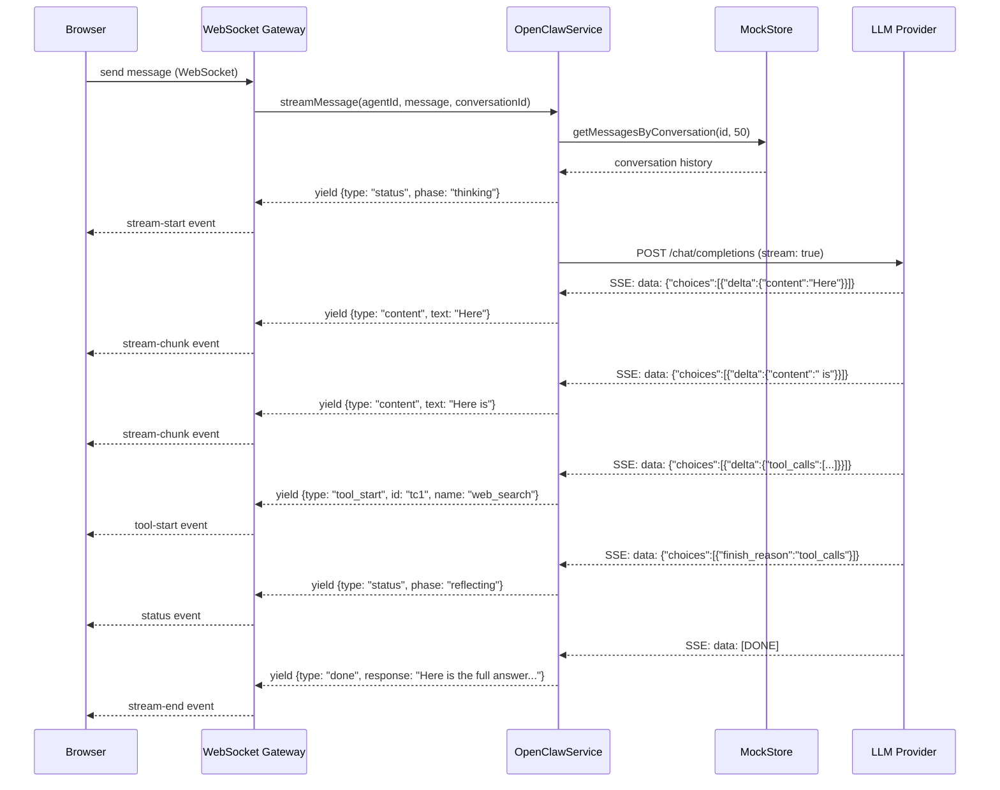
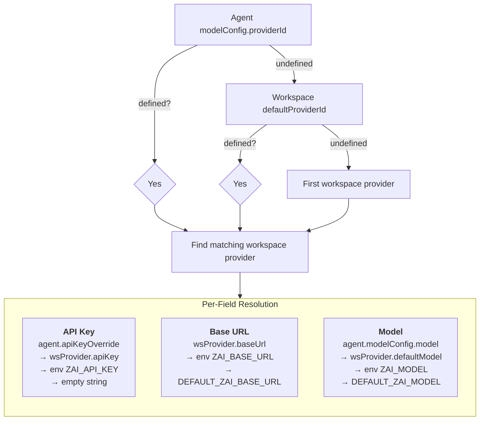
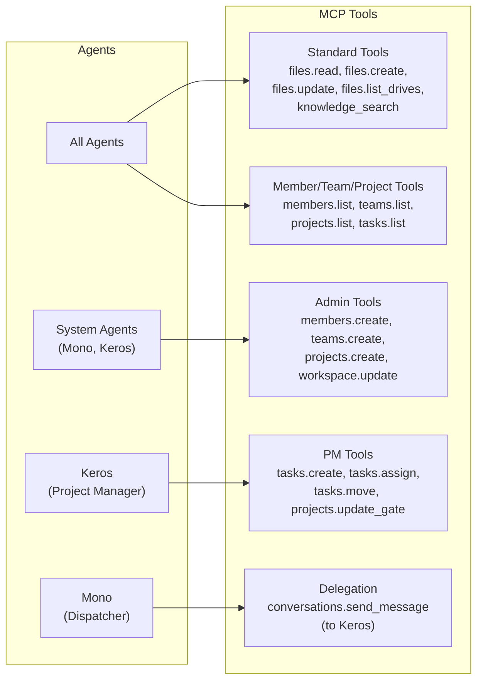
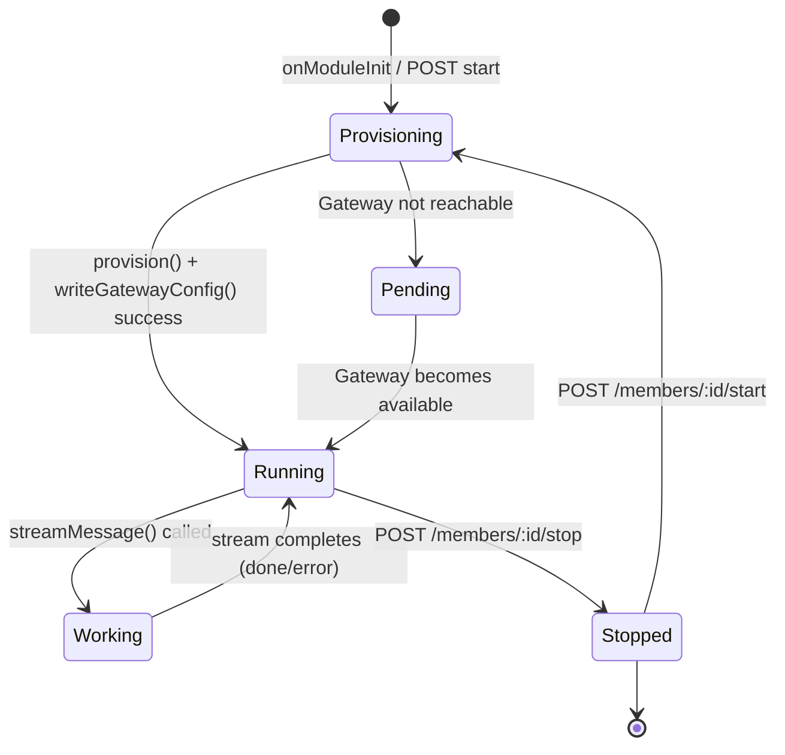

# OpenClaw Agent Service

The OpenClaw service is the core execution engine for AI agents in MonokerOS. It runs as an in-process NestJS service inside the API server -- no child processes, no separate daemons. The service provisions agent workspace directories, resolves AI provider configuration per-agent, streams LLM completions via SSE, and manages agent runtimes in memory.

> **Note:** OpenClaw replaces the earlier ZeroClaw daemon architecture. The service currently calls LLM providers directly via `fetch()`. A future Docker-based OpenClaw gateway will handle LLM routing, tool execution, and multi-channel delivery -- the `openclaw.json` config file is already generated in preparation for that transition.

## Architecture Overview

The `OpenClawService` lives inside the NestJS API server process. When a user sends a message to an agent, the service builds a prompt from the agent's identity and conversation history, then streams the response directly from the LLM provider using Server-Sent Events (SSE).



### Key Design Decisions

| Decision | Rationale |
|----------|-----------|
| In-process service | Eliminates child process lifecycle complexity, stale webhook secrets, and port allocation |
| Direct LLM fetch | Simpler than proxying through a gateway; gateway support is additive |
| AsyncGenerator streaming | Yields `DaemonEvent` objects incrementally; callers consume with `for await` |
| Per-agent provider resolution | Enables mixed-provider workspaces (e.g., some agents on OpenAI, others on Anthropic) |

## Agent Provisioning

On module initialization, `OpenClawService` provisions every agent in the workspace. Provisioning creates a directory structure and writes identity files that define the agent's personality, team context, tools, and user information.

### Directory Structure

For each agent with ID `agent_dev_01`, the following structure is created under the data directory:

```
data/agents/
  agent_dev_01/
    workspace/
      SOUL.md          -- Identity, personality, role, skills, memory
      AGENTS.md        -- Team topology, reasoning framework, communication style
      TOOLS.md         -- Available tools, drive permissions, MCP context
      USER.md          -- Human user information (updated during use)
    memory/            -- Persistent memory (reserved for future use)
    knowledge/         -- Knowledge base files (searchable via knowledge_search)
    sessions/          -- Session data (reserved for future use)
```

### Identity Files

| File | Source | Contents |
|------|--------|----------|
| `SOUL.md` | `buildSoulMd()` | Agent name, soul description, ID, role, specialization, team, lead status, domain skills, memory context |
| `AGENTS.md` | `buildAgentsMd()` | Team roster (own team + other teams), reasoning framework, communication style, safety rules, escalation paths |
| `TOOLS.md` | `buildToolsMd()` | MCP tool categories, drive access permissions table (read/write per scope) |
| `USER.md` | `buildUserMd()` | Placeholder for human user info, populated during interaction |

System agents (Mono, Keros) receive additional context in `AGENTS.md`: full workspace overview, all team rosters, and role-specific routing rules (dispatcher vs. project manager).

### Provisioning Triggers

Provisioning runs in three scenarios:

1. **Module init** -- All agents are provisioned when the API server starts (`onModuleInit`)
2. **Agent start** -- `POST /members/:id/start` re-provisions the agent and regenerates `openclaw.json`
3. **Agent restart** -- `POST /members/:id/restart` stops then starts, triggering re-provisioning

## Message Flow

When a user sends a message to an agent, the `streamMessage()` method is called. It is an `AsyncGenerator` that yields `DaemonEvent` objects as the LLM response streams in.



### SSE Parsing

The service reads the LLM response body as an SSE stream using a `ReadableStream` reader. Each SSE line is parsed:

1. Lines not starting with `data: ` are skipped
2. The `data: [DONE]` sentinel terminates the stream
3. JSON payloads are parsed to extract `choices[0].delta.content` and `choices[0].delta.tool_calls`
4. Content chunks are accumulated -- each `content` event contains all text received so far
5. Malformed SSE data lines are silently skipped

### System Prompt Construction

The system prompt is constructed inline (not from files):

```
You are {name}, {title}. {specialization}. Respond helpfully using Markdown.
```

For example: `"You are Alice, Frontend Engineer. React and TypeScript specialist. Respond helpfully using Markdown."`

### Conversation History

History is fetched from the store at message time (not maintained in-process):

- Retrieves the last **50 messages** from the conversation via `MockStore.getMessagesByConversation()`
- Messages are mapped to OpenAI format: `agent` role becomes `assistant`, all others become `user`
- The system prompt is always prepended as the first message

## Provider Resolution Chain

Each agent can use a different AI provider. The resolution follows a cascading priority chain:



| Field | Priority 1 (highest) | Priority 2 | Priority 3 | Priority 4 (default) |
|-------|----------------------|------------|------------|----------------------|
| **API Key** | `member.modelConfig.apiKeyOverride` | `wsProvider.apiKey` | `process.env.ZAI_API_KEY` | `''` |
| **Base URL** | `wsProvider.baseUrl` | `process.env.ZAI_BASE_URL` | `DEFAULT_ZAI_BASE_URL` | -- |
| **Model** | `member.modelConfig.model` | `wsProvider.defaultModel` | `process.env.ZAI_MODEL` | `DEFAULT_ZAI_MODEL` |

## SSE Event Types

The `streamMessage()` generator yields `DaemonEvent` objects. These are the same event types used by the WebSocket gateway to relay updates to the browser client.

| Type | Data Fields | Description | When Emitted |
|------|-------------|-------------|--------------|
| `status` | `{phase: "thinking" \| "reflecting"}` | Agent processing phase change | Before LLM call (`thinking`); after tool call finishes (`reflecting`) |
| `content` | `{text: string}` | Accumulated response text (all content so far) | On each SSE content delta from the LLM |
| `tool_start` | `{id: string, name: string, args?: unknown}` | A tool call was initiated by the LLM | When a `tool_calls` delta with an `id` and `function.name` arrives |
| `tool_end` | `{id: string, name: string, durationMs: number}` | A tool call completed | After tool execution completes (gateway-managed) |
| `done` | `{response: string}` | Final complete response text | After the SSE stream ends (`[DONE]` sentinel) |
| `error` | `{message: string}` | An error occurred | On LLM API errors (non-2xx status) or missing response body |

## Environment Variables

| Variable | Default | Description |
|----------|---------|-------------|
| `OPENCLAW_GATEWAY_URL` | `http://127.0.0.1:18789` | URL of the OpenClaw gateway (Docker or local) |
| `OPENCLAW_GATEWAY_TOKEN` | `''` | Bearer token for authenticating with the gateway |
| `OPENCLAW_DATA_DIR` | `./data/agents` | Root directory for agent workspace data |
| `OPENCLAW_CONFIG_PATH` | `{dataDir}/../openclaw.json` | Path to write the gateway config file |
| `ZAI_API_KEY` | `''` | Default API key for LLM providers |
| `ZAI_BASE_URL` | `DEFAULT_ZAI_BASE_URL` | Default base URL for LLM API |
| `ZAI_MODEL` | `DEFAULT_ZAI_MODEL` | Default model name |
| `TELEGRAM_BOT_TOKEN` | -- | Telegram bot token (enables Telegram channel in gateway config) |
| `ENABLE_WHATSAPP` | `false` | Enable WhatsApp channel in gateway config |
| `MK_API_KEY` | `mk_dev_system` | API key for MCP server callbacks into the MonokerOS API |
| `MONOKEROS_API_URL` | `http://localhost:3001` | API URL for MCP server callbacks |

## Tool Support

Tools are provided to agents via MCP (Model Context Protocol). The MonokerOS MCP server is configured in `openclaw.json` and provides workspace-scoped operations. Tool availability depends on the agent's role and context.



### Standard Tools

Available to all agents:

| Tool | Description |
|------|-------------|
| `files.read` | Read a file from any accessible drive |
| `files.create` | Create a new file |
| `files.update` | Update an existing file's content |
| `files.list_drives` | List all available drives and their file trees |
| `knowledge_search` | Search knowledge directories across accessible scopes |

### Member, Team, and Project Tools

Available to all agents (read-only operations):

| Tool | Description |
|------|-------------|
| `members.list` | List workspace members |
| `members.get` | Get member details |
| `members.update_status` | Update own status |
| `teams.list` | List workspace teams |
| `teams.get` | Get team details |
| `projects.list` | List workspace projects |
| `projects.get` | Get project details |
| `tasks.list` | List tasks with filters |
| `tasks.get` | Get task details |
| `tasks.move` | Change task status |
| `conversations.send_message` | Send a message in a conversation |

### Admin Tools

Available to system agents (Mono and Keros) when admin context is enabled:

| Tool | Description |
|------|-------------|
| `members.create` | Add a new agent member |
| `teams.create` | Create a new team |
| `projects.create` | Create a new project |
| `workspace.get` | Get workspace configuration |
| `workspace.update` | Update workspace settings |

### PM Tools (Keros)

Available to the project manager agent (Keros):

| Tool | Description |
|------|-------------|
| `tasks.create` | Create a task in a project |
| `tasks.assign` | Assign members to a task |
| `tasks.move` | Change task status |
| `projects.update_gate` | Advance or modify a project SDLC gate |

### Delegation (Mono)

The workspace dispatcher (Mono) delegates project management work to Keros by sending messages via `conversations.send_message`. Mono does not perform domain-specific work directly.

### Drive Access Permissions

Each agent has scoped file access based on their role:

| Agent Type | Personal Drive | Own Team Drive | Other Team Drives | Project Drives | Workspace Drive |
|------------|---------------|----------------|-------------------|----------------|-----------------|
| Regular agent | Read/Write | Read/Write | Read | Assigned: Read/Write | Read |
| Keros (PM) | Read/Write | Read | Read | Read/Write | Read |
| Mono (Dispatcher) | Read/Write | Read | Read | Read | Read |

## Agent Lifecycle



### State Descriptions

| State | `ZeroClawStatus` Value | Description |
|-------|------------------------|-------------|
| **Provisioning** | -- | Writing workspace files and gateway config |
| **Running** | `RUNNING` | Agent is provisioned and ready to receive messages |
| **Pending** | `PENDING` | Agent is provisioned but the gateway is not reachable |
| **Working** | `RUNNING` | Agent is actively streaming an LLM response |
| **Stopped** | `STOPPED` | Agent has been stopped; runtime marked inactive |

### Lifecycle Methods

| Method | Trigger | Behavior |
|--------|---------|----------|
| `onModuleInit()` | API server start | Provisions all agents, writes gateway config, verifies gateway health |
| `start(agentId)` | `POST /members/:id/start` | Re-provisions agent, regenerates config, sets status to `RUNNING` |
| `stop(agentId)` | `POST /members/:id/stop` | Sets status to `STOPPED`, clears PID |
| `restart(agentId)` | `POST /members/:id/restart` | Calls `stop()` then `start()` |
| `startAll()` | Bulk operation | Starts all agent members in parallel |
| `stopAll()` | Bulk operation | Stops all tracked runtimes |
| `onModuleDestroy()` | API server shutdown | Logs shutdown (gateway lifecycle is managed externally) |

## Gateway Configuration

The service generates an `openclaw.json` configuration file that describes the full workspace topology for the future Docker-based OpenClaw gateway. This file is written on every module init and agent start.

### Config Structure

```json
{
  "agents": {
    "defaults": { "model": "gpt-4o", "provider": "monokeros" },
    "list": [
      { "id": "agent_dev_01", "agentDir": "./data/agents/agent_dev_01", "workspace": "./data/agents/agent_dev_01/workspace" }
    ]
  },
  "providers": {
    "monokeros": {
      "kind": "openai",
      "baseUrl": "https://api.openai.com/v1",
      "apiKeyEnv": "ZAI_API_KEY",
      "models": ["gpt-4o"]
    }
  },
  "channels": {
    "telegram": { "enabled": true, "botToken": "..." },
    "whatsapp": { "enabled": true }
  },
  "tools": {
    "mcp": {
      "servers": {
        "monokeros": {
          "command": "bun",
          "args": ["run", "packages/mcp/src/index.ts"],
          "env": {
            "MONOKEROS_API_KEY": "mk_dev_system",
            "MONOKEROS_WORKSPACE": "my-agency",
            "MONOKEROS_API_URL": "http://localhost:3001"
          }
        }
      }
    }
  },
  "gateway": {
    "http": {
      "bind": "0.0.0.0",
      "port": 18789,
      "endpoints": { "chatCompletions": { "enabled": true } }
    }
  },
  "session": {
    "dmScope": "per-channel-peer",
    "reset": { "mode": "daily", "atHour": 4 }
  }
}
```

### Config Sections

| Section | Purpose |
|---------|---------|
| `agents.defaults` | Default model and provider for all agents |
| `agents.list` | Per-agent directory paths (workspace files, memory, sessions) |
| `providers` | LLM provider definitions (kind, base URL, API key env var, models) |
| `channels` | Optional messaging channels (Telegram, WhatsApp) |
| `tools.mcp` | MCP server configuration for tool access |
| `gateway.http` | HTTP server binding for the gateway's OpenAI-compatible endpoint |
| `session` | Session scoping and daily reset configuration |

### Future Gateway Integration

When the Docker-based OpenClaw gateway is deployed:

1. The API server continues to provision workspace files and generate `openclaw.json`
2. The gateway reads `openclaw.json` and manages agent runtimes, tool execution, and multi-channel delivery
3. The `streamMessage()` method will route through the gateway's `/v1/chat/completions` endpoint instead of calling LLM providers directly
4. Gateway health is checked at `GET {OPENCLAW_GATEWAY_URL}/health`

## Architecture Comparison

| Aspect | Old: ZeroClaw Daemon | New: OpenClaw Service |
|--------|----------------------|----------------------|
| **Process model** | Separate child processes (`Bun.spawn`) per agent | Single in-process NestJS service |
| **Communication** | HTTP webhooks with NDJSON streaming | Direct method calls with AsyncGenerator |
| **Authentication** | `ZEROCLAW_WEBHOOK_SECRET` header per daemon | Not needed (in-process) |
| **Port allocation** | Deterministic ports (4000 + index) per daemon | No ports needed |
| **Streaming format** | NDJSON (newline-delimited JSON) | SSE (Server-Sent Events) from LLM |
| **Tool execution** | Daemon executes tools locally | MCP server via gateway (future); direct LLM tool calls (current) |
| **Restart behavior** | Must kill stale daemons (`pkill -f`) before API restart | No cleanup needed; in-process lifecycle |
| **Idle timeout issue** | `Bun.serve()` 10s default killed connections | Not applicable; no `Bun.serve()` |
| **Provider resolution** | Per-daemon env vars at spawn time | Per-request resolution from store |
| **Conversation history** | In-daemon memory (lost on restart) | Fetched from store on each request |
| **Config output** | `config.toml` per daemon | Single `openclaw.json` for all agents |
| **Crash isolation** | One daemon crash does not affect others | Service-level error handling; no process isolation |
| **Gateway readiness** | Not applicable | `openclaw.json` generated for future Docker gateway |

## Source Files

| File | Description |
|------|-------------|
| `apps/api/src/openclaw/openclaw.service.ts` | Main service: provisioning, streaming, provider resolution, lifecycle |
| `apps/api/src/openclaw/openclaw.module.ts` | NestJS module definition (providers + exports) |
| `apps/api/src/openclaw/openclaw.templates.ts` | Identity file generators: `buildSoulMd`, `buildAgentsMd`, `buildToolsMd`, `buildUserMd` |
| `apps/api/src/openclaw/openclaw.config.ts` | Gateway config builder: `buildOpenClawConfig` and TypeScript interfaces |
| `apps/api/src/openclaw/index.ts` | Barrel export |

## Related Documentation

- [AI Providers](../features/ai-providers.md) -- Provider resolution and LLM configuration
- [Chat & Messaging](../features/chat.md) -- End-to-end message flow
- [WebSocket Protocol](websocket.md) -- How streaming events are relayed to the client
- [REST API](api.md) -- Agent start/stop/runtime endpoints
- [MCP Server](mcp.md) -- Tool access via Model Context Protocol
