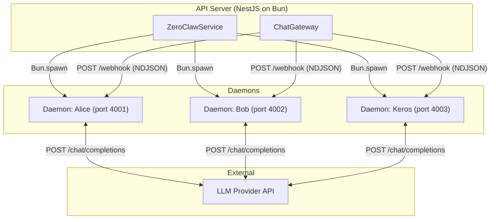
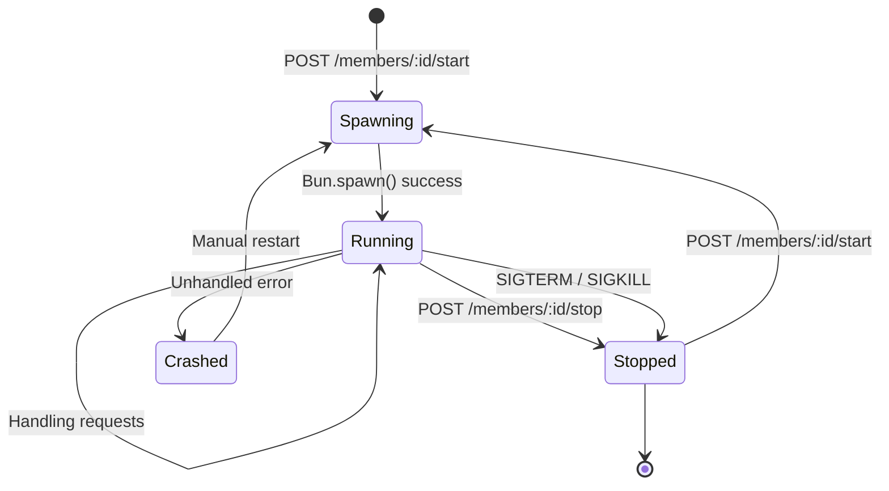
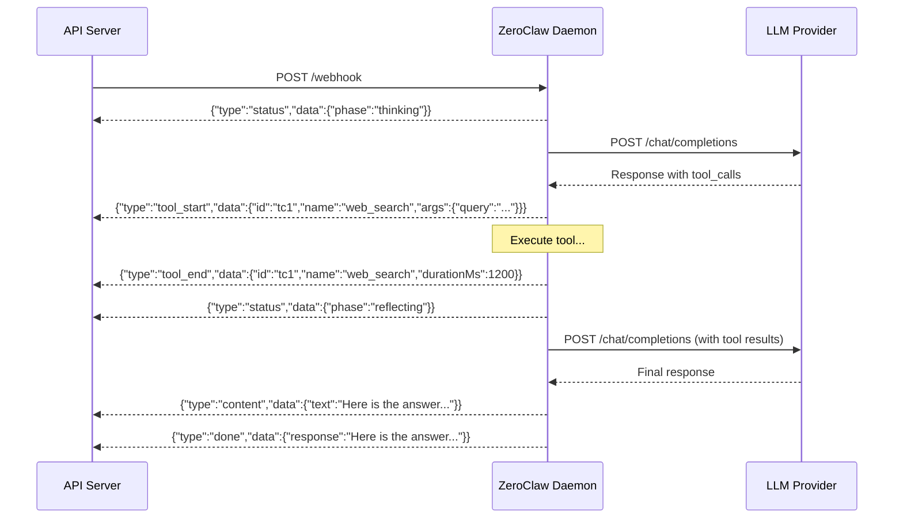
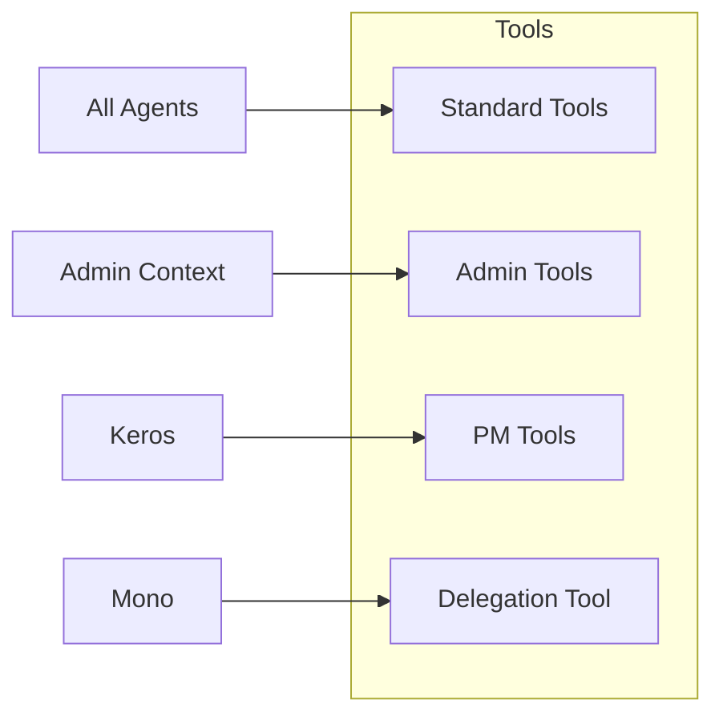

# ZeroClaw Daemon System

The ZeroClaw daemon is the core execution engine for AI agents in MonokerOS. Each active agent runs as an independent child process (daemon) that handles LLM communication, tool execution, and conversation management.

> **Note:** ZeroClaw is MonokerOS's own embedded agent daemon. Its design and tool-calling capabilities are directly inspired by and ported from [OpenClaw](../architecture/inspirations.md). Future versions of MonokerOS will support pluggable agent backends -- including full OpenClaw or ZeroClaw standalone runtimes -- as alternatives to the current embedded daemon.

## What is a Daemon?

A daemon is a standalone Bun HTTP server spawned as a child process by the API server's `ZeroClawService`. Each agent gets its own daemon process, providing:

- **Isolation** -- One agent crashing does not affect others
- **Independent context** -- Each daemon maintains its own conversation history and system prompt
- **Tool access** -- Daemons can execute tools (web search, file read/write, knowledge search, admin operations)
- **Streaming** -- Responses are streamed as NDJSON back to the API server



## Daemon Lifecycle



### Starting a Daemon

When an agent is started (via `POST /members/:id/start`), the `ZeroClawService`:

1. Writes a `config.toml` to a temporary working directory with the agent's configuration.
2. Copies identity files (`SOUL.md`, `FOUNDATION.md`, `AGENTS.md`, `SKILLS.md`) to the working directory.
3. Generates a `ZEROCLAW_WEBHOOK_SECRET` (UUID) for authenticating webhook calls.
4. Spawns the daemon as a child process using `Bun.spawn`.
5. Passes environment variables (`ZAI_API_KEY`, `ZAI_BASE_URL`, `ZAI_MODEL`, `ZEROCLAW_WEBHOOK_SECRET`, `MONOKEROS_API_KEY`).
6. Waits for the daemon's health check to respond.

### Stopping a Daemon

When stopped (via `POST /members/:id/stop`), the service:

1. Sends `SIGTERM` to the daemon process.
2. Waits a grace period for graceful shutdown.
3. Sends `SIGKILL` if the process has not exited.

### Critical: Kill Daemons Before API Restart

Daemons are child processes that can outlive the API server. After an API restart, old daemons have stale webhook secrets and will return `401 Unauthorized` on webhook calls. Always kill all daemons before restarting the API server:

```bash
pkill -f "bun run.*daemon.ts"
```

## Communication Protocol

### Webhook Endpoint

The daemon exposes two HTTP endpoints:

| Method | Path | Description |
|--------|------|-------------|
| GET | `/health` | Health check -- returns `{"status": "ok"}` |
| POST | `/webhook` | Receive a message and generate a response |

### Webhook Authentication

Every webhook request must include the `x-webhook-secret` header matching the `ZEROCLAW_WEBHOOK_SECRET` environment variable. If the secret does not match, the daemon returns `401 Unauthorized`.

### Webhook Request Body

```json
{
  "message": "User's message text",
  "conversation_id": "conv-123",
  "admin_context": false
}
```

| Field | Type | Description |
|-------|------|-------------|
| `message` | string | The user's message content |
| `conversation_id` | string | Conversation identifier for history tracking |
| `admin_context` | boolean | Whether the agent has admin tool privileges |

## NDJSON Streaming

The daemon responds with a streaming NDJSON (newline-delimited JSON) body. Each line is a JSON event:



### NDJSON Event Types

| Type | Data | Description |
|------|------|-------------|
| `status` | `{phase: "thinking" \| "reflecting"}` | Agent processing phase |
| `tool_start` | `{id, name, args}` | Tool call initiated |
| `tool_end` | `{id, name, durationMs}` | Tool call completed |
| `content` | `{text}` | Accumulated response text |
| `done` | `{response}` | Final complete response |
| `error` | `{message}` | Error occurred |

Response headers:

```
Content-Type: application/x-ndjson
Transfer-Encoding: chunked
Cache-Control: no-cache
```

## Environment Variables

Variables passed to the daemon process at spawn time:

| Variable | Source | Description |
|----------|--------|-------------|
| `HOME` | Daemon working directory | Set to the daemon's temporary working directory |
| `ZAI_API_KEY` | [Provider resolution chain](../features/ai-providers.md) | API key for LLM calls |
| `ZAI_BASE_URL` | Provider resolution chain | Base URL for LLM API |
| `ZAI_MODEL` | Provider resolution chain | Model name |
| `ZEROCLAW_WEBHOOK_SECRET` | Generated per spawn | UUID for authenticating webhook calls |
| `MONOKEROS_API_KEY` | API server | Key for the daemon to call back into the API |

## Tool Support

Daemons support function calling through the OpenAI tool calling protocol. The LLM can request tool executions, and the daemon handles up to 5 rounds of tool calls per message.

### Standard Tools

Available to all agents:

| Tool | Description |
|------|-------------|
| `web_search` | Search the web for current information |
| `web_read` | Read a web page's content |
| `file_read` | Read a file from any drive |
| `file_write` | Create or update a file |
| `list_drives` | List all available drives |
| `knowledge_search` | Search knowledge directories |

### Admin Tools

Available when `admin_context: true`:

| Tool | Description |
|------|-------------|
| `create_team` | Create a new team |
| `create_member` | Add a new agent member |
| `update_team` | Modify team configuration |
| `create_project` | Create a new project |
| `update_workspace` | Update workspace settings |

### PM Tools (Keros)

Available to the project manager agent (Keros):

| Tool | Description |
|------|-------------|
| `create_task` | Create a task in a project |
| `assign_task` | Assign members to a task |
| `move_task` | Change task status |
| `update_task` | Update task metadata |
| `list_tasks` | List tasks with filters |
| `list_members` | List workspace members |
| `list_teams` | List workspace teams |
| `list_projects` | List workspace projects |
| `update_project` | Update project metadata |
| `update_gate` | Advance or modify a project gate |

### Delegation Tool (Mono)

Available to the workspace orchestrator (Mono):

| Tool | Description |
|------|-------------|
| `delegate_to_keros` | Delegate project management requests to Keros |



## Idle Timeout Fix

Bun's `Bun.serve()` has a default `idleTimeout` of 10 seconds. During LLM calls that take longer than 10 seconds (which is common), Bun would kill the connection mid-flight, causing the API server's `fetch()` to fail silently.

**Fix**: The daemon sets `idleTimeout: 255` (the maximum value, in seconds) in the `Bun.serve()` configuration:

```typescript
Bun.serve({
  port,
  hostname: host,
  idleTimeout: 255, // Max value -- LLM calls can take >10s
  fetch(req) { ... },
});
```

**Symptom without the fix**: The chat UI shows "Thinking..." forever, the daemon is at 0% CPU, and the health check passes.

## Conversation History

Each daemon maintains per-conversation history in memory:

- History is bounded by `DAEMON_MAX_HISTORY` (keeps system prompt + last N messages).
- When the limit is exceeded, older messages are trimmed while preserving the system prompt.
- History is lost when the daemon restarts.

## System Prompt Construction

At startup, the daemon reads identity files from its working directory and concatenates them to form the system prompt:

```
SOUL.md
---
FOUNDATION.md
---
AGENTS.md
---
SKILLS.md
```

Missing files are silently skipped. If no files exist, the fallback prompt is `"You are a helpful AI assistant."`.

## Health Check

The daemon exposes `GET /health` which returns:

```json
{"status": "ok"}
```

The API server polls this endpoint after spawning to verify the daemon is ready to receive requests.

## Port Allocation

Daemon ports are allocated deterministically starting from a base port of `4000`. Each agent is assigned a port based on its index in the workspace agent list:

```
Port = 4000 + agent_index
```

For example, if a workspace has three agents, they will be assigned ports `4000`, `4001`, and `4002`. This is useful for debugging -- you can query a specific daemon's health check directly:

```bash
curl http://localhost:4001/health
```

## Related Documentation

- [AI Providers](../features/ai-providers.md) -- Provider resolution and LLM configuration
- [Chat & Messaging](../features/chat.md) -- End-to-end message flow
- [WebSocket Protocol](websocket.md) -- How NDJSON events are relayed to the client
- [REST API](api.md) -- Agent start/stop/runtime endpoints
- [MCP Server](mcp.md) -- External tool access pattern comparison
