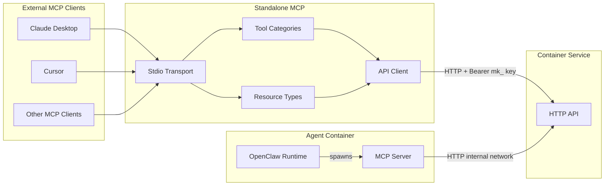
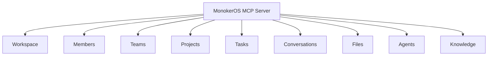
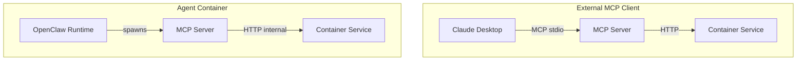

# MCP Server

MonokerOS includes an MCP (Model Context Protocol) server that exposes workspace operations as standardized tools. This allows external AI clients (such as Claude Desktop, Cursor, or other MCP-compatible tools) to interact with MonokerOS workspaces programmatically.

## What is MCP?

The Model Context Protocol (MCP) is a standardized protocol for AI tool use, created by Anthropic. It defines how AI models can discover and invoke tools, read resources, and interact with external systems through a structured JSON-RPC interface.

MonokerOS implements an MCP server using the `@modelcontextprotocol/sdk` package, communicating over stdio transport.

## Architecture

The MCP server runs inside each agent container, spawned by OpenClaw via the `openclaw.json` configuration. It communicates with the Container Service over the internal Docker network (`http://container-service:3002`). External MCP clients (like Claude Desktop) can also run the MCP server standalone for workspace management.



## Setup

### Environment Variables

| Variable | Description |
|----------|-------------|
| `MONOKEROS_API_KEY` or `MK_API_KEY` | API key with `mk_` prefix for authentication |
| `MONOKEROS_WORKSPACE` or `MK_WORKSPACE` | Workspace slug to operate on |

### Running the MCP Server

```bash
cd packages/mcp
MONOKEROS_API_KEY=mk_your_key MONOKEROS_WORKSPACE=my-agency bun src/index.ts
```

The server communicates over stdin/stdout using the MCP stdio transport protocol.

### Claude Desktop Configuration

Add to your Claude Desktop MCP config:

```json
{
  "mcpServers": {
    "monokeros": {
      "command": "bun",
      "args": ["run", "/path/to/monokeros/packages/mcp/src/index.ts"],
      "env": {
        "MONOKEROS_API_KEY": "mk_your_api_key",
        "MONOKEROS_WORKSPACE": "my-agency"
      }
    }
  }
}
```

## Tool Categories

The MCP server registers 9 categories of tools, totaling 30+ individual operations:



### Workspace Tools

| Tool | Description |
|------|-------------|
| `workspace.get` | Get workspace configuration (name, industry, branding, status, providers) |
| `workspace.update` | Update workspace configuration fields |
| `workspace.list_providers` | List all configured AI providers (keys masked) |
| `workspace.add_provider` | Add or replace an AI provider configuration |
| `workspace.remove_provider` | Remove an AI provider |
| `workspace.set_default_provider` | Set the default AI provider for all agents |

### Member Tools

| Tool | Description |
|------|-------------|
| `members.list` | List all workspace members with optional team filter |
| `members.get` | Get full member details including identity and stats |
| `members.create` | Create a new agent member with identity and model config |
| `members.update` | Update member fields (name, title, team, model config) |
| `members.update_status` | Change member status (idle, working, reviewing, blocked, offline) |
| `members.start_agent` | Start an agent |
| `members.stop_agent` | Stop a running agent |
| `members.reroll_name` | Generate a new random name for an agent |
| `members.reroll_identity` | Generate a completely new identity (name, gender, avatar) |

### Team Tools

| Tool | Description |
|------|-------------|
| `teams.list` | List all teams with member IDs |
| `teams.get` | Get a team with full member details |
| `teams.create` | Create a new team with name, type, color, and lead |
| `teams.update` | Update team fields |
| `teams.delete` | Delete a team |

### Project Tools

| Tool | Description |
|------|-------------|
| `projects.list` | List projects with optional status, type, and search filters |
| `projects.get` | Get full project details including SDLC gates |
| `projects.create` | Create a project with types, phases, and team assignments |
| `projects.update` | Update project fields |
| `projects.update_gate` | Approve or reject an SDLC gate for a project phase |

### Task Tools

| Tool | Description |
|------|-------------|
| `tasks.list` | List tasks with optional project, status, and assignee filters |
| `tasks.get` | Get full task details including dependencies |
| `tasks.create` | Create a task with title, project, team, phase, priority |
| `tasks.update` | Update task fields |
| `tasks.move` | Move a task to a different status column |
| `tasks.assign` | Assign members to a task |

### Conversation Tools

| Tool | Description |
|------|-------------|
| `conversations.list` | List all conversations (DMs, group chats, project chats) |
| `conversations.get` | Get a conversation with full message history |
| `conversations.create` | Create a new conversation (1 participant = DM, 2+ = group) |
| `conversations.rename` | Rename a group chat conversation |
| `conversations.send_message` | Send a message (agent may respond via LLM, up to 2 minutes) |

### File Tools

| Tool | Description |
|------|-------------|
| `files.list_drives` | List all drives with their file trees |
| `files.read` | Read a file's content from any drive |
| `files.create` | Create a new file in a drive |
| `files.update` | Update an existing file's content |
| `files.create_folder` | Create a new folder |
| `files.rename` | Rename a file or folder (system files protected) |
| `files.delete` | Delete a file or folder (system files protected) |

### Agent Runtime Tools

| Tool | Description |
|------|-------------|
| `agents.get_runtime` | Get agent runtime status |
| `agents.list_runtimes` | List runtime status for all agents |

### Knowledge Tools

| Tool | Description |
|------|-------------|
| `knowledge_search` | Search across all accessible KNOWLEDGE directories |

## Resources

The MCP server also exposes read-only resources for quick data access:

| Resource | URI Pattern | Description |
|----------|------------|-------------|
| Members | `monokeros://members` | List of all workspace members |
| Teams | `monokeros://teams` | List of all teams |
| Projects | `monokeros://projects` | List of all projects |
| Workspace | `monokeros://workspace` | Workspace configuration |

## How Agents Use MCP Tools

The MCP server runs inside each agent container, spawned by OpenClaw via the `openclaw.json` configuration. This gives agents access to the same 9 tool categories listed above. External MCP clients use the same tool interface.



- **External MCP** -- Clients connect via stdio, tools are called through JSON-RPC, the MCP server translates to HTTP calls to the Container Service.
- **Internal MCP** -- Inside each agent container, OpenClaw spawns the MCP server as a tool provider. The MCP server communicates with the Container Service at `http://container-service:3002` over the internal Docker network.

## Example Usage

### List all team members via MCP

An MCP client (like Claude Desktop) can use the `members.list` tool:

```json
{
  "method": "tools/call",
  "params": {
    "name": "members.list",
    "arguments": {}
  }
}
```

Response:

```json
[
  {
    "id": "agent-alice",
    "name": "Alice",
    "type": "agent",
    "title": "Frontend Engineer",
    "specialization": "React, TypeScript",
    "teamId": "team-engineering",
    "status": "working",
    "isLead": false
  }
]
```

### Send a message to an agent

```json
{
  "method": "tools/call",
  "params": {
    "name": "conversations.send_message",
    "arguments": {
      "conversationId": "conv-123",
      "content": "Please review the latest pull request",
      "references": []
    }
  }
}
```

Note: If the conversation has an agent participant, this call may take up to 2 minutes as the agent generates a response via its LLM.

## Related Documentation

- [Chat & Messaging](../features/chat.md) -- Conversation and messaging details
- [File Management](../features/file-management.md) -- File operations exposed as MCP tools
- [Design Inspirations](../architecture/inspirations.md) -- OpenClaw and containerized agent architecture
