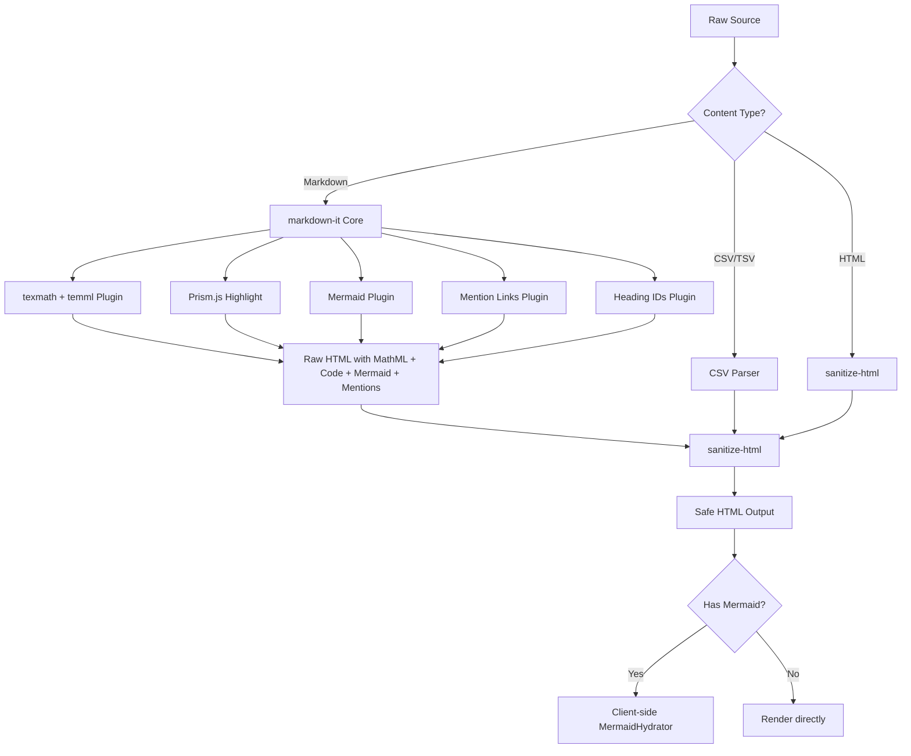
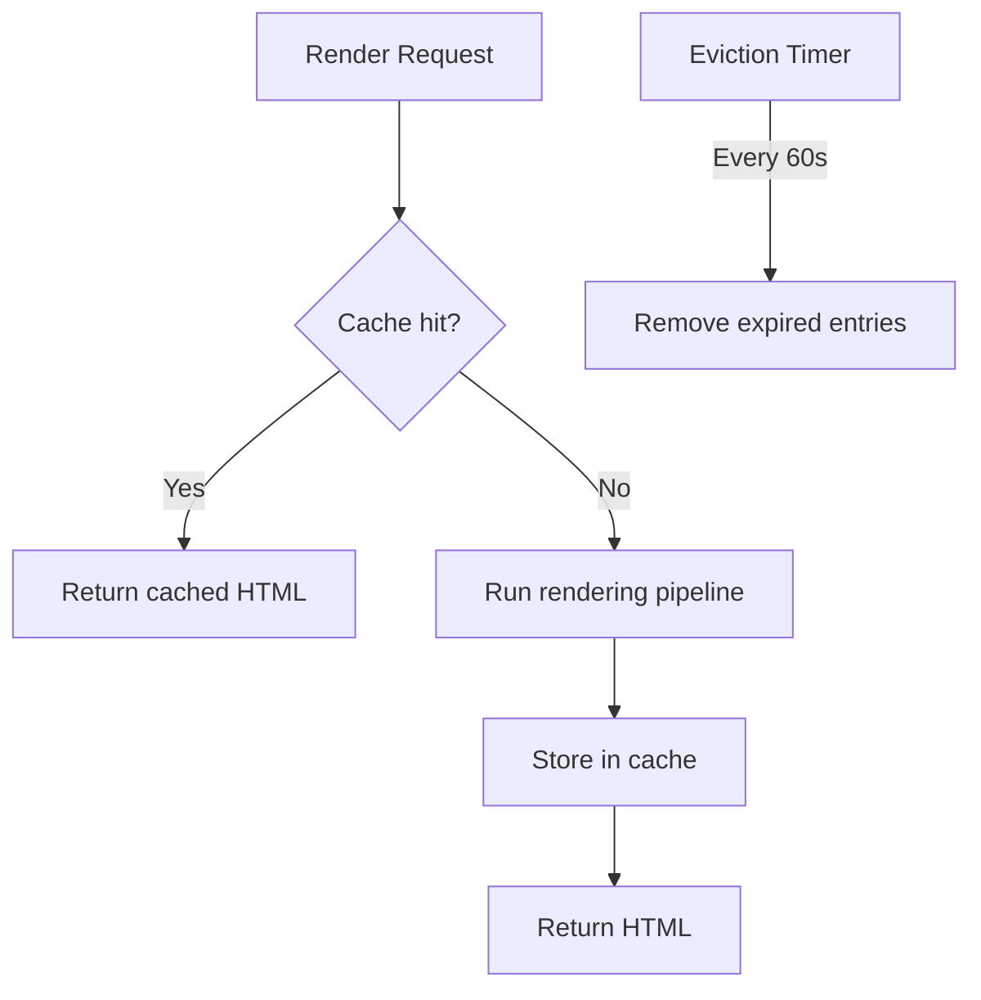

# Rendering Pipeline

The MonokerOS rendering pipeline converts raw markdown, code, and structured data into safe, styled HTML. It runs server-side in the `@monokeros/renderer` package and is used by both the API (via `RenderService`) and can be imported directly by any workspace package.

## Pipeline Overview



## markdown-it Core

The pipeline is built on `markdown-it`, configured as a singleton:

```typescript
const md = new MarkdownIt({
  html: false,       // Disable raw HTML in source
  linkify: true,     // Auto-detect URLs
  typographer: true, // Smart quotes, dashes
  highlight(str, lang) { ... }, // Prism.js
});
```

HTML input is disabled (`html: false`) to prevent injection. URLs are auto-linked, and typographic replacements (smart quotes, em-dashes) are applied.

## Prism.js Syntax Highlighting

Code blocks are highlighted server-side using Prism.js. The following languages are loaded:

| Language | Prism Component |
|----------|----------------|
| TypeScript | `prism-typescript` |
| Python | `prism-python` |
| Bash/Shell | `prism-bash` |
| JSON | `prism-json` |
| YAML | `prism-yaml` |
| CSS | `prism-css` |
| HTML/XML | `prism-markup` |
| Rust | `prism-rust` |
| Go | `prism-go` |
| Java | `prism-java` |
| SQL | `prism-sql` |
| TOML | `prism-toml` |
| Ruby | `prism-ruby` |
| Swift | `prism-swift` |
| Kotlin | `prism-kotlin` |
| PHP | `prism-php` |

Unrecognized languages fall back to plaintext (HTML-escaped, no highlighting).

### Output Format

```html
<pre class="language-typescript">
  <code class="language-typescript">
    <span class="token keyword">const</span> x
    <span class="token operator">=</span>
    <span class="token number">42</span><span class="token punctuation">;</span>
  </code>
</pre>
```

## texmath + temml (LaTeX Math)

LaTeX math expressions are rendered to MathML using the `markdown-it-texmath` plugin with the `temml` engine. This produces pure MathML output that requires zero client-side JavaScript.

### Delimiters

| Syntax | Type | Example |
|--------|------|---------|
| `$...$` | Inline math | `The formula $E = mc^2$ is famous.` |
| `$$...$$` | Display math | `$$\int_0^\infty e^{-x} dx = 1$$` |

### Output

```html
<math xmlns="http://www.w3.org/1998/Math/MathML" display="inline">
  <mi>E</mi>
  <mo>=</mo>
  <mi>m</mi>
  <msup><mi>c</mi><mn>2</mn></msup>
</math>
```

MathML is natively supported by all modern browsers, so no client-side rendering library (like KaTeX or MathJax) is needed.

## Mermaid Plugin

Fenced code blocks with the language `mermaid` are converted to placeholder `<div>` elements that are hydrated client-side.

### Server-Side (Plugin)

The plugin intercepts `fence` tokens with `info === 'mermaid'`:

```typescript
if (info === 'mermaid') {
  const encoded = Buffer.from(token.content).toString('base64');
  const escaped = md.utils.escapeHtml(token.content);
  return (
    `<div class="mermaid-diagram" data-source="${encoded}">`
    + `<pre class="mermaid-source"><code>${escaped}</code></pre>`
    + `</div>`
  );
}
```

The base64-encoded source is stored in `data-source` for the client-side hydrator. The escaped source is shown as a fallback.

### Client-Side (MermaidHydrator)

The `RenderResult` type includes a `hasMermaid` boolean. When `true`, the client renders a `MermaidHydrator` component that:

1. Queries all `.mermaid-diagram` elements in the rendered HTML.
2. Decodes the `data-source` attribute.
3. Calls `mermaid.render()` to produce an SVG.
4. Replaces the placeholder `<pre>` with the rendered SVG.

```mermaid
flowchart LR
    A["```mermaid\ngraph LR\n  A-->B\n```"] --> B[Plugin: div.mermaid-diagram]
    B --> C[Client: MermaidHydrator]
    C --> D[mermaid.render]
    D --> E[SVG Diagram]
```

## Mention Links Plugin

The mention links plugin converts inline patterns (`@agent`, `#project`, `~task`, `:file`) into styled, clickable spans.

### Pattern Matching

The inline rule triggers on `@`, `#`, `~`, or `:` followed by a word character, but only after whitespace or at the start of input:

```
/^([@#~:])([\w][\w.\-]*)/
```

### Type Mapping

| Prefix | Type | CSS Class |
|--------|------|-----------|
| `@` | `agent` | `mention-agent` |
| `#` | `project` | `mention-project` |
| `~` | `task` | `mention-task` |
| `:` | `file` | `mention-file` |

### Output

```html
<span class="mention mention-agent"
      data-mention-type="agent"
      data-mention-name="alice">@alice</span>
```

The `data-mention-type` and `data-mention-name` attributes are used by the client to navigate on click.

## Heading IDs Plugin

The heading IDs plugin adds `id` attributes to heading elements for anchor navigation:

```markdown
## My Section Title
```

Becomes:

```html
<h2 id="my-section-title">My Section Title</h2>
```

The slug is generated by lowercasing, removing non-word characters, and replacing spaces with hyphens.

## Sanitization

All rendered HTML passes through `sanitize-html` before being returned. The sanitizer uses strict allowlists.

### Allowed Elements

| Category | Elements |
|----------|----------|
| **Block** | `h1`-`h6`, `p`, `div`, `span`, `br`, `hr`, `blockquote`, `pre`, `code` |
| **Lists** | `ul`, `ol`, `li` |
| **Tables** | `table`, `thead`, `tbody`, `tfoot`, `tr`, `th`, `td` |
| **Inline** | `a`, `strong`, `em`, `del`, `s`, `sub`, `sup`, `img` |
| **MathML** | `math`, `mi`, `mo`, `mn`, `ms`, `mtext`, `mspace`, `mrow`, `mfrac`, `msqrt`, `mroot`, `msub`, `msup`, `msubsup`, `munder`, `mover`, `munderover`, `mtable`, `mtr`, `mtd`, `mpadded`, `mphantom`, `menclose`, `mmultiscripts`, `semantics`, `annotation` |
| **SVG** | `svg`, `g`, `path`, `rect`, `circle`, `ellipse`, `line`, `polyline`, `polygon`, `text`, `tspan`, `defs`, `marker`, `use`, `clipPath`, `mask`, `pattern` |

### Allowed Attributes (Selected)

| Element | Attributes |
|---------|-----------|
| `*` (all) | `class`, `id` |
| `a` | `href`, `target`, `rel` |
| `img` | `src`, `alt`, `width`, `height` |
| `span` | `class`, `data-mention-type`, `data-mention-name` |
| `div` | `data-source` |
| `math` | `xmlns`, `display`, `mathvariant` |
| SVG elements | `viewBox`, `width`, `height`, `fill`, `stroke`, `d`, `transform`, etc. |

### Security Notes

- `foreignObject` is not allowed in SVG (prevents XSS via embedded HTML in SVG).
- Only `http`, `https`, and `mailto` URL schemes are permitted.
- Raw HTML in markdown source is disabled at the parser level.

## CSV/TSV Rendering

The `renderCSV` function parses CSV or TSV content and produces an HTML table:

```html
<div class="csv-table-wrapper">
  <table class="csv-table">
    <thead><tr><th>Name</th><th>Age</th></tr></thead>
    <tbody><tr><td>Alice</td><td>30</td></tr></tbody>
  </table>
</div>
```

Features:
- First row treated as header
- Handles quoted fields with escaped quotes
- Tab delimiter for `.tsv` files

## CSS Themes

The rendered HTML is styled by two theme files:

| File | Purpose |
|------|---------|
| `markdown-theme.css` | Typography, headings, lists, tables, blockquotes, mentions |
| `code-theme.css` | Prism.js token colors, `<pre>` styling, line numbers |

## Render Caching (RenderService)

The API server's `RenderService` wraps the rendering functions with an LRU cache:



| Parameter | Value | Source |
|-----------|-------|--------|
| Max entries | `RENDER_CACHE_MAX_ENTRIES` | `@monokeros/constants` |
| TTL | `RENDER_CACHE_TTL_MS` | `@monokeros/constants` |
| Hash function | `Bun.hash` | Fast built-in hash, base-36 encoded |
| Eviction | Every 60 seconds | Timer-based sweep |

Cache keys are prefixed by content type (`md:` for markdown, `file:{ext}:` for file renders).

## RenderResult Type

```typescript
interface RenderResult {
  html: string;       // Sanitized HTML output
  hasMermaid: boolean; // True if Mermaid diagrams are present
  hasMath: boolean;    // True if MathML content is present
}
```

The `hasMermaid` and `hasMath` flags allow the client to conditionally load the Mermaid hydrator or apply math-specific styles.

## API Endpoints

| Method | Path | Description |
|--------|------|-------------|
| POST | `/workspaces/:slug/render/markdown` | Render markdown string to HTML |
| POST | `/workspaces/:slug/render/file` | Render file content by extension |

See the [REST API reference](api.md) for full endpoint documentation.

## Related Documentation

- [Chat & Messaging](../features/chat.md) -- How rendered HTML appears in chat
- [File Management](../features/file-management.md) -- File preview rendering
- [REST API](api.md) -- Render endpoints
