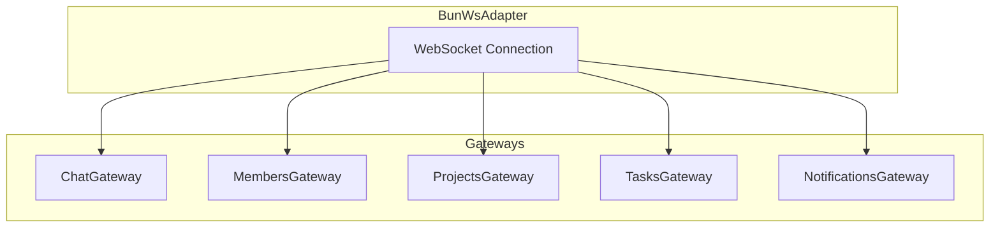
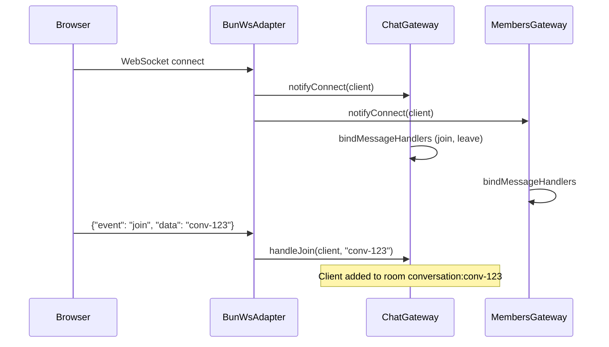
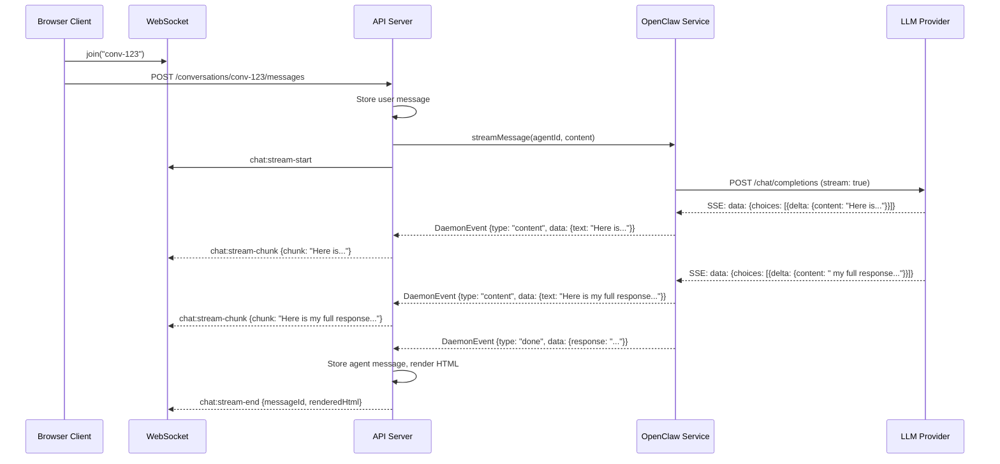
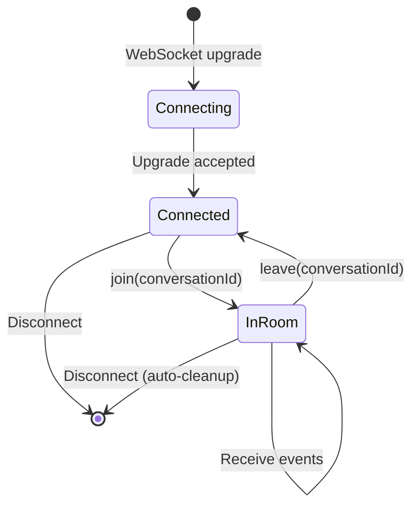

# WebSocket Protocol

MonokerOS uses WebSocket connections to deliver real-time events to the browser client. The server-side implementation is built on a custom `BunWsAdapter` that integrates Bun's native WebSocket support with the NestJS gateway pattern.

## Connection

### Transport

The WebSocket server runs on the same port as the HTTP API (default `3001`). Connections are upgraded from HTTP to WebSocket by the `BunHttpAdapter` when the adapter detects a WebSocket upgrade request.

```
ws://localhost:3001/
```

### Handshake

The client connects by sending a standard WebSocket upgrade request. Authentication is handled by passing the JWT token during the initial connection or in the first message payload.

### Message Format

All WebSocket messages (both directions) use JSON:

```json
{
  "event": "event-name",
  "data": { ... }
}
```

## Architecture: Multi-Gateway

MonokerOS uses multiple NestJS WebSocket gateways, each responsible for a domain of events. All gateways share the same underlying WebSocket connection through the `BunWsAdapter`.



### BunWsAdapter Internals

The `BunWsAdapter` bridges Bun's native WebSocket with NestJS's `WebSocketAdapter` interface:

- **`BunWsServer`** -- A virtual server object injected into each gateway via `@WebSocketServer()`. Tracks connected clients and dispatches connection callbacks.
- **Multi-gateway support** -- Multiple gateways register their `@SubscribeMessage()` handlers through `bindMessageHandlers()`. Each client maintains an array of handler entries so that every gateway's handlers are checked on each incoming message.
- **Room management** -- The `ChatGateway` manages rooms manually (conversation-based). The `BaseGateway.emit()` method broadcasts to all clients; `ChatGateway.emitTo()` narrows delivery to a specific room.



## Rooms

Rooms are used by the `ChatGateway` to scope event delivery to specific conversations:

| Room Pattern | Description |
|-------------|-------------|
| `conversation:{id}` | All clients viewing a specific conversation |

### Joining a Room

```json
// Client sends:
{"event": "join", "data": "conversation-id-123"}
```

### Leaving a Room

```json
// Client sends:
{"event": "leave", "data": "conversation-id-123"}
```

Rooms are automatically cleaned up when a client disconnects.

## Server-Emitted Events

### Chat Events

These events are scoped to conversation rooms (only sent to clients that have joined the conversation):

| Event | Payload | Description |
|-------|---------|-------------|
| `chat:message` | `{conversationId, message}` | New message posted (user or agent) |
| `chat:stream-start` | `{conversationId, agentId}` | Agent began generating a response |
| `chat:stream-chunk` | `{conversationId, chunk}` | Accumulated response text so far |
| `chat:stream-end` | `{conversationId, messageId, renderedHtml?}` | Agent response complete |
| `chat:typing` | `{conversationId, agentId}` | Agent is typing |
| `chat:thinking-status` | `{conversationId, phase}` | Agent thinking phase (`thinking`, `reflecting`) |
| `chat:tool-start` | `{conversationId, id, name, args?}` | Agent started a tool call |
| `chat:tool-end` | `{conversationId, id, name, durationMs}` | Agent tool call completed |

### Member Events

These events are broadcast to all connected clients:

| Event | Payload | Description |
|-------|---------|-------------|
| `member:status-changed` | `{memberId, status, timestamp}` | Agent status changed |
| `member:created` | `{member, timestamp}` | New member created |
| `member:updated` | `{member, timestamp}` | Member details updated |

### Project Events

| Event | Payload | Description |
|-------|---------|-------------|
| `project:gate-updated` | `{project, timestamp}` | Project gate status changed |

### Task Events

| Event | Payload | Description |
|-------|---------|-------------|
| `task:created` | `{task, timestamp}` | New task created |
| `task:updated` | `{task, timestamp}` | Task details changed |
| `task:moved` | `{task, previousStatus, timestamp}` | Task status changed |

### Notification Events

| Event | Payload | Description |
|-------|---------|-------------|
| `notification:created` | `{notification}` | New notification for the user |
| `notification:read` | `{notificationId}` | Notification marked as read |
| `notification:read-all` | `{}` | All notifications marked as read |

## Client-Sent Events

| Event | Payload | Description |
|-------|---------|-------------|
| `join` | `conversationId` (string) | Join a conversation room |
| `leave` | `conversationId` (string) | Leave a conversation room |

Note: Sending chat messages is done via the [REST API](api.md) (`POST /conversations/:id/messages`), not over the WebSocket. The WebSocket is for receiving real-time events.

## Streaming Flow (End-to-End)



## Connection Lifecycle



## BaseGateway

All gateways extend `BaseGateway`, which provides:

- **`emit(event, data)`** -- Broadcasts to all connected clients. Used by `MembersGateway`, `ProjectsGateway`, `TasksGateway`, and `NotificationsGateway`.
- **`emitTo(room, event, data)`** -- Room-scoped delivery. Overridden by `ChatGateway` to send only to clients in a specific conversation room. Default implementation falls back to `emit()`.

## Related Documentation

- [Chat & Messaging](../features/chat.md) -- Chat event flow and streaming details
- [OpenClaw Service](daemon.md) -- SSE streaming and agent runtime
- [Authentication](auth.md) -- Token-based WebSocket auth
- [REST API](api.md) -- HTTP endpoints for sending messages
